# ARCHITECTURE.md

**Software Architecture Specification — Fundación Alborada Platform**

---

## Document Metadata

| Field | Value |
|---|---|
| **Version** | 0.1 |
| **Status** | Draft — **complete** (Sections 1–36). Awaiting review and approval. |
| **Owner** | Ernesto Cosovi |
| **Authority** | Layer 3, peer of `MASTER_DEVELOPMENT_GUIDE.md`. Subordinate to the institutional corpus (`docs/`) and to `PROJECT_CONSTITUTION.md`. Supersedes nothing. |
| **Scope** | Software architecture of the entire Alborada technological ecosystem — current, planned, deferred, and undecided. Excludes implementation detail, institutional doctrine, and operational procedure. |
| **Repository** | `alborada` — single application, git, branch `main`, 5 commits, **local only (never pushed)**. Remote configured: `github.com/ercotan/alborada-foundation`. |
| **Last Updated** | 19 July 2026 |
| **Verification basis** | Written after direct inspection of `package.json`, `tsconfig.json`, `vite.config.ts`, `index.html`, `metadata.json`, `.gitignore`, `.env.example`, all 32 files in `src/`, `assets/`, and the 112-document corpus in `docs/`. No claim in Sections 4–5 is inferred. |

> **A note on placement in the hierarchy.** `PROJECT_CONSTITUTION.md` defines a four-layer precedence model that predates this document. Rather than silently renumber it, this specification is declared a **peer of layer 3**. Formally amending the Constitution to name ARCHITECTURE.md explicitly is an
> **OPEN DECISION — REQUIRES ERNESTO'S APPROVAL**

---

## 1. Purpose

### 1.1 Why this document exists

The Alborada platform is expected to grow from a single public website into an ecosystem spanning education, administration, agriculture, finance, security, analytics, and an institutional intelligence (HERA). That growth will span years and involve people who were not present for the original decisions.

This document exists so that those people inherit **reasoning**, not just code. It records what exists, what is intended, what has been deliberately postponed, and — critically — what has never been decided at all.

Its second purpose is defensive. In a project of this ambition, the most common failure is not bad architecture but *undocumented* architecture: choices made implicitly, in a hurry, by whoever happened to be typing. Every unresolved question in this document is marked explicitly so that it cannot be resolved by accident.

### 1.2 Relationship to other documents

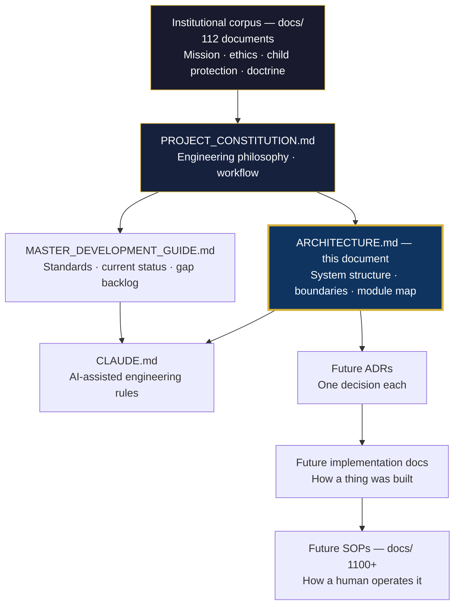
```mermaid
graph TD
    A["Institutional corpus — docs/<br/>112 documents<br/>Mission · ethics · child protection · doctrine"]
    B["PROJECT_CONSTITUTION.md<br/>Engineering philosophy · workflow"]
    C["ARCHITECTURE.md — this document<br/>System structure · boundaries · module map"]
    D["MASTER_DEVELOPMENT_GUIDE.md<br/>Standards · current status · gap backlog"]
    E["CLAUDE.md<br/>AI-assisted engineering rules"]
    F["Future ADRs<br/>One decision each"]
    G["Future implementation docs<br/>How a thing was built"]
    H["Future SOPs — docs/ 1100+<br/>How a human operates it"]

    A --> B --> C
    B --> D
    C --> E
    D --> E
    C --> F --> G --> H

    style A fill:#1a1a2e,stroke:#d4af37,color:#fff
    style B fill:#16213e,stroke:#d4af37,color:#fff
    style C fill:#0f3460,stroke:#d4af37,color:#fff,stroke-width:3px
```

| Document | Answers | Relationship to this one |
|---|---|---|
| `docs/` (institutional corpus) | *What is Alborada, and what may it never do?* | **Binds this document.** Where doctrine constrains architecture, it is cited. |
| `PROJECT_CONSTITUTION.md` | *How do we engineer?* | Supplies the principles Section 3 elaborates. |
| **`ARCHITECTURE.md`** | *What is the system made of, and where are its boundaries?* | — |
| `MASTER_DEVELOPMENT_GUIDE.md` | *What standards apply, and how far short do we currently fall?* | Peer. The Guide tracks *quality and gaps*; this tracks *structure*. Where they overlap, the Guide holds the honest status ledger. |
| `CLAUDE.md` | *What rules govern AI-assisted work?* | Derives from this document. |
| **Future ADRs** | *Why was this specific choice made?* | Each future ADR resolves exactly one `OPEN DECISION` from this document and amends it. |
| **Future implementation docs** | *How was it actually built?* | Subordinate. Must never contradict this document; if reality diverges, this document is corrected. |
| **Future SOPs** (`docs/` series 1100+) | *How does a person operate it?* | Consume architecture; do not define it. |

### 1.3 What this document is not

This document defines **software architecture, not implementation**. It describes structure, boundaries, responsibilities, data sensitivity, and dependency direction. It does not specify algorithms, schemas, endpoint signatures, or code.

It also does not select technologies. Where a technology is genuinely in use it is recorded as fact; where one is merely needed, the requirement is stated as a capability and the choice is left open.

---

## 2. Executive Summary

### 2.1 Current reality, stated plainly

The repository today contains **one thing: a static, single-page public institutional website.** It is 32 source files and roughly 2,664 lines, built with React 19 and Vite 6, styled with Tailwind CSS v4, and deployed as static assets. It has no server component of any kind.

Alongside it sits a substantial body of institutional documentation — **112 documents, roughly 106,000 words** — that describes the intended future of the foundation in considerable depth.

The gap between those two facts is the defining characteristic of this project at this moment, and this document exists largely to hold it honestly.

### 2.2 What exists

| Area | Status |
|---|---|
| Public institutional website | **Exists.** Sixteen sections, modular component architecture, verified builds. |
| Cinematic canvas engine | **Exists.** A 470-line sunrise renderer driven by a `progress` parameter, currently frozen at a fixed value. |
| Generative audio engine | **Exists but disconnected.** `src/utils/audio.ts` is imported by nothing. |
| Institutional documentation corpus | **Exists.** 112 documents under version control as of commit `ccc80af`. |
| Governance documents | **Exist.** Constitution, development guide, AI engineering rules. |
| Build and type-check pipeline | **Exists**, manual only. |

### 2.3 What does not exist

Stated explicitly, because the institutional documentation describes many of these in the future tense and it would be easy to mistake intent for reality:

- **No backend.** No server, no application layer, no business logic outside the browser.
- **No database.** No persistence of any kind. Nothing the user does is stored anywhere.
- **No authentication and no authorization.** No accounts, no sessions, no roles.
- **No API.** Neither consumed nor exposed. No API gateway.
- **No HERA.** No AI integration whatsoever. `@google/genai` appears in `package.json` but is imported nowhere.
- **No tests**, no linter, no formatter, no CI/CD, no monitoring, no error tracking.
- **No deployment.** The site has never been published. The repository has never been pushed.
- **No mobile application.** No API ecosystem. No agents. No automation.

### 2.4 What is planned

Thirteen future modules are catalogued in Section 9. All are **Not Started**. The institutional corpus establishes their purpose and, in several cases, binding constraints on their shape — but it selects no technology for any of them.

### 2.5 What remains undecided

Every technology decision beyond the current frontend remains open. The corpus was examined specifically for pre-existing choices and contains none: no database, no backend framework, no LLM provider, no vector store, no hosting platform, no identity provider.

What the corpus *does* impose are shape constraints — no vendor lock-in, a mandatory API gateway, per-domain databases, five permission levels, 99.9 % availability, encryption and audit logging by default. These narrow the field considerably without naming a product, and they are recorded in Section 10.

### 2.6 Trajectory

The repository currently represents the public institutional website. It is expected to evolve into a substantially larger ecosystem. This document assumes that evolution will be **incremental and evidence-driven** — each module introduced when a real requirement forces it, not in anticipation. That assumption follows directly from YAGNI, which `PROJECT_CONSTITUTION.md` declares binding.

---

## 3. Guiding Principles

These govern every architectural decision. Where two conflict, the earlier prevails.

### 3.1 Child Protection

**The highest constraint in the system.** `docs/# 32_CHILD_PROTECTION_SYSTEM` states: *"Ningún objetivo educativo, tecnológico, financiero o institucional tendrá prioridad sobre la seguridad, la dignidad y el bienestar de las estudiantes."*

Architecturally this means: data concerning minors is the most restricted class in the system; it is never public, never used for training or analytics without explicit institutional authorization, never exposed through any public surface, and every access to it is logged. Any design that cannot satisfy this is rejected regardless of merit.

### 3.2 Privacy by Design

`docs/# 07_HERA_ETHICS`: *"Los datos pertenecen a las personas. No a la Fundación. No a HERA."* Privacy is a property of the structure, not a policy layered on afterwards. Data minimisation, purpose limitation, encryption at rest and in transit, and subject access rights are architectural requirements, not features.

### 3.3 Security First

Security is a design input, not a review stage. OWASP practices apply throughout. No secret is ever committed, hardcoded, or exposed to the client. Every input is validated at the trust boundary. Every surface is authenticated and authorised by default, with public access as the explicit exception.

### 3.4 Least Privilege

Every actor — human, service, or agent — receives the minimum access required. The corpus fixes five permission levels (0 Público, 1 Estudiantes, 2 Docentes, 3 Directivos, 4 Administración); these are the coarse frame, and finer authorisation is expected within them.

### 3.5 Auditability

`docs/# 16` and `# 24` require that actions be logged and reconstructible. Systems handling institutional or personal data must be able to answer *who did what, when, and on whose authority.* Audit logs are append-only and are themselves protected data.

### 3.6 Human Oversight

`docs/# 1007`: HERA assists but *"Nunca sustituye la aprobación humana."* No autonomous system may take a consequential institutional action — approving a document, disbursing funds, altering a student record — without a human in the loop. Automation proposes; people decide.

### 3.7 Documentation First

Documentation is part of the software. An architectural change that is not written down did not happen. This principle is the reason this document exists, and the reason every unresolved question in it is marked rather than quietly settled.

### 3.8 No Silent Architectural Decisions

Structural choices are made explicitly, recorded with reasoning, and attributed. Writing code that presumes an unmade decision *is* making that decision — silently, and usually badly. Where this document says `OPEN DECISION`, no implementation may proceed on an assumption.

### 3.9 No Unapproved Technologies

No framework, database, provider, or platform enters the system without explicit approval. Packages already present in `package.json` but unused are scaffold residue and constitute no approval whatsoever.

### 3.10 Modularity

High cohesion, low coupling, one responsibility per component. The corpus reinforces this for HERA specifically: *"Una responsabilidad por componente"*, and each new capability *"deberá implementarse como un módulo independiente."*

### 3.11 Scalability

Design so that growth is additive rather than corrective. In practice this means honest seams — a module can be replaced without rewriting its neighbours — rather than speculative infrastructure built for load that does not exist.

### 3.12 Maintainability

Optimise for the reader, not the writer. `MASTER_DEVELOPMENT_GUIDE.md` states the intent precisely: a future maintainer, *possibly a student who came through the programme*, should be able to open any file and understand it without reading twenty others.

### 3.13 Accessibility

WCAG 2.1 Level AA is the target for every public surface. An institution built on human dignity cannot ship interfaces that exclude people. This is currently the largest gap between standard and reality; the Guide holds the ledger.

### 3.14 No Premature Optimization

YAGNI is binding. Build what is required now, structured so that what comes later fits. The thirteen modules in Section 9 are a map of the territory, not a construction schedule.

### 3.15 Long-Term Thinking

The design horizon is decades, not quarters. Favour boring, portable, well-understood approaches over novel ones. Avoid dependencies that cannot be replaced. Prefer formats and protocols that will outlive their vendors.

### 3.16 Preserve Existing Visual Identity

The current visual language is an asset and is not to be altered incidentally. Redesign requires explicit approval; refactoring must produce identical rendered output, and "no visual change" is a claim that must be proven rather than asserted. See Section 8.

---

## 4. Current Repository Overview

Everything in this section is verified fact as of 19 July 2026.

### 4.1 Frontend stack

| Layer | Technology | Version | Notes |
|---|---|---|---|
| UI framework | React | `^19.0.1` | Function components throughout; `React.FC` convention |
| Build tool | Vite | `^6.2.3` | Also duplicated in `devDependencies` |
| Language | TypeScript | `~5.8.2` | **`strict` not enabled** — see 4.9 |
| Styling | Tailwind CSS | `^4.1.14` | v4 CSS-first; **no config file exists** |
| Tailwind integration | `@tailwindcss/vite` | `^4.1.14` | Vite plugin |
| React integration | `@vitejs/plugin-react` | `^5.0.4` | |
| Animation | `motion` | `^12.23.24` | Framer Motion successor |
| Icons | `lucide-react` | `^0.546.0` | Inline SVG components |

**Present in `package.json` but imported nowhere in `src/`** — scaffold residue from the Google AI Studio template this repository was generated from. These are **not** approved technologies:

`@google/genai` · `express` · `dotenv` · `@types/express` · `autoprefixer` · `esbuild` · `tsx`

### 4.2 Repository organization

```
alborada/
├── ARCHITECTURE.md              ← this document
├── PROJECT_CONSTITUTION.md      ← engineering philosophy (layer 2)
├── MASTER_DEVELOPMENT_GUIDE.md  ← standards + gap ledger (layer 3)
├── CLAUDE.md                    ← AI engineering rules (layer 4)
├── README.md                    ← ⚠ still Google AI Studio scaffold text
├── index.html                   ← ⚠ still scaffold metadata
├── metadata.json                ← ⚠ AI Studio manifest, declares Gemini capability
├── .env.example                 ← ⚠ scaffold vars (GEMINI_API_KEY, APP_URL)
├── .gitignore
├── package.json                 ← ⚠ name is still "react-example", version 0.0.0
├── tsconfig.json
├── vite.config.ts
├── assets/                      ← effectively empty; gitignored
│   └── .aistudio/.gitignore
├── docs/                        ← institutional corpus, 112 documents
└── src/                         ← 32 files, ~2,664 lines
```

`assets/` contains no assets. It holds a single nested `.gitignore` from the scaffold and is itself ignored by git.

### 4.3 `src/` organization

| Directory | Files | Responsibility |
|---|---|---|
| `src/` | `App.tsx`, `main.tsx`, `index.css`, `types.ts` | Entry point, shell, global styles, shared contracts |
| `src/components/` | `Homepage.tsx`, `CinematicCanvas.tsx` | Page composition; canvas engine |
| `src/components/layout/` | `Header`, `FooterSection` | Structural chrome |
| `src/components/sections/` | 14 sections + `index.ts` barrel | Full-width page sections |
| `src/components/ui/` | `SectionEyebrow`, `GoldDivider` | Presentational primitives |
| `src/components/shared/` | `ScrollButton` | Reusable components with behaviour |
| `src/data/` | `homepage.ts` (476 lines) | All editorial content |
| `src/hooks/` | `useContactForm`, `useDonationForm` | Stateful logic |
| `src/utils/` | `scroll.ts`, `audio.ts` | Pure helpers |

`ui/` versus `shared/` is decided by behaviour: `ui/` renders, `shared/` does something.

### 4.4 Homepage composition

`Homepage.tsx` is **40 lines** and contains only imports and JSX composition — no state, no handlers, no markup beyond the wrapper. It renders fifteen components in fixed order:

| # | Component | DOM `id` |
|---|---|---|
| 1 | `HeroSection` (renders `Header` internally) | `hero` |
| 2 | `MissionSection` | `mission` |
| 3 | `VisionSection` | `vision` |
| 4 | `ModelSection` | `model` |
| 5 | `CohortSection` | `girls` |
| 6 | `CampusSection` | `campus` |
| 7 | `HeraSection` | `ai` |
| 8 | `SustainabilitySection` | `sustainability` |
| 9 | `ImpactSection` | `impact` |
| 10 | `TimelineSection` | `timeline` |
| 11 | `TransparencySection` | `transparency` |
| 12 | `DonationSection` | `donations` |
| 13 | `AlliancesSection` | `alliances` |
| 14 | `ContactSection` | `contact` |
| 15 | `OrientationSection` | `orientation` |
| 16 | `FooterSection` | — |

**Documented exception:** `Header` is rendered *inside* `HeroSection`, not at page level, because it is absolutely positioned against that section. Hoisting it changes its positioning context. This is intentional and must not be "corrected".

### 4.5 Data organization

Editorial content is separated from presentation. `src/data/homepage.ts` exports typed content arrays consumed by presentational components; `src/types.ts` holds the contracts.

```
src/types.ts  ──defines──▶  src/data/homepage.ts  ──consumed by──▶  sections/*.tsx
```

This makes copy changes one-line data edits with no layout risk, and makes a future CMS or API substitution possible without touching components.

### 4.6 Styling strategy

Tailwind CSS v4 in **CSS-first** mode. There is no `tailwind.config.js` and no PostCSS config. The theme lives in the `@theme` block of `src/index.css` (95 lines), which defines `--font-serif` / `--font-sans` / `--font-mono` and `--color-gold-*` / `--color-navy-*` ramps.

A known inconsistency exists: components largely bypass these tokens and hardcode equivalent colours as arbitrary values. See Section 8.4.

### 4.7 Verification workflow

Entirely manual. Two commands constitute the whole gate:

```bash
npx tsc --noEmit     # must exit 0
npx vite build       # must succeed
```

For changes claiming visual parity, an additional procedure is established and has been used successfully twice: render before and after with `renderToStaticMarkup`, normalise class-attribute token order, and diff. Identical output proves DOM, classes, and text unchanged.

### 4.8 Current documentation

| Location | Content |
|---|---|
| `docs/` | 112 institutional documents — 100 constitutional (00–99), 1 strategic (100), 11 master norms (1000–1010) |
| Repository root | Constitution, development guide, AI rules, this document |

### 4.9 Known limitations

Recorded here because architecture must describe reality, not aspiration. The authoritative ledger is `MASTER_DEVELOPMENT_GUIDE.md` Appendix A.

| Limitation | Consequence |
|---|---|
| **TypeScript `strict` disabled** — `strict`, `noImplicitAny`, `strictNullChecks` all absent | A passing type-check proves far less than it appears to |
| **No tests, no linter, no CI** | Manual verification is the only quality gate |
| **Zero `aria-*` attributes, zero `<label>` elements** | Fails the stated WCAG 2.1 AA target |
| **No navigation below 1024 px** | Header nav is `hidden … lg:flex` with no mobile alternative |
| **`index.html` is scaffold** | Title `My Google AI Studio App`; no description, Open Graph, or favicon; `lang="en"` while all copy is Spanish |
| **Fabricated funding data in `DonationSection`** | Hardcoded percentages presented as live progress; violates `docs/# 01_BRAND_BIBLE` Cap. VII |
| **Two parallel colour systems** | Theme tokens and raw hex express identical colours |
| **`src/utils/audio.ts` orphaned** | 208 lines, imported nowhere |
| **Corpus split** | Two documents exist only in `DOCUMENTATION/`; `docs/` holds 0-byte placeholders |
| **Never deployed, never pushed** | 5 commits exist only on this machine |

### 4.10 Current architecture diagram

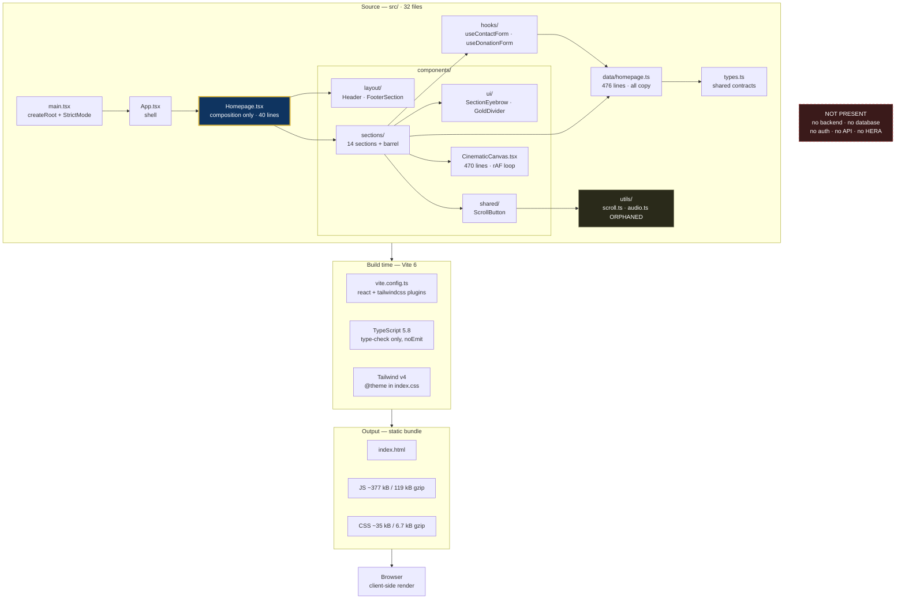
```mermaid
graph TD
    subgraph BUILD["Build time — Vite 6"]
        VC["vite.config.ts<br/>react + tailwindcss plugins"]
        TS["TypeScript 5.8<br/>type-check only, noEmit"]
        TW["Tailwind v4<br/>@theme in index.css"]
    end

    subgraph SRC["Source — src/ · 32 files"]
        MAIN["main.tsx<br/>createRoot + StrictMode"]
        APP["App.tsx<br/>shell"]
        HP["Homepage.tsx<br/>composition only · 40 lines"]

        subgraph COMP["components/"]
            LAY["layout/<br/>Header · FooterSection"]
            SEC["sections/<br/>14 sections + barrel"]
            UI["ui/<br/>SectionEyebrow · GoldDivider"]
            SH["shared/<br/>ScrollButton"]
            CAN["CinematicCanvas.tsx<br/>470 lines · rAF loop"]
        end

        DATA["data/homepage.ts<br/>476 lines · all copy"]
        HOOKS["hooks/<br/>useContactForm · useDonationForm"]
        UTILS["utils/<br/>scroll.ts · audio.ts ORPHANED"]
        TYPES["types.ts<br/>shared contracts"]
    end

    subgraph OUT["Output — static bundle"]
        HTML["index.html"]
        JS["JS ~377 kB / 119 kB gzip"]
        CSS["CSS ~35 kB / 6.7 kB gzip"]
    end

    BROWSER["Browser<br/>client-side render"]

    MAIN --> APP --> HP
    HP --> SEC
    HP --> LAY
    SEC --> UI
    SEC --> SH
    SEC --> HOOKS
    SEC --> DATA
    SEC --> CAN
    DATA --> TYPES
    HOOKS --> DATA
    SH --> UTILS

    SRC --> BUILD --> OUT --> BROWSER

    NOBACK["NOT PRESENT<br/>no backend · no database<br/>no auth · no API · no HERA"]

    style HP fill:#0f3460,stroke:#d4af37,color:#fff,stroke-width:3px
    style NOBACK fill:#3a1a1a,stroke:#c44,color:#fff,stroke-dasharray: 6 4
    style UTILS fill:#2a2a1a,stroke:#aa8,color:#fff
```

---

## 5. Runtime Architecture

### 5.1 What actually happens at runtime

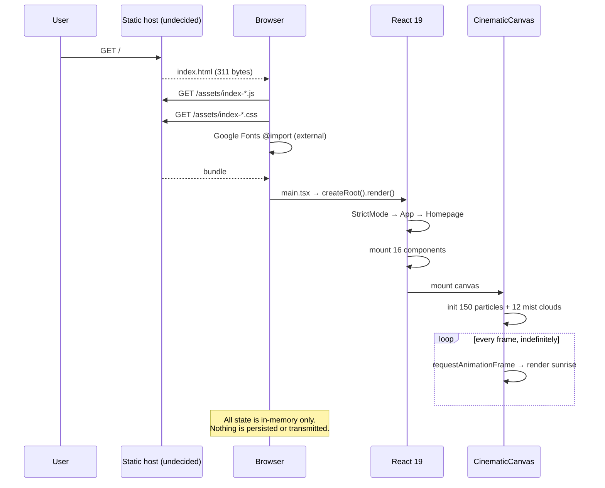
```mermaid
sequenceDiagram
    participant U as User
    participant CDN as Static host (undecided)
    participant B as Browser
    participant R as React 19
    participant C as CinematicCanvas

    U->>CDN: GET /
    CDN-->>B: index.html (311 bytes)
    B->>CDN: GET /assets/index-*.js
    B->>CDN: GET /assets/index-*.css
    B->>B: Google Fonts @import (external)
    CDN-->>B: bundle
    B->>R: main.tsx → createRoot().render()
    R->>R: StrictMode → App → Homepage
    R->>R: mount 16 components
    R->>C: mount canvas
    C->>C: init 150 particles + 12 mist clouds
    loop every frame, indefinitely
        C->>C: requestAnimationFrame → render sunrise
    end
    Note over B: All state is in-memory only.<br/>Nothing is persisted or transmitted.
```

### 5.2 Execution characteristics

| Aspect | Reality |
|---|---|
| Rendering | **Client-side only.** No SSR, no SSG, no hydration. |
| Entry | `main.tsx` → `createRoot` → `StrictMode` → `App` → `Homepage` |
| Routing | **None.** Single page. In-page navigation is `scrollIntoView` on DOM `id`s. |
| State | React local state only. Two hooks. No global store, no context. |
| Persistence | **None.** No `localStorage`, no cookies, no server. State dies on refresh. |
| Network | Only the Google Fonts stylesheet. No application requests are made. |
| Animation | `motion` in 4 of 16 sections (interaction-triggered); canvas `requestAnimationFrame` runs continuously |
| Assets | Bundled JS and CSS only. **No images or video anywhere in the project.** |
| Bundle | ~377 kB JS (119 kB gzip), ~35 kB CSS (6.7 kB gzip) |

### 5.3 Data flow

There is no data flow beyond the browser. Both forms are inert:

- `useContactForm` sets a local success flag. **The message is transmitted nowhere.**
- `useDonationForm` sets a local confirmation flag for four seconds. **No payment occurs.**

This is architecturally significant: the site currently *collects nothing, stores nothing, and transmits nothing*, which is why it presently raises no data-protection obligations. That changes the moment any backend is introduced.

### 5.4 Deployment assumptions

The application builds to static assets and requires no runtime beyond a web server. It has **never been deployed**, and the repository has never been pushed.

Note that `metadata.json` declares `MAJOR_CAPABILITY_SERVER_SIDE_GEMINI_API` and `.env.example` documents `GEMINI_API_KEY` and `APP_URL`. These are Google AI Studio scaffold artifacts describing a capability the application does not use. They must not be read as an approved hosting or AI arrangement.

**OPEN DECISION — REQUIRES ERNESTO'S APPROVAL**
Hosting and deployment target. Constrained by `docs/# 16`: *"Nunca dependeremos completamente de un proveedor"*, with a requirement to run local / cloud / hybrid / multicloud / edge. This argues against deeply proprietary managed platforms.

**OPEN DECISION — REQUIRES ERNESTO'S APPROVAL**
Rendering strategy for future content-bearing modules. Client-only SPA suffices today; the Academy and Guidance Center will likely need indexable URLs, which forces SSR or SSG.

### 5.5 What explicitly does not exist at runtime

Stated without hedging, because the institutional corpus describes several of these in detail:

| Capability | Status |
|---|---|
| Backend / application server | **Does not exist** |
| Database / persistence | **Does not exist** |
| Authentication | **Does not exist** |
| Authorization | **Does not exist** |
| API (consumed or exposed) | **Does not exist** |
| API gateway | **Does not exist** (mandated for HERA — Section 10) |
| Server-side rendering | **Does not exist** |
| Background processing | **Does not exist** |
| File storage | **Does not exist** |
| Observability / logging | **Does not exist** |
| HERA / any AI integration | **Does not exist** |

---

## 6. Frontend Architecture

### 6.1 Layer responsibilities

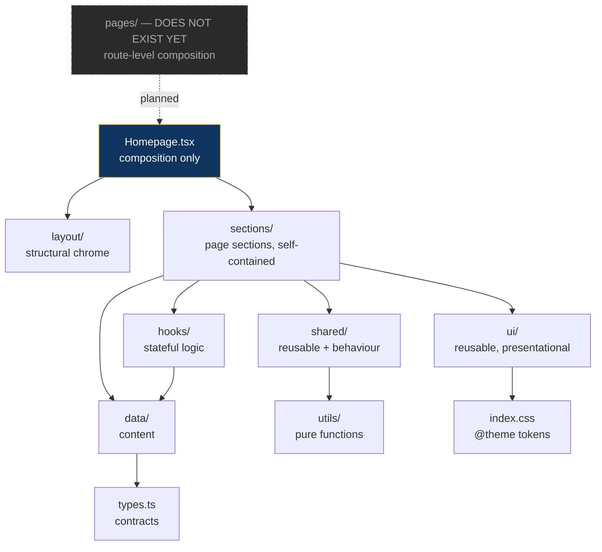
```mermaid
graph TD
    P["pages/ — DOES NOT EXIST YET<br/>route-level composition"]
    HP["Homepage.tsx<br/>composition only"]
    L["layout/<br/>structural chrome"]
    S["sections/<br/>page sections, self-contained"]
    SH["shared/<br/>reusable + behaviour"]
    UI["ui/<br/>reusable, presentational"]
    H["hooks/<br/>stateful logic"]
    D["data/<br/>content"]
    U["utils/<br/>pure functions"]
    T["types.ts<br/>contracts"]
    ST["index.css<br/>@theme tokens"]

    P -.planned.-> HP
    HP --> L
    HP --> S
    S --> SH
    S --> UI
    S --> H
    S --> D
    SH --> U
    H --> D
    D --> T
    UI --> ST

    style P fill:#2a2a2a,stroke:#666,color:#aaa,stroke-dasharray: 5 5
    style HP fill:#0f3460,stroke:#d4af37,color:#fff
```

**Dependency direction is one-way and downward.** A `ui/` primitive never imports a section; `data/` never imports a component; `utils/` imports nothing from the application.

| Layer | Contains | Admission test |
|---|---|---|
| `pages/` | *Does not exist yet* | Created when a second route exists |
| `layout/` | `Header`, `FooterSection` | Would it appear on most pages? |
| `sections/` | 14 page sections | Does it own a `<section>` and a slice of the narrative? |
| `ui/` | `SectionEyebrow`, `GoldDivider` | Style-only, no business meaning? |
| `shared/` | `ScrollButton` | Encapsulates an interaction? |
| `hooks/` | Two form hooks | Stateful logic reusable or worth isolating? |
| `utils/` | `scroll.ts`, `audio.ts` | Pure, framework-independent? |
| `data/` | `homepage.ts` | Editorial content, no logic |
| `types.ts` | Shared interfaces | Used by more than one module? |
| `assets/` | *Effectively empty* | Static binary assets — none yet |
| `index.css` | `@theme` + utilities | Brand tokens, global styles |

### 6.2 Component responsibilities

- **`Homepage.tsx` is a composition layer only.** Imports and JSX. It is 40 lines and should stay in that neighbourhood.
- **Sections are self-contained.** A section owns its local state and imports its own content. Sections do not import one another.
- **Sections are exported through `sections/index.ts`** so page files import from one place.
- **Content lives in `data/`, never hardcoded in JSX.**
- **State lives at the lowest level that works.**

### 6.3 Separation of concerns

| Concern | Home |
|---|---|
| Structure & composition | `Homepage.tsx`, `layout/` |
| Presentation | `sections/`, `ui/` |
| Behaviour | `shared/`, `hooks/` |
| Content | `data/` |
| Contracts | `types.ts` |
| Pure logic | `utils/` |
| Visual tokens | `index.css` |

A component that mixes two of these is a candidate for splitting.

### 6.4 Growth rules

1. **A second route introduces `src/pages/`**, and each page gets its own `data/<page>.ts`. `data/homepage.ts` must not become a global content dump.
2. **Extract on the second use, not the first.** Premature abstraction costs as much as duplication.
3. **Components stay under ~150 lines.** All current sections comply; the largest is `ContactSection` at 139.
4. **New shared behaviour becomes a hook or a `shared/` component**, never a copy-paste.
5. **When a section exceeds its own file comfortably**, split it into a section plus local sub-components — do not promote incidental parts to `ui/`.
6. **Growth beyond one application** is deferred; monorepo tooling is a ratified deferral (`PROJECT_CONSTITUTION.md` A.3).

### 6.5 How reusable components should evolve

The current `ui/` and `shared/` layers are deliberately thin — three components total — because only three patterns have genuinely repeated. The intended evolution is **evidence-driven**: a pattern earns promotion into `ui/` when it appears a second time with identical markup, and into `shared/` when it appears a second time with identical behaviour.

The long-term destination is a small design-system layer whose components emit tokenised markup exclusively. That is contingent on resolving the dual-colour-system problem (Section 8.4) and is not yet actionable.

### 6.6 Why visual consistency is critical

Visual consistency is not a matter of taste here; it is a **trust mechanism**. Alborada asks institutions and donors to believe it can steward children and money over decades. A surface that appears carelessly assembled undermines that claim more efficiently than any argument can support it.

Consistency is also an architectural property. Arbitrary values — fifteen text opacities, eight border opacities, five background colours — are not merely untidy; they make change unsafe, because no one can predict what a modification affects. Tokenisation is therefore a maintainability requirement as much as an aesthetic one.

This is why `PROJECT_CONSTITUTION.md` and `CLAUDE.md` both require that refactors prove identical rendered output, and why redesign requires explicit approval.

---

## 7. Content Architecture

### 7.1 Current model

Content is code-resident and typed: `src/data/homepage.ts` (476 lines) exports typed arrays; `src/types.ts` defines their shapes; sections consume them. Content changes are data edits, reviewable independently of layout.

### 7.2 Language policy

| Domain | Language |
|---|---|
| User-facing copy | **Spanish** |
| Code identifiers, comments, commits, technical docs | **English** |
| Institutional corpus (`docs/`) | Spanish |

These are never mixed. A variable is `donationTiers`, and the string it holds is `"Sponsor de Educación Élite"`.

### 7.3 Localization readiness

The current structure is **localization-ready but not localized**. Because content is already separated from markup and typed, introducing locale keys would not require touching components — the substitution point already exists.

No i18n library is present and none is approved.

**OPEN DECISION — REQUIRES ERNESTO'S APPROVAL**
Whether the platform will be multilingual, and if so which locales. This materially affects content architecture, routing, and SEO strategy, and should be settled before the content volume grows.

### 7.4 Content classification

Derived from `docs/# 10_TRANSPARENCY_STANDARD` Cap. VII and `docs/# 32_CHILD_PROTECTION_SYSTEM`:

| Class | Definition | May appear publicly | Examples |
|---|---|---|---|
| **Public** | Institutional communication | Yes | Mission, model, campus plan, aggregate transparency reporting |
| **Internal** | Operational, non-sensitive | No | SOPs, internal planning, staff procedure |
| **Confidential** | Institutional sensitive | No | Finances in detail, legal matters, campus security |
| **Highly Sensitive** | Concerning minors | **Never** | Personal, medical, psychological data; **individual academic records** |

`docs/# 10` is explicit: *"Ser transparentes no significa divulgar información privada… La transparencia siempre respetará la privacidad."*

### 7.5 Protection of information involving minors

Binding architectural rules:

1. No names, images, or personal histories of students on any public surface.
2. **Individual academic data is never published**, even anonymised, without institutional authorization.
3. Aggregate reporting must not permit re-identification. **With a founding cohort of fifteen, ordinary aggregation may be insufficient** — a specific privacy analysis is required before any statistic derived from student data is published.
4. `docs/# 01_BRAND_BIBLE` Cap. VII forbids imagery that compromises dignity, guilt-based fundraising, manipulated statistics, and invented results.

> **Known violation, currently in the codebase.** `DonationSection` renders hardcoded funding percentages as live progress bars and displays a completed-transaction state with no payment processor. This contradicts `docs/# 01` and `docs/# 10`. Tracked as `PROJECT_CONSTITUTION.md` open item B.6. It must not reach production.

### 7.6 Future editorial workflow

The institutional corpus already defines a 13-stage approval workflow (`docs/# 1007`) culminating in publication, and states that *"Ningún documento tendrá validez institucional sin haber recorrido el proceso definido."* Website content is currently outside that workflow entirely — it is changed by editing a TypeScript file.

**OPEN DECISION — REQUIRES ERNESTO'S APPROVAL**
Whether public website copy is subject to the `docs/# 1007` approval workflow, and if so how a git-based content file participates in a process designed for institutional documents.

**OPEN DECISION — REQUIRES ERNESTO'S APPROVAL**
Whether content remains code-resident (developer-edited, version-controlled, deploy-coupled) or moves to a CMS (staff-edited, decoupled). The current architecture deliberately keeps both options open.

---

## 8. Design System Architecture

### 8.1 Current visual language

| Element | Current implementation |
|---|---|
| **Palette** | Near-black canvas; gold accent `#d4af37`; navy ramp |
| **Accent use** | Deliberately sparse — eyebrows, CTAs, icons, dividers, figures |
| **Typography** | Cormorant Garamond (display/serif), Inter (body/sans), JetBrains Mono (defined, barely used) |
| **Heading style** | `font-light`, wide tracking — restraint as institutional confidence |
| **Spacing** | `py-28` vertical rhythm across most sections |
| **Motion** | `motion` in 4 of 16 sections, interaction-triggered only; canvas runs a continuous rAF loop |
| **Depth** | Three large blur glows; one dot-grid texture |
| **Imagery** | **None.** No images or video exist anywhere in the project. |

### 8.2 Tailwind v4, CSS-first

There is **no `tailwind.config.js`** and no PostCSS config. Theme values live in the `@theme` block of `src/index.css`:

```
@theme {
  --font-serif / --font-sans / --font-mono
  --color-gold-50 … --color-gold-900   (gold-500 = #d4af37)
  --color-navy-50 … --color-navy-950   (navy-950 = #050A1A, navy-800 = #020408)
}
```

To change a brand value, edit `@theme`. **Do not create a config file.**

### 8.3 Theme tokens

`src/index.css` is the single source of truth for brand values. `MASTER_DEVELOPMENT_GUIDE.md` documents them; it does not define them.

### 8.4 Known coexistence of raw hex values

Two colour systems currently coexist, and this is the most consequential design-system defect:

| Notation | Where |
|---|---|
| Theme tokens (`bg-navy-950`, `text-gold-500`) | `App.tsx`, `CinematicCanvas.tsx`, `DonationSection.tsx` |
| Raw hex (`bg-[#020712]`, `bg-[#050a16]`, `text-[#d4af37]`) | Most sections |

Three of the primary backgrounds in use — `#020712`, `#050a16`, `#07101f` — **exist nowhere in `@theme`**. Meanwhile `#050a16` and `#050a1a` differ by four in the blue channel: imperceptible, and therefore certainly accidental drift.

**Consequence:** a rebrand currently requires a find-and-replace across nearly every component instead of one edit to `@theme`.

Measured drift across the codebase:

| Property | Distinct values in use |
|---|---|
| Text opacity | 15 |
| Border opacity | 8 |
| Card background | 10 |
| Corner radius | 5 |
| Container width | 7 |
| Icon size | 5 |

### 8.5 Future standardization strategy

Sequenced so that each step is independently verifiable:

1. Tokenise the three undefined background colours into `@theme`.
2. Collapse the opacity, radius, and container scales to a small fixed set.
3. Migrate components from raw hex to tokens — mechanical but touching nearly every file, therefore its own change with DOM-diff verification.
4. Harmonise the two sections built in a different design generation (`DonationSection`, `OrientationSection`).
5. Formalise a motion scale (shared easing curve, three durations).

Steps 3 and 4 alter rendered output in principle and therefore require explicit approval.

### 8.6 Redesign requires approval

**Stated explicitly.** The visual identity is not to be altered incidentally, opportunistically, or as a side effect of other work. Refactoring must produce identical rendered output, proven by DOM diff rather than asserted. Any change to the visual language — colour, typography, spacing, motion, layout — is a design decision requiring Ernesto's approval.

`docs/# 01_BRAND_BIBLE` imposes **no** colour or typography constraints; it explicitly disclaims them. Its constraints are tonal — serene, elegant, reserved, never shouting, never urgent — and the current identity is consistent with them. The brand tokens are therefore a *project* decision, not an institutional one, but they are still a decision and are still owned.

---

## 9. Application Modules

Thirteen modules are catalogued. **Every one except the Public Website is Not Started.** No technology has been selected for any of them.

Sensitivity uses the classification in 7.4. Access levels reference the five levels fixed in `docs/# 16`: 0 Público · 1 Estudiantes · 2 Docentes · 3 Directivos · 4 Administración.

### 9.1 Module map

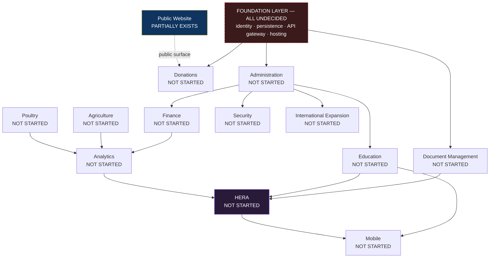
```mermaid
graph TD
    PW["Public Website<br/>PARTIALLY EXISTS"]
    DON["Donations<br/>NOT STARTED"]
    DOC["Document Management<br/>NOT STARTED"]
    ADM["Administration<br/>NOT STARTED"]
    EDU["Education<br/>NOT STARTED"]
    HERA["HERA<br/>NOT STARTED"]
    FIN["Finance<br/>NOT STARTED"]
    AGR["Agriculture<br/>NOT STARTED"]
    AVI["Poultry<br/>NOT STARTED"]
    SEC["Security<br/>NOT STARTED"]
    ANA["Analytics<br/>NOT STARTED"]
    INT["International Expansion<br/>NOT STARTED"]
    MOB["Mobile<br/>NOT STARTED"]

    FOUND["FOUNDATION LAYER — ALL UNDECIDED<br/>identity · persistence · API gateway · hosting"]

    FOUND --> ADM
    FOUND --> DOC
    FOUND --> DON
    ADM --> EDU
    ADM --> FIN
    ADM --> SEC
    DOC --> HERA
    EDU --> HERA
    FIN --> ANA
    AGR --> ANA
    AVI --> ANA
    ANA --> HERA
    EDU --> MOB
    HERA --> MOB
    ADM --> INT
    PW -.public surface.-> DON

    style PW fill:#0f3460,stroke:#d4af37,color:#fff
    style FOUND fill:#3a1a1a,stroke:#c44,color:#fff,stroke-dasharray: 6 4
    style HERA fill:#2a1a3a,stroke:#96f,color:#fff
```

### 9.2 Summary

| Module | Status | Primary users | Access | Sensitivity |
|---|---|---|---|---|
| Public Website | **Partially exists** | Public, donors, allies | 0 | Public |
| Donations | Not started | Donors | 0 | Confidential (financial + PII) |
| Document Management | Not started | Staff, direction | 2–4 | Internal → Confidential |
| Administration | Not started | Staff, direction | 3–4 | Confidential |
| Education | Not started | Students, teachers | 1–2 | **Highly Sensitive** |
| HERA | Not started | All, by level | 0–4 | **Highly Sensitive** |
| Finance | Not started | Direction, admin | 3–4 | Confidential |
| Agriculture | Not started | Operations, students | 1–3 | Internal |
| Poultry | Not started | Operations, students | 1–3 | Internal |
| Security | Not started | Security, direction | 3–4 | **Highly Sensitive** |
| Analytics | Not started | Direction | 3–4 | Confidential |
| International Expansion | Not started | Direction, partners | 3–4 | Confidential |
| Mobile | Not started | Students, staff, public | 0–2 | **Highly Sensitive** |

### 9.3 Module detail

**Public Website** — *Partially exists.*
Communicates mission and enables contact. Currently a static SPA with two inert forms. Depends on nothing. Will later surface Donations and Transparency data. Open: rendering strategy; whether transparency figures are served live or published as reviewed snapshots.

**Donations** — *Not started.*
Accepts contributions and links them to outcomes. Depends on: payment processing, persistence, financial record-keeping, Transparency for credibility. **Highest-risk module in the platform** — money, PCI scope, fraud exposure, legal obligation, and reputational fragility. Must not ship before a testing strategy exists. Open: processor (Colombia availability, nonprofit rates, international cards); hosted vs embedded checkout; tax receipts and jurisdictions; how donation data reaches Transparency without exposing individual donors.

**Document Management** — *Not started.*
Implements the corpus's own document standards — classification, metadata, versioning, approval workflow, traceability. Depends on: persistence, identity, file storage, search. Feeds HERA's knowledge layer directly. **Blocked before design:** `docs/# 1000` and `docs/# 1003` contradict each other on what Serie 1000 and Serie 3000 mean. Open: whether existing 112 documents are migrated or re-authored to standard; how ~45 mandatory metadata fields are captured.

**Administration** — *Not started.*
Institutional operations — people, processes, records. Depends on identity, authorization, persistence, audit logging. Becomes the backbone most other modules attach to. Open: build vs adopt; scope boundary against Finance and HR.

**Education** — *Not started.*
Course delivery, curriculum, assessment, progress. Holds detailed records about minors — the most sensitive data the foundation will ever store. Depends on identity, persistence, media hosting, content pipeline. Open: **build or adopt an existing LMS** — mature open-source options exist and building bespoke is a multi-year commitment for a small team; whether this is a separate application; offline requirements given campus connectivity; retention policy for minors' educational records.

**HERA** — *Not started.*
The institutional intelligence. The corpus specifies its *shape* in unusual detail (see Section 10.3) while naming no technology. Depends on essentially everything: persistence, identity, document management, API gateway, observability. Open: model provider; retrieval strategy; **whether student conversations are persisted at all** — a policy decision preceding any technical one; guardrails and who reviews them; cost bounding against abuse.

**Finance** — *Not started.*
Budgeting, expenditure, financial reporting, donation reconciliation. Feeds Transparency and Analytics. Depends on Administration, Donations. Open: accounting system integration vs native; source of truth for financial data published publicly.

**Agriculture** — *Not started.*
Crop planning, production tracking, campus food systems; doubles as student learning surface. Likely involves IoT sensing. Open: sensor and telemetry approach; whether this is an operational tool, an educational one, or both.

**Poultry** — *Not started.*
Flock management, production, health records. Architecturally near-identical to Agriculture. Open: whether Agriculture and Poultry are one module with two domains or two modules — the answer determines whether a shared operations substrate is worth building.

**Security** — *Not started.*
Campus access control, incident management, safeguarding. Depends on identity, audit logging. **Contains the sharpest unresolved tension in the corpus:** `docs/# 18_SECURITY_PROTOCOLS` contemplates biometrics and facial recognition for campus access, while `docs/# 07` holds that data belongs to the person and `docs/# 32` makes child protection supreme. Biometric data of minors is among the most sensitive categories that exists.

**OPEN DECISION — REQUIRES ERNESTO'S APPROVAL**
Whether biometric identification of minors is permissible at all. This must be ruled on before any Security specification is written.

**Analytics** — *Not started.*
Institutional metrics and decision support. Consumes from Finance, Education, Agriculture, Poultry, Operations. **Constrained:** with a cohort of fifteen, any student-derived metric risks re-identification. Open: aggregation thresholds guaranteeing anonymity; live vs reviewed-snapshot publication.

**International Expansion** — *Not started.*
Replication of the model in new territories. Implies multi-tenancy, multi-currency, multi-jurisdiction, multi-language. Open: whether replication is multi-tenant software or independent deployments — a foundational decision that would ripple through every other module if deferred too long.

**Mobile** — *Not started.*
Student, staff, and public access on device. Depends on identity, API ecosystem, most content modules. Open: native vs cross-platform vs progressive web app; **whether minors hold accounts at all**, which changes the legal position of the entire platform.

### 9.4 Cross-cutting open decision

**OPEN DECISION — REQUIRES ERNESTO'S APPROVAL**
**Do minors hold authenticated accounts?** This single question determines the legal posture, data-retention obligations, consent mechanics, and safeguarding requirements of Education, HERA, Mobile, and Security simultaneously. It should be answered before any of them is designed.

---

## 10. Backend Architecture

**No backend exists.** Nothing in this section describes a running system. It defines *capabilities the platform will require* and records what the institutional corpus already constrains — deliberately without selecting technology.

### 10.1 Current reality

| Capability | Status |
|---|---|
| API layer | Does not exist |
| Business rules | Does not exist (no logic outside presentation) |
| Authentication | Does not exist |
| Authorization | Does not exist |
| Validation | Does not exist (`required` attributes only; no meaningful validation) |
| Notifications | Does not exist |
| Audit logs | Does not exist |
| Document services | Does not exist |
| File storage | Does not exist |
| Background processing | Does not exist |
| Integrations | Does not exist |
| Observability | Does not exist |
| Horizontal scalability | Not applicable — static assets only |

### 10.2 Future capability requirements

Expressed as capabilities, not products.

| Capability | Requirement |
|---|---|
| **API layer** | Single external entry point. Versioned, documented, authenticated by default with public access as explicit exception. |
| **Business rules** | Domain logic isolated from transport and storage. Independently testable. |
| **Authentication** | Verifiable identity for humans and services. Secure credential handling, recovery, session lifecycle. |
| **Authorization** | Enforcement of the five permission levels plus finer-grained rules. **Server-side always**, regardless of UI state. |
| **Validation** | Every input validated at the trust boundary. Client validation is UX, never a control. |
| **Notifications** | Transactional delivery with preference management and audit trail. |
| **Audit logs** | Append-only, tamper-evident, queryable. Records actor, action, timestamp, authority. Themselves protected data. |
| **Document services** | Classification, metadata, versioning, approval workflow, traceability, retention — per `docs/# 1003`–`# 1008`. |
| **File storage** | Durable, access-controlled, encrypted at rest. Distinguishes public assets from confidential documents from highly sensitive records. |
| **Background processing** | Asynchronous jobs, scheduling, retry with backoff, dead-letter visibility. |
| **Integrations** | Outbound to external systems through an anti-corruption layer so external models never leak into the domain. |
| **Observability** | Structured logging, metrics, tracing, alerting. Required to defend the 99.9 % target. |
| **Horizontal scalability** | Stateless application tier; state externalised; no single-instance assumptions. |

### 10.3 Constraints the corpus already imposes

These are **binding** and narrow the solution space without naming a product:

| Constraint | Source | Architectural consequence |
|---|---|---|
| *"Nunca dependeremos completamente de un proveedor"* — must run local, cloud, hybrid, multicloud, edge | `# 16` | Argues strongly against deeply proprietary managed services. **The single most consequential technical constraint in the corpus.** |
| API Gateway mandatory — *"Nunca se accederá directamente a los motores internos"* | `# 16`, `# 08` | All external traffic through one controlled entry point |
| Ten single-responsibility engines | `# 16` | Memory, Reasoning, Planning, Communication, Knowledge, Learning, Security, Monitoring, Tool, Workflow |
| Reasoning Engine *"nunca accederá directamente a bases de datos"* | `# 16` | All data access mediated by the Memory Engine |
| *"No existirá una única base"* — per-domain databases | `# 16` | Polyglot persistence across ~10 named domains |
| Five permission levels | `# 16` | Fixed coarse authorization frame |
| 99.9 % annual availability | `# 24` | ~8.8 h downtime/year budget; drives redundancy and observability |
| Encryption and protection by default; least privilege; full audit | `# 07`, `# 18`, `# 32` | Non-negotiable baseline |
| Human approval never replaced by automation | `# 1007` | Workflow engines propose; humans decide |

### 10.4 Conceptual target shape

Illustrative only — no component here is approved, and every box is a capability rather than a product.

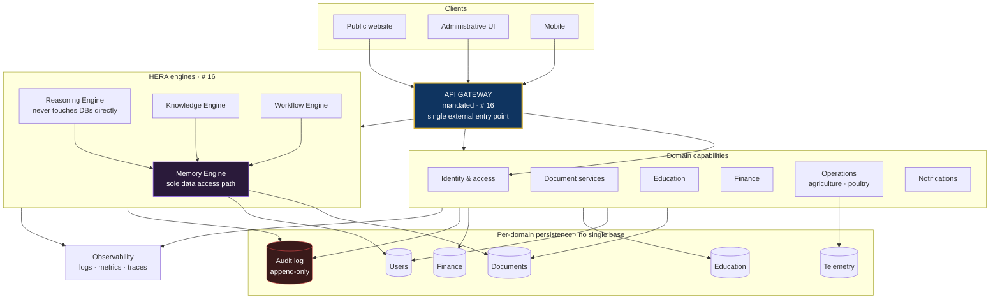
```mermaid
graph TD
    subgraph CLIENTS["Clients"]
        WEB["Public website"]
        ADMIN["Administrative UI"]
        MOBILE["Mobile"]
    end

    GW["API GATEWAY<br/>mandated · # 16<br/>single external entry point"]

    subgraph SVC["Domain capabilities"]
        AUTH["Identity & access"]
        DOCS["Document services"]
        EDU["Education"]
        FIN["Finance"]
        OPS["Operations<br/>agriculture · poultry"]
        NOTIF["Notifications"]
    end

    subgraph HERA_L["HERA engines · # 16"]
        MEM["Memory Engine<br/>sole data access path"]
        REA["Reasoning Engine<br/>never touches DBs directly"]
        KNO["Knowledge Engine"]
        WFL["Workflow Engine"]
    end

    subgraph DATA["Per-domain persistence · no single base"]
        DB1[("Documents")]
        DB2[("Users")]
        DB3[("Education")]
        DB4[("Finance")]
        DB5[("Telemetry")]
        AUDIT[("Audit log<br/>append-only")]
    end

    OBS["Observability<br/>logs · metrics · traces"]

    WEB --> GW
    ADMIN --> GW
    MOBILE --> GW
    GW --> AUTH
    GW --> SVC
    GW --> HERA_L
    REA --> MEM
    KNO --> MEM
    WFL --> MEM
    MEM --> DB1
    MEM --> DB2
    SVC --> DB1
    SVC --> DB2
    SVC --> DB3
    SVC --> DB4
    OPS --> DB5
    SVC --> AUDIT
    HERA_L --> AUDIT
    SVC --> OBS
    HERA_L --> OBS

    style GW fill:#0f3460,stroke:#d4af37,color:#fff,stroke-width:3px
    style AUDIT fill:#3a1a1a,stroke:#c44,color:#fff
    style MEM fill:#2a1a3a,stroke:#96f,color:#fff
```

### 10.5 Open decisions

Every item below is unresolved. **No implementation may assume an answer.**

**OPEN DECISION — REQUIRES ERNESTO'S APPROVAL** — Backend language and framework. Nothing is named anywhere in 112 documents.

**OPEN DECISION — REQUIRES ERNESTO'S APPROVAL** — Persistence technologies per domain, consistent with *"No existirá una única base"* and the portability mandate.

**OPEN DECISION — REQUIRES ERNESTO'S APPROVAL** — Identity provider and protocol. Managed vs self-hosted; a small team getting authentication wrong is a serious risk, which weighs toward managed — but that tensions against no-vendor-lock-in.

**OPEN DECISION — REQUIRES ERNESTO'S APPROVAL** — API style: REST, GraphQL, RPC, or mixed.

**OPEN DECISION — REQUIRES ERNESTO'S APPROVAL** — Hosting and deployment model; how the local/cloud/hybrid/edge requirement is actually satisfied.

**OPEN DECISION — REQUIRES ERNESTO'S APPROVAL** — Synchronous versus event-driven communication between capabilities.

**OPEN DECISION — REQUIRES ERNESTO'S APPROVAL** — Observability stack.

**OPEN DECISION — REQUIRES ERNESTO'S APPROVAL** — Testing strategy. None exists. **This must be resolved before any module handling money, personal data, or authentication ships.**

**OPEN DECISION — REQUIRES ERNESTO'S APPROVAL** — Applicable legal regime. The corpus defers everywhere to *"legislación aplicable"* without naming it. Minors' data in Colombia with international donors likely implicates Ley 1581/2012 (habeas data) and possibly GDPR. **This cannot be engineered against while unnamed**, and it constrains persistence, retention, residency, and audit design.

**OPEN DECISION — REQUIRES ERNESTO'S APPROVAL** — LLM provider, retrieval strategy, and vector storage for HERA. `@google/genai` sitting unused in `package.json` is scaffold residue and constitutes no approval.

---

## 11. Data Architecture

**No database technology is selected.** This section defines the institutional data model as *domains* — coherent bodies of information with distinct ownership, sensitivity, and lifecycle. Domains are a logical concept; how many physical stores they map to is a separate decision.

The corpus establishes the frame in `docs/# 16`: *"No existirá una única base. Existirán varias especializadas."* It names ten domains (Documentos, Usuarios, Conversaciones, Memoria, Logs, Métricas, Sensores, Finanzas, Agricultura, Investigación). The model below extends that to institutional scope.

### 11.1 The governing constraint

Before any domain description: **data concerning minors is architecturally isolated, not merely access-controlled.**

`docs/# 32` makes child protection supreme over every other objective. `docs/# 07` establishes that *"Los datos pertenecen a las personas. No a la Fundación. No a HERA."* `docs/# 10` forbids publication of individual academic, medical, and psychological data.

The architectural consequence is stronger than a permission check. Highly sensitive domains must be **separable stores with independent credentials, independent encryption keys, and independent audit trails**, such that a compromise of the administrative or public tier does not extend to them, and such that no ordinary query path can join a student's identity to their health or psychological record.

### 11.2 Sensitivity tiers

| Tier | Definition | Handling |
|---|---|---|
| **T0 — Public** | Intended for publication | Standard controls |
| **T1 — Internal** | Operational, non-personal | Authenticated access, audit on write |
| **T2 — Confidential** | Institutional sensitive, adult personal data | Encrypted, least privilege, audit on read and write |
| **T3 — Highly Sensitive** | Concerning minors; health; psychology | Isolated store, separate keys, full audit, no analytics join without aggregation review, no export without institutional authorization |

### 11.3 Domain map

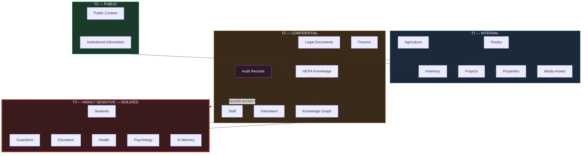
```mermaid
graph TD
    subgraph T0["T0 — PUBLIC"]
        PC["Public Content"]
        II["Institutional Information"]
    end

    subgraph T1["T1 — INTERNAL"]
        AGR["Agriculture"]
        AVI["Poultry"]
        INV["Inventory"]
        PRJ["Projects"]
        PROP["Properties"]
        MED["Media Assets"]
    end

    subgraph T2["T2 — CONFIDENTIAL"]
        STF["Staff"]
        VOL["Volunteers"]
        FIN["Finance"]
        LEG["Legal Documents"]
        AUD["Audit Records"]
        KNW["HERA Knowledge"]
        KG["Knowledge Graph"]
    end

    subgraph T3["T3 — HIGHLY SENSITIVE — ISOLATED"]
        STU["Students"]
        GUA["Guardians"]
        EDU["Education"]
        HLT["Health"]
        PSY["Psychology"]
        AIM["AI Memory"]
    end

    PC --> II
    STF --> EDU
    STU --> EDU
    STU --> HLT
    STU --> PSY
    STU --> GUA
    AGR --> INV
    AVI --> INV
    FIN --> PRJ
    FIN --> PROP
    II --> KNW
    LEG --> KNW
    KNW --> KG
    KG --> AIM
    AUD -.records access to.-> T3

    style T3 fill:#3a1a1a,stroke:#c44,color:#fff,stroke-width:3px
    style T2 fill:#3a2a1a,stroke:#c84,color:#fff
    style T1 fill:#1a2a3a,stroke:#48c,color:#fff
    style T0 fill:#1a3a2a,stroke:#4c8,color:#fff
    style AUD fill:#2a1a2a,stroke:#a6a,color:#fff
```

### 11.4 Domain summary

| Domain | Tier | Owner | Access level | Growth |
|---|---|---|---|---|
| Public Content | T0 | Communications | 0 | Low, steady |
| Institutional Information | T0 | Direction | 0–3 | Low, steady |
| Staff | T2 | Human Resources | 3–4 | Low |
| Volunteers | T2 | Human Resources | 3–4 | Moderate, seasonal |
| **Students** | **T3** | Direction + Safeguarding | 3–4 | Very low volume, very high depth |
| **Guardians** | **T3** | Direction + Safeguarding | 3–4 | Very low |
| **Education** | **T3** | Academic Direction | 2–4 | High and continuous |
| **Health** | **T3** | Medical | Medical only | Continuous |
| **Psychology** | **T3** | Psychology | Psychology only | Continuous |
| Finance | T2 | Finance | 3–4 | High, transactional |
| Agriculture | T1 | Operations | 1–3 | High if sensor-driven |
| Poultry | T1 | Operations | 1–3 | High if sensor-driven |
| Inventory | T1 | Operations | 2–4 | Moderate |
| Projects | T1 | Direction | 2–4 | Moderate |
| Properties | T1 | Administration | 3–4 | Low |
| Legal Documents | T2 | Legal | 4 | Low, permanent |
| Audit Records | T2 | Direction + Audit | Auditor, append-only | Very high, monotonic |
| Media Assets | T1 | Communications | 0–3 | High (binary) |
| HERA Knowledge | T2 | Direction | 0–4 by level | High |
| Knowledge Graph | T2 | Direction | 0–4 by level | High, derived |
| **AI Memory** | **T3** | Direction + Safeguarding | Subject + authorized | High, continuous |

### 11.5 Domain detail

#### T3 — Highly sensitive

**Students.** Identity, enrolment, and lifecycle for the girls in the programme. *Ownership:* Direction jointly with safeguarding. *Growth:* fifteen records in the founding cohort — very low volume, extraordinary depth over a decade. *Retention:* likely long or permanent for institutional continuity, but the boundary between institutional memory and a person's right to be forgotten is unresolved. *Access:* narrowly scoped, individually justified, fully logged. *Relationships:* the root identity referenced by Education, Health, Psychology, Guardians, AI Memory — and **the join point that must be hardest to traverse**. A pseudonymous key rather than a direct identifier should be considered so that dependent domains do not carry names.

**Guardians.** Family and legal representatives. Consent, authority, and contact. *Sensitivity:* T3 by association — reveals family circumstance. *Retention:* tied to the student relationship. *Relationships:* Students. Consent records here gate lawful processing elsewhere, which makes this domain load-bearing for compliance, not merely contact management.

**Education.** Enrolment, curriculum progress, assessment, learning records. *Growth:* the highest-volume T3 domain — continuous across a decade per student. *Access:* teachers see their own students; direction sees aggregate; **individual academic data is never published** (`docs/# 10`). *Relationships:* Students, Staff, HERA. *Note:* aggregate reporting from fifteen students may still identify individuals; see 11.7.

**Health.** Medical records. *Ownership:* medical personnel exclusively. *Access:* **medical role only** — not direction, not administration, not analytics. *Retention:* governed by medical record law, unknown until the legal regime is named. *Relationships:* Students only. Must not be joinable with Education or Analytics.

**Psychology.** Psychological and emotional support records. Held separately from Health because the professional duty, access set, and disclosure rules differ. *Access:* psychology role only. *Relationships:* Students only. **This is the single most sensitive domain in the platform**; a disclosure here causes harm that no remediation reverses.

**AI Memory.** HERA's long-term memory of individuals. `docs/# 14` establishes that a student's personal memory is private and *"La estudiante conservará el control sobre esta información."* *Access:* the subject, plus narrowly authorized roles. *Retention:* must support deletion at the subject's request. *Relationships:* Students, Education, Knowledge Graph — but the graph must not absorb personal memory into shared institutional knowledge.

**OPEN DECISION — REQUIRES ERNESTO'S APPROVAL**
Whether HERA persists conversations with students at all. Storing them creates a duty of care proportional to their intimacy; not storing them forfeits continuity of mentoring. This is a policy decision that must precede any technical design of the Memory Engine.

#### T2 — Confidential

**Staff.** Employment, roles, qualifications, performance. *Access:* HR and direction. *Relationships:* Education (as teachers), Audit.

**Volunteers.** Identity, vetting status, assignments. *Sensitivity:* T2, elevated because **volunteer vetting status is safeguarding data**. *Growth:* moderate and seasonal, with high turnover — the domain most likely to accumulate stale records. *Relationships:* Staff-adjacent, Security.

**Finance.** Budgets, expenditure, donations, reconciliation. *Growth:* high and transactional. *Retention:* statutory, typically long. *Relationships:* Projects, Properties, Analytics, Transparency reporting. Donation records contain donor PII and must not become public through transparency reporting.

**Legal Documents.** Constitutive documents, contracts, regulatory filings, IP. *Growth:* low; *retention:* effectively permanent. *Access:* level 4. *Relationships:* Properties, Finance, Institutional Information.

**Audit Records.** Append-only record of who did what, when, under what authority. *Ownership:* direction with independent auditor read access. *Growth:* the fastest-growing domain in the system and monotonic — it only accumulates. *Retention:* long by definition; an audit trail shorter than the incidents it must evidence is useless. *Access:* **append-only for all writers; no actor may delete or amend.** *Relationships:* records access to every other domain, especially T3.

**HERA Knowledge.** The institutional corpus and derived representations available for retrieval. *Access:* filtered by permission level at retrieval time — a level-1 query must not surface level-4 content. *Relationships:* Documents, Institutional Information, Legal, Knowledge Graph.

**Knowledge Graph.** Entities and relationships derived from institutional knowledge. *Growth:* high, derived. *Critical constraint:* **the graph must not become a re-identification vector.** A graph that links enough anonymous facts can reconstruct an individual; the boundary between institutional knowledge and personal data must be enforced at ingestion, not at query time.

#### T1 — Internal

**Agriculture** and **Poultry.** Production planning, cycles, yields, health, resource use. *Growth:* high if IoT sensing is adopted — telemetry dominates volume. *Access:* operations; students where it serves learning. *Retention:* operational data ages quickly; raw telemetry likely downsampled after a defined window. *Relationships:* Inventory, Analytics, Education.

**Inventory.** Assets, supplies, equipment. *Relationships:* Agriculture, Poultry, Finance, Properties.

**Projects.** Initiatives, milestones, campus construction. *Relationships:* Finance, Properties, Public Content (progress reporting).

**Properties.** Land, buildings, infrastructure. *Growth:* low; *retention:* permanent. *Relationships:* Legal, Finance, Projects.

**Media Assets.** Photography, video, renders, documents-as-media. *Growth:* high in bytes, low in records. **Governed by `docs/# 01_BRAND_BIBLE` Cap. VII:** no imagery compromising the dignity of the girls. Any asset depicting a minor is T3 regardless of where it is stored, and requires explicit consent and publication review.

#### T0 — Public

**Public Content.** Website copy, published reports, public communication. Currently code-resident in `src/data/homepage.ts`. *Relationships:* Institutional Information, Transparency reporting.

**Institutional Information.** Mission, governance, structure, policy. Partly the corpus itself. *Relationships:* source for Public Content and HERA Knowledge.

### 11.6 Cross-domain rules

1. **T3 domains are isolated stores.** Separate credentials, separate encryption keys, separate audit streams.
2. **No direct joins from T3 into Analytics.** Only reviewed, aggregated projections cross the boundary.
3. **Audit is append-only** and records every T3 access without exception.
4. **Consent state gates processing.** Guardians' consent records are consulted, not assumed.
5. **Pseudonymous keys** should be preferred over direct identifiers in dependent domains.
6. **Deletion is a first-class operation** in T3 — the architecture must support removing a subject's data, which rules out designs where personal data is irreversibly baked into derived artifacts.

### 11.7 The fifteen-student problem

A recurring constraint deserving its own statement: **the founding cohort is fifteen people.** At that scale, ordinary anonymisation fails. "Average assessment score by year group" may identify individuals. "Three students required medical attention" may be re-identifiable to anyone who knows the cohort.

Any statistic derived from student data therefore requires an explicit privacy analysis before publication — including in the Transparency Dashboard, whose entire purpose is publication.

**OPEN DECISION — REQUIRES ERNESTO'S APPROVAL**
Minimum aggregation thresholds and suppression rules for any student-derived statistic.

### 11.8 Open decisions

**OPEN DECISION — REQUIRES ERNESTO'S APPROVAL** — Database technologies per domain, consistent with *"No existirá una única base"* and the portability mandate.

**OPEN DECISION — REQUIRES ERNESTO'S APPROVAL** — Data residency. Where T3 data physically resides has legal consequences that depend on the unnamed legal regime.

**OPEN DECISION — REQUIRES ERNESTO'S APPROVAL** — Retention periods per domain. **Cannot be specified until the applicable legal regime is named** (Ley 1581/2012, GDPR, or other).

**OPEN DECISION — REQUIRES ERNESTO'S APPROVAL** — Whether an institutional data warehouse exists, and if so how T3 exclusion is enforced structurally rather than by policy.

---

## 12. API Architecture

**No API style is selected.** REST, GraphQL, RPC, and hybrid approaches all remain open. This section defines the requirements any chosen style must satisfy.

The one fixed constraint comes from `docs/# 16`: **a single API gateway is mandatory** — *"Toda comunicación externa pasará por un único punto… Nunca se accederá directamente a los motores internos."*

### 12.1 Requirements

| Requirement | Specification |
|---|---|
| **Versioning** | Explicit and discoverable. Consumers must never be broken by a server-side change. A version's support window is published, and deprecation is announced before removal. |
| **Authentication** | Every endpoint authenticated by default; public access is an explicit, reviewed exception. Credentials never in URLs. Service-to-service identity distinct from human identity. |
| **Authorization** | Enforced **server-side on every request**, independent of what the client shows. Evaluated against the five permission levels plus resource-scoped rules. Absence of a rule denies. |
| **Validation** | All input validated at the boundary against an explicit schema. Reject unknown fields rather than ignoring them. Client validation is UX, never a control. |
| **Pagination** | Mandatory on every collection. No unbounded response. Stable ordering so pages do not overlap or skip under concurrent writes. |
| **Filtering** | Declarative and server-enforced. Filters must not become an exfiltration channel — a filter over T3 data must obey the same authorization as direct access. |
| **Sorting** | Explicit allowed-field list. Never accept arbitrary field names into a storage query. |
| **Error handling** | Consistent structure, stable machine-readable codes, human-readable message, correlation ID. **Never leak stack traces, internal identifiers, or storage detail.** Authorization failures must not reveal whether a resource exists. |
| **Idempotency** | Required for all state-changing operations that may be retried — payments above all. Client-supplied idempotency keys with a defined retention window. |
| **Rate limiting** | Per identity and per operation class. Protects availability and bounds cost for expensive operations, particularly AI inference. Limits are documented and observable to the caller. |
| **Auditability** | Every request carries a correlation ID propagated through all downstream work. Mutations and T3 reads are recorded in the audit domain. |
| **Documentation** | Machine-readable contract generated from the implementation, not maintained beside it. Drift between contract and behaviour is a defect. |
| **Backward compatibility** | Additive change is the default. Breaking change requires a new version, a migration path, and a deprecation period. |

### 12.2 Boundary model

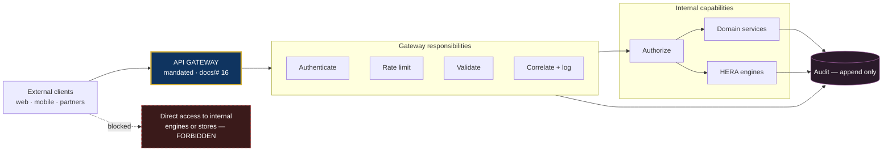
```mermaid
graph LR
    EXT["External clients<br/>web · mobile · partners"]
    GW["API GATEWAY<br/>mandated · docs/# 16"]

    subgraph EDGE["Gateway responsibilities"]
        AUTHN["Authenticate"]
        RATE["Rate limit"]
        VAL["Validate"]
        LOG["Correlate + log"]
    end

    subgraph INT["Internal capabilities"]
        AUTHZ["Authorize"]
        DOM["Domain services"]
        HERA["HERA engines"]
    end

    AUD[("Audit — append only")]

    EXT --> GW --> EDGE --> AUTHZ --> DOM
    AUTHZ --> HERA
    EDGE --> AUD
    DOM --> AUD
    HERA --> AUD

    NEVER["Direct access to internal<br/>engines or stores — FORBIDDEN"]
    EXT -.->|blocked| NEVER

    style GW fill:#0f3460,stroke:#d4af37,color:#fff,stroke-width:3px
    style NEVER fill:#3a1a1a,stroke:#c44,color:#fff,stroke-dasharray: 6 4
    style AUD fill:#2a1a2a,stroke:#a6a,color:#fff
```

### 12.3 Future external integrations

Anticipated categories — none selected, none approved: payment processing, email and messaging delivery, accounting systems, academic and institutional partners, campus IoT telemetry, model providers.

**Architectural rule:** every external integration sits behind an anti-corruption layer. External data models never propagate into the domain. An integration must be replaceable without changing business logic — this is the portability mandate applied at the integration boundary.

### 12.4 Open decisions

**OPEN DECISION — REQUIRES ERNESTO'S APPROVAL** — API style (REST / GraphQL / RPC / hybrid).

**OPEN DECISION — REQUIRES ERNESTO'S APPROVAL** — Contract specification format and tooling.

**OPEN DECISION — REQUIRES ERNESTO'S APPROVAL** — Versioning scheme and support-window policy.

**OPEN DECISION — REQUIRES ERNESTO'S APPROVAL** — Whether any public, unauthenticated API exists at all, and its exact surface.

**OPEN DECISION — REQUIRES ERNESTO'S APPROVAL** — Whether partners receive API access, and under what agreement.

---

## 13. Identity and Access Management

**No identity provider is selected.** This section defines requirements.

### 13.1 The prior question

**OPEN DECISION — REQUIRES ERNESTO'S APPROVAL**
**Do minors hold authenticated accounts?**

This is stated first because it determines everything else in this section. If students authenticate, the platform holds credentials for minors, which changes consent mechanics, recovery flows, session policy, monitoring obligations, and the legal posture of Education, HERA, and Mobile simultaneously. No IAM design should be drafted before it is answered.

### 13.2 Role model

The corpus fixes five coarse levels (`docs/# 16`). Functional roles sit within them.

| Role | Level | Scope | Notes |
|---|---|---|---|
| **Public** | 0 | Published content only | Unauthenticated |
| **Student** | 1 | Own learning, own AI memory | Contingent on 13.1 |
| **Educator** | 2 | Assigned students' academic records | **No health or psychology access** |
| **Direction** | 3 | Institutional operations, aggregates | No individual clinical records |
| **Administration** | 4 | System and institutional administration | Not automatically T3 clinical access |
| **Medical** | special | Health domain only | Narrow, professional |
| **Psychological** | special | Psychology domain only | Narrow, professional |
| **Volunteer** | 1–2 | Task-scoped, time-boxed | Vetting status gates activation |
| **Auditor** | read-only | Audit records, read-only across scope | Independent of direction |
| **HERA service account** | derived | Never exceeds invoking user | See 13.4 |

**The central rule:** administrative seniority does not confer clinical access. A level-4 administrator does **not** automatically read Health or Psychology. Those are professional domains with independent access sets — a distinction that must be structural, because it is the one most likely to erode under operational pressure.

### 13.3 Access model

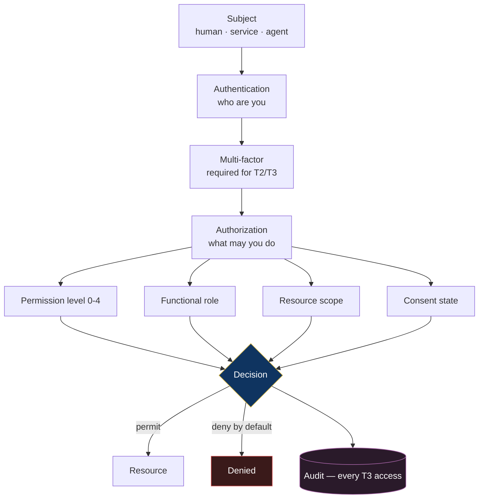
```mermaid
graph TD
    SUB["Subject<br/>human · service · agent"]
    AUTHN["Authentication<br/>who are you"]
    MFA["Multi-factor<br/>required for T2/T3"]
    AUTHZ["Authorization<br/>what may you do"]
    LVL["Permission level 0-4"]
    ROLE["Functional role"]
    SCOPE["Resource scope"]
    CONS["Consent state"]
    DEC{"Decision"}
    AUD[("Audit — every T3 access")]

    SUB --> AUTHN --> MFA --> AUTHZ
    AUTHZ --> LVL --> DEC
    AUTHZ --> ROLE --> DEC
    AUTHZ --> SCOPE --> DEC
    AUTHZ --> CONS --> DEC
    DEC -->|permit| RES["Resource"]
    DEC -->|deny by default| REJ["Denied"]
    DEC --> AUD

    style DEC fill:#0f3460,stroke:#d4af37,color:#fff
    style AUD fill:#2a1a2a,stroke:#a6a,color:#fff
    style REJ fill:#3a1a1a,stroke:#c44,color:#fff
```

### 13.4 HERA service accounts

HERA acts on behalf of users and must never become a privilege-escalation path.

1. **Never exceeds the invoking user's authority.** A level-1 student's query cannot surface level-4 content, regardless of what HERA can technically reach.
2. **Distinct, attributable identity.** Audit records show both the agent and the human on whose behalf it acted.
3. **Narrowly scoped per capability.** The Reasoning Engine holds no data credentials — `docs/# 16` requires all access through the Memory Engine.
4. **Autonomous workflows are bounded**, time-limited, revocable, and cannot approve their own actions (`docs/# 1007`: *"Nunca sustituye la aprobación humana"*).

### 13.5 Access lifecycle

| Concern | Requirement |
|---|---|
| **Temporary access** | Time-boxed with automatic expiry. Extension is a new grant, not a silent renewal. |
| **Emergency access** | A break-glass path must exist for genuine emergencies — particularly medical. Heavily logged, alerts on use, mandatory post-hoc review. **Its absence is itself a safeguarding risk**, so this cannot be deferred indefinitely. |
| **Session management** | Bounded lifetime, idle timeout, revocable centrally. Shorter for T3 contexts. |
| **Password policy** | Length over composition rules. Screened against known-breached credentials. No forced rotation absent evidence of compromise. |
| **Multi-factor** | **Mandatory** for all T2/T3 access and all administrative roles. |
| **Account recovery** | Verified, rate-limited, fully audited. Recovery is the most common attack path against privileged accounts and must be at least as strong as primary authentication. |
| **Periodic access review** | Scheduled recertification by data owners. Volunteers especially — high turnover makes stale access the default failure mode. |
| **Approval workflow** | Elevated access requires documented approval by the data owner. Self-service escalation never exists. |
| **Offboarding** | Immediate revocation across all systems. A single revocation point is required; distributed manual revocation will fail. |

### 13.6 Open decisions

**OPEN DECISION — REQUIRES ERNESTO'S APPROVAL** — Identity provider: managed or self-hosted. Managed reduces the risk of a small team implementing authentication incorrectly; self-hosted better satisfies the no-vendor-lock-in mandate. **These pull in opposite directions and the tension must be resolved deliberately.**

**OPEN DECISION — REQUIRES ERNESTO'S APPROVAL** — Authentication protocols and standards.

**OPEN DECISION — REQUIRES ERNESTO'S APPROVAL** — Second-factor methods, given a campus where phone access may be restricted for students.

**OPEN DECISION — REQUIRES ERNESTO'S APPROVAL** — Whether biometric identification of minors is permissible. `docs/# 18` contemplates facial recognition for campus access; this sits in direct tension with `docs/# 07` and `docs/# 32`. **Must be ruled on before any Security module specification.**

**OPEN DECISION — REQUIRES ERNESTO'S APPROVAL** — Emergency-access policy: who may invoke it, under what circumstances, reviewed by whom.

---

## 14. Security Architecture

### 14.1 Philosophy

Security here is not primarily about protecting an organisation from loss. It is about protecting fifteen children from harm. That distinction changes the calculus: a breach of Psychology records is not a compliance event to be managed, it is an injury to a person that no remediation undoes.

Consequently: **security is a design input, never a review stage.** A design that cannot be secured is rejected rather than shipped and hardened later. Where security and convenience conflict, security prevails and the inconvenience is documented.

### 14.2 Child protection as a security requirement

`docs/# 32` Principle 14 — *"La tecnología debe proteger"* — makes protection a function of the technology itself. Architecturally this means isolation of T3 domains, no public surface that can reach them, full audit of every access, and no analytics or AI pathway that can extract personal data as a side effect.

### 14.3 Privacy by design

Privacy is structural, not a policy layer. Data minimisation at collection. Purpose limitation enforced by domain separation. Pseudonymous keys where identity is not required. Deletion as a first-class operation. `docs/# 07` Cap. VI mandates protection by default and encryption.

### 14.4 Controls

| Control | Requirement |
|---|---|
| **Encryption at rest** | All T2/T3 data. **Independent keys per sensitivity tier**, so one compromise does not cascade. Documented key rotation. |
| **Encryption in transit** | TLS everywhere, internal traffic included. No plaintext internal hop is acceptable on the assumption the network is trusted. |
| **Secret management** | Never in source, never in client bundles, never in logs. Dedicated secret store with rotation and access audit. Current `.env.example` is scaffold residue, not a secrets model. |
| **Input validation** | Schema-based at every trust boundary. Allow-lists over deny-lists. |
| **Output encoding** | Context-appropriate encoding on every rendered value. React escapes by default; any raw-HTML injection path requires explicit review. |
| **Dependency management** | Every dependency is liability. Automated vulnerability scanning, prompt patching, periodic review for removal. **`package.json` currently carries five unused packages that should be removed.** |
| **Logging** | Structured, correlated, centralised. **Never log credentials, tokens, or T3 content.** Logs are themselves protected. |
| **Monitoring** | Availability, error rates, latency, plus security-relevant events: failed authentication, authorization denials, anomalous T3 access. |
| **Security headers** | CSP, HSTS, frame options, referrer policy, permissions policy on every response. Cheap, high-value, currently absent. |
| **File upload validation** | Type, size, and content verified — never trust declared type. Scan for malware. Store outside the web root. Serve through an authorization check, never directly. |
| **Least privilege** | Every actor minimum necessary. Default deny. |
| **Backups** | Automated, encrypted, off-site, **restore-tested on a schedule**. An untested backup is a hypothesis, not a control. |
| **Disaster recovery** | Defined RPO and RTO consistent with the 99.9 % target in `docs/# 24`. Documented and rehearsed. |
| **Incident response** | Written plan: detection, containment, eradication, recovery, notification, post-incident review. **Notification obligations depend on the unnamed legal regime.** |
| **Security review** | Design-stage review for anything touching T2/T3 or authentication. |
| **Audit trails** | Append-only, tamper-evident. Cover authentication, authorization decisions, T3 access, administrative actions, and configuration change. |
| **Threat modelling** | Per module before implementation. Explicitly include insider threat and social engineering — for a residential institution with children, the human vector dominates the technical one. |
| **Supply chain** | Pinned dependencies, integrity verification, provenance where available, minimal build-time network access. |
| **Penetration testing** | Independent testing before any T3 system goes live. **Not optional for systems holding minors' data.** |

### 14.5 Current security posture

Stated honestly: the current application processes no data, stores nothing, transmits nothing, and has no authentication — so its attack surface is minimal and its risk is genuinely low.

Present weaknesses are informational rather than exploitable: no security headers, five unused dependencies, and a scaffold `metadata.json` advertising a Gemini capability that is not used.

**The risk profile changes discontinuously the moment a backend exists.** None of the controls above are in place, and several — secret management, audit, encryption, incident response — must exist *before* the first byte of personal data is stored, not after.

### 14.6 Open decisions

**OPEN DECISION — REQUIRES ERNESTO'S APPROVAL** — Secret management solution.

**OPEN DECISION — REQUIRES ERNESTO'S APPROVAL** — Backup, retention, and disaster-recovery targets (RPO/RTO).

**OPEN DECISION — REQUIRES ERNESTO'S APPROVAL** — Whether an independent security audit is commissioned before launch of any T3 system. **Recommended as mandatory.**

**OPEN DECISION — REQUIRES ERNESTO'S APPROVAL** — Applicable legal regime, which determines breach-notification obligations and lawful bases for processing.

---

## 15. HERA Architecture

### 15.1 What HERA is, and is not

**HERA is a decision-support platform.** It is not a chatbot, and it is not a replacement for people.

`docs/# 1007` is unambiguous: HERA assists but *"Nunca sustituye la aprobación humana."* This is not a limitation to be engineered around as capability improves — it is a permanent property of the design. HERA surfaces knowledge, drafts, analyses, and recommends. **Humans decide, approve, and bear responsibility.**

`docs/# 07` sets the ethical frame: data belongs to the people it describes; it is never sold, never ceded commercially, and never used to manipulate behaviour.

### 15.2 Conceptual architecture

Derived from the ten engines specified in `docs/# 16`. No technology is selected for any component.

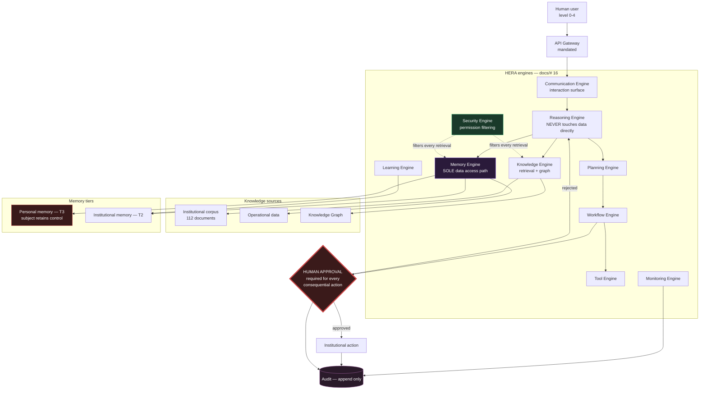
```mermaid
graph TD
    U["Human user<br/>level 0-4"]
    GW["API Gateway<br/>mandated"]

    subgraph ENG["HERA engines — docs/# 16"]
        COM["Communication Engine<br/>interaction surface"]
        REA["Reasoning Engine<br/>NEVER touches data directly"]
        PLA["Planning Engine"]
        MEM["Memory Engine<br/>SOLE data access path"]
        KNO["Knowledge Engine<br/>retrieval + graph"]
        LEA["Learning Engine"]
        WFL["Workflow Engine"]
        TOO["Tool Engine"]
        SEC["Security Engine<br/>permission filtering"]
        MON["Monitoring Engine"]
    end

    subgraph KB["Knowledge sources"]
        DOCS["Institutional corpus<br/>112 documents"]
        OPS["Operational data"]
        GRAPH["Knowledge Graph"]
    end

    subgraph MEMT["Memory tiers"]
        M1["Personal memory — T3<br/>subject retains control"]
        M2["Institutional memory — T2"]
    end

    HUM{"HUMAN APPROVAL<br/>required for every<br/>consequential action"}
    ACT["Institutional action"]
    AUD[("Audit — append only")]

    U --> GW --> COM --> REA
    REA --> PLA
    REA --> MEM
    REA --> KNO
    KNO --> GRAPH
    KNO --> DOCS
    MEM --> M1
    MEM --> M2
    MEM --> OPS
    SEC -.filters every retrieval.-> KNO
    SEC -.filters every retrieval.-> MEM
    PLA --> WFL --> HUM
    WFL --> TOO
    HUM -->|approved| ACT
    HUM -->|rejected| REA
    LEA --> M2
    MON --> AUD
    ACT --> AUD
    HUM --> AUD

    style HUM fill:#3a1a1a,stroke:#c44,color:#fff,stroke-width:4px
    style MEM fill:#2a1a3a,stroke:#96f,color:#fff
    style M1 fill:#3a1a1a,stroke:#c44,color:#fff
    style SEC fill:#1a3a2a,stroke:#4c8,color:#fff
    style AUD fill:#2a1a2a,stroke:#a6a,color:#fff
```

### 15.3 Capabilities

| Capability | Requirement |
|---|---|
| **Knowledge ingestion** | Institutional documents ingested with classification and permission level preserved. Ingestion **never** strips access control — a level-4 document remains level-4 inside HERA. |
| **Institutional documentation** | The corpus is HERA's primary knowledge base. Requires the document lifecycle in Section 16 — HERA must know which version is current and must not answer from obsolete doctrine. |
| **Retrieval-Augmented Generation** | Answers grounded in institutional sources with citation. Retrieval is permission-filtered **before** generation, never filtered afterwards. |
| **Knowledge Graph** | Entities and relationships across institutional knowledge. **Must not become a re-identification vector** — see 11.5. |
| **Long-term memory** | Two tiers: personal (T3, subject-controlled per `docs/# 14`) and institutional (T2). They are not merged. |
| **Reasoning** | Analysis and synthesis. `docs/# 16`: the Reasoning Engine *"nunca accederá directamente a bases de datos"* — all data via the Memory Engine. This is a security boundary, not a convenience. |
| **Multi-agent collaboration** | Specialised agents under orchestration. Each carries its own bounded, attributable identity; none may exceed the invoking user's authority. |
| **Workflow automation** | Automates routine institutional processes — but every consequential step routes to human approval. |
| **Decision support** | Presents options, evidence, and trade-offs. **Recommends; does not decide.** |
| **Explainability** | Every answer traceable to sources. An unexplainable output is unusable for institutional decisions and must be presented as such. |
| **Auditability** | Every query, retrieval, and action logged with actor, purpose, and sources consulted. |
| **Human approval** | Structural, not configurable. There is no mode in which HERA acts unilaterally on institutional matters. |
| **Institutional learning** | The Learning Engine improves institutional memory over time — **without absorbing personal data into shared knowledge.** |
| **Model independence** | `docs/# 16` requires *"Independencia tecnológica."* Model providers are replaceable; prompts, retrieval, and memory are institutional assets that survive a provider change. |
| **Safety boundaries** | Refuses to surface T3 data outside authorization; refuses to act without approval; refuses to generate content violating `docs/# 01` (fabricated results, manipulated statistics, guilt-based appeals). |

### 15.4 Safety and the student relationship

If HERA interacts with students directly, it is interacting with children. That imposes requirements beyond ordinary AI safety: age-appropriate behaviour, escalation to humans on any indication of distress or harm, no manipulation or engagement optimisation, and conversation handling governed by 11.5's unresolved persistence question.

**OPEN DECISION — REQUIRES ERNESTO'S APPROVAL**
Whether students interact with HERA directly at all, and if so under what supervision.

### 15.5 Open decisions

**OPEN DECISION — REQUIRES ERNESTO'S APPROVAL** — Model provider(s), evaluated on Spanish capability, cost per interaction, and data-retention terms regarding minors.

**OPEN DECISION — REQUIRES ERNESTO'S APPROVAL** — Retrieval strategy and vector storage.

**OPEN DECISION — REQUIRES ERNESTO'S APPROVAL** — Knowledge graph technology and the ingestion boundary preventing personal data entering shared knowledge.

**OPEN DECISION — REQUIRES ERNESTO'S APPROVAL** — Whether any institutional data may be transmitted to a third-party model provider, and which tiers are permanently excluded. **T3 exclusion is strongly recommended as an absolute rule.**

**OPEN DECISION — REQUIRES ERNESTO'S APPROVAL** — Guardrail definition and who reviews it.

**OPEN DECISION — REQUIRES ERNESTO'S APPROVAL** — Cost bounding against abuse.

---

## 16. Documentation Architecture

### 16.1 Purpose

Documentation is how an institution remembers. `docs/# 1000`–`# 1010` define a complete documentary system; this section describes it as software architecture and records where the current corpus diverges from it.

### 16.2 Hierarchy

| Series | Content | Authority |
|---|---|---|
| **00–99** | Constitutional and foundational (100 documents) | Highest |
| **100–999** | Strategic frameworks (1 document) | High |
| **1000–1010** | Master norms — documentary governance (11 documents) | Governs all documents |
| **1100+** | SOPs — operational procedure | Operational |
| **3000+** | Protocols | Operational |

**OPEN DECISION — REQUIRES ERNESTO'S APPROVAL**
`docs/# 1000` and `docs/# 1003` **contradict each other** on series meaning. `# 1000` assigns Serie 1000 = "Manuales Operativos (SOP)" and Serie 3000 = "HERA"; `# 1003` assigns Serie 1000 = "Normas Maestras" and Serie 3000 = "Protocolos". These are irreconcilable. **Any document-management implementation is blocked until one is authoritative.**

### 16.3 Required properties

| Property | Standard | Current state |
|---|---|---|
| **Naming** | `[CÓDIGO]_[TIPO]_[ÁREA]_[NOMBRE]`; only letters, numbers, underscore; no spaces, accents, or symbols (`# 1004`) | ❌ All 112 filenames begin with `"# "` — a space *and* a symbol — and lack `TIPO`/`ÁREA` segments |
| **Metadata** | ~45 mandatory fields across 8 blocks (`# 1005`) | ❌ No file has frontmatter. Roughly 5 of 45 fields present |
| **Identity** | Immutable UUID per document; codes never reused | ❌ Absent |
| **Versioning** | `MAJOR.MINOR`; one VIGENTE version; nothing deleted; history table required (`# 1006`) | ❌ All "1.0"; no history tables |
| **Approval** | 13-stage workflow; *"Ningún documento tendrá validez institucional sin haber recorrido el proceso"* (`# 1007`) | ❌ None completed |
| **Status** | Explicit state (BORRADOR / VIGENTE / OBSOLETO / ARCHIVADO) | ❌ Absent |
| **Relationships** | Traceability between documents (`# 1008`) | ❌ Absent |
| **Classification** | Type and area taxonomies (`# 1003`) | ⚠️ Partial |
| **Storage** | Principal + secondary + off-site (`# 1006`) | ⚠️ Now in git as of `ccc80af`; single remote, never pushed |

**Consequence, stated plainly:** under its own rules, **no document in the corpus currently holds institutional validity.** They are unapproved drafts. This does not diminish their content, but it must be resolved before HERA ingests them as authoritative — an AI answering from doctrine that was never approved is a governance failure, not a technical one.

### 16.4 Document lifecycle

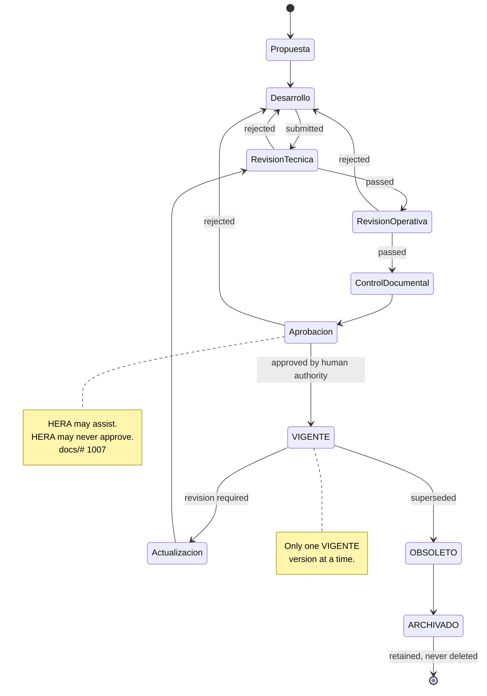
```mermaid
stateDiagram-v2
    [*] --> Propuesta
    Propuesta --> Desarrollo
    Desarrollo --> RevisionTecnica: submitted
    RevisionTecnica --> Desarrollo: rejected
    RevisionTecnica --> RevisionOperativa: passed
    RevisionOperativa --> Desarrollo: rejected
    RevisionOperativa --> ControlDocumental: passed
    ControlDocumental --> Aprobacion
    Aprobacion --> Desarrollo: rejected
    Aprobacion --> VIGENTE: approved by human authority
    VIGENTE --> Actualizacion: revision required
    Actualizacion --> RevisionTecnica
    VIGENTE --> OBSOLETO: superseded
    OBSOLETO --> ARCHIVADO
    ARCHIVADO --> [*]: retained, never deleted

    note right of Aprobacion
        HERA may assist.
        HERA may never approve.
        docs/# 1007
    end note

    note right of VIGENTE
        Only one VIGENTE
        version at a time.
    end note
```

### 16.5 Search, traceability, and conflict prevention

**Search** must be permission-aware: results are filtered by the requester's level before display, never after. **Traceability** (`# 1008`) records which documents supersede, depend on, or reference others.

**Conflict prevention** is the property the current corpus most conspicuously lacks — the Serie 1000/3000 contradiction went undetected because nothing checks. A document system should detect contradictory assertions at approval time, enforce single-VIGENTE, flag orphaned references, and prevent code reuse.

### 16.6 Future ingestion by HERA

HERA consumes documents as its primary knowledge base. Requirements: only VIGENTE documents answer institutional questions; classification and permission level survive ingestion; answers cite document code and version; superseded documents are re-indexed on state change; and OBSOLETO content is retrievable for historical enquiry but never presented as current.

**This creates a hard dependency: HERA's institutional accuracy is bounded by documentary discipline.** Ingesting 112 unapproved, unversioned, metadata-less documents would produce a confident system with no way to know whether it is quoting doctrine or a draft.

### 16.7 Open decisions

**OPEN DECISION — REQUIRES ERNESTO'S APPROVAL** — Serie numbering authority (`# 1000` vs `# 1003`).

**OPEN DECISION — REQUIRES ERNESTO'S APPROVAL** — Whether the existing 112 documents are migrated to standard, re-authored, or grandfathered.

**OPEN DECISION — REQUIRES ERNESTO'S APPROVAL** — Metadata storage format. `# 1005` requires compatibility with YAML/JSON/XML/SQL/NoSQL but mandates none.

**OPEN DECISION — REQUIRES ERNESTO'S APPROVAL** — Whether documents remain files in git or move to a document-management system.

**OPEN DECISION — REQUIRES ERNESTO'S APPROVAL** — Whether repository governance documents (this file, the Constitution, the Guide) enter the institutional series or remain engineering artifacts.

---

## 17. Infrastructure Architecture

**No cloud provider is selected.** `docs/# 16` constrains the choice: infrastructure must support *"Localmente. Cloud. Híbrida. Multicloud. Edge Computing"* — and **"Nunca dependeremos completamente de un proveedor."**

This is the most consequential infrastructure constraint in the corpus. It argues against deeply proprietary managed services whose abstractions cannot be reproduced elsewhere, and favours portable, standards-based components.

### 17.1 Environments

| Environment | Purpose | Data | Access |
|---|---|---|---|
| **Development** | Local engineering | Synthetic only | Engineers |
| **Preview** | Per-change validation | Synthetic only | Team + reviewers |
| **Testing** | Automated verification | Synthetic only | CI identity |
| **Staging** | Production-equivalent rehearsal | Synthetic or anonymised — **never T3** | Team + approvers |
| **Production** | Live | Real | Strictly controlled |

**Absolute rule: production data never flows downward.** No copy of T3 data exists outside production for any reason. Testing against real student, health, or psychological records is prohibited without exception — including for debugging.

### 17.2 Requirements

| Concern | Requirement |
|---|---|
| **Containers** | Portable, reproducible runtime artifacts. Serves the multicloud mandate directly — the same image must run locally, in cloud, and at the edge. |
| **Infrastructure as Code** | All infrastructure declared, versioned, reviewed. No console-only changes. Reproducibility is the portability guarantee. |
| **Secrets** | Dedicated store, never in code, images, or IaC. Per-environment isolation, rotation, access audit. |
| **DNS / domains** | Institution-owned registration under institutional control, never a personal account. Documented renewal ownership — **an expired domain is an outage no engineering can fix.** |
| **Backups** | Automated, encrypted, geographically separated, **restore-tested on a schedule.** |
| **Logging** | Centralised, structured, retention-bounded, access-controlled. |
| **Monitoring** | Availability, performance, errors, security events, cost. Alerting to defined owners. |
| **Asset delivery** | Efficient static delivery with cache control. Public assets and access-controlled documents travel different paths. |
| **Deployment approvals** | Production deployment requires explicit human approval. |
| **Rollback** | Every deployment reversible. **A release without a rollback path is not releasable.** Requires backward-compatible data migrations. |
| **Cost monitoring** | Budget visibility with alerting. AI inference and object storage are the likely runaway costs; both need hard bounds. A foundation's budget is an architectural constraint. |

### 17.3 Open decisions

**OPEN DECISION — REQUIRES ERNESTO'S APPROVAL** — Hosting model and provider(s), consistent with the no-lock-in mandate.

**OPEN DECISION — REQUIRES ERNESTO'S APPROVAL** — Whether any on-campus infrastructure exists, and its relationship to cloud components. Relevant to campus connectivity and offline requirements.

**OPEN DECISION — REQUIRES ERNESTO'S APPROVAL** — Container orchestration, if any. **Recommendation: defer** — orchestration for a single application is unjustified complexity.

**OPEN DECISION — REQUIRES ERNESTO'S APPROVAL** — Infrastructure-as-Code tooling.

**OPEN DECISION — REQUIRES ERNESTO'S APPROVAL** — Domain strategy and registrar.

**OPEN DECISION — REQUIRES ERNESTO'S APPROVAL** — Data residency, dependent on the unnamed legal regime.

---

## 18. Observability

**Nothing exists today.** No logging, no metrics, no tracing, no error tracking, no monitoring, no dashboards. The application is a static bundle with no instrumentation whatsoever.

Observability is what makes the 99.9 % availability target in `docs/# 24` defensible rather than aspirational — you cannot commit to availability you cannot measure.

### 18.1 Requirements

| Pillar | Requirement |
|---|---|
| **Logs** | Structured, correlated by request ID, centralised, retention-bounded. **Never contain credentials, tokens, or T3 content.** Logs are themselves protected data. |
| **Metrics** | Availability, latency distributions, error rates, throughput, saturation. Percentiles, not averages — averages conceal the experience of the affected minority. |
| **Tracing** | Distributed traces across gateway, services, and HERA engines. Essential once request paths span multiple components. |
| **Application monitoring** | Health, dependency status, background job health, queue depth. |
| **Performance monitoring** | Real-user metrics on public surfaces; server-side latency budgets. |
| **Error tracking** | Aggregated, deduplicated, attributed, alerting on new or spiking errors. |
| **Security monitoring** | Failed authentication, authorization denials, anomalous T3 access patterns, configuration change, privilege escalation. **Distinct from operational monitoring, with a different audience.** |
| **Operational dashboards** | System health for engineers and operations. |
| **Audit dashboards** | Institutional accountability for direction and auditors. Answers *who accessed what, when, and under what authority.* Read-only, independent of operational tooling. |
| **Retention** | Defined per stream. Operational logs short; audit records long. Bounded by cost and by the legal regime once named. |
| **Access control** | Observability data is sensitive — it reveals system structure and user behaviour. Access is authorised and itself audited. |
| **Incident timelines** | Reconstructable sequence of events for post-incident review and, where required, breach notification. |

### 18.2 The audit-versus-operations distinction

Operational observability answers *is the system healthy?* Audit answers *did anyone do something they should not have?* They have different audiences, retention, access, and integrity requirements — **audit must be append-only and tamper-evident; operational logs need not be.**

Conflating them is a common and consequential error: it either over-retains noisy operational data at cost, or under-protects audit records that must withstand scrutiny.

### 18.3 Open decisions

**OPEN DECISION — REQUIRES ERNESTO'S APPROVAL** — Observability stack, consistent with portability.

**OPEN DECISION — REQUIRES ERNESTO'S APPROVAL** — Retention periods per stream.

**OPEN DECISION — REQUIRES ERNESTO'S APPROVAL** — Alerting destinations and on-call expectations. A 99.9 % target implies someone responds outside working hours; **whether that capacity exists is an institutional question, not a technical one.**

---

## 19. Testing Strategy

### 19.1 Current situation

**There is no testing of any kind.**

| Aspect | State |
|---|---|
| Test framework | None installed |
| Test files | Zero |
| Test script | None (`lint` runs `tsc --noEmit`) |
| Coverage | None — `coverage/` is gitignored for coverage that cannot be produced |
| Linter | None (no ESLint) |
| Formatter | None (no Prettier) |
| CI | None (no `.github/workflows`) |

The entire quality gate is two manual commands: `npx tsc --noEmit` and `npx vite build`. And type-checking is weaker than it appears — **`strict`, `noImplicitAny`, and `strictNullChecks` are all absent** from `tsconfig.json`, so a passing check proves considerably less than it seems.

One genuine verification practice does exist and has worked twice: DOM-diff verification of visual parity via `renderToStaticMarkup` with class-token normalisation. It is manual and ad hoc, but it is real and should be formalised into visual regression testing.

### 19.2 Target architecture

| Layer | Purpose | Priority |
|---|---|---|
| **Static analysis** | Catch defects without execution | High |
| **Type checking** | Enable `strict`; make the compiler load-bearing | **Highest — cheapest available win** |
| **Linting** | Enforce conventions; `react-hooks` rules especially | High |
| **Unit tests** | Pure logic — hooks, utils, data transforms | High |
| **Component tests** | Rendering and interaction in isolation | Medium |
| **Integration tests** | Modules against real boundaries | High once a backend exists |
| **End-to-end tests** | Critical journeys through the real stack | **Mandatory for payments and authentication** |
| **Accessibility testing** | Automated WCAG checks in CI + manual audit | High — current state fails the stated AA target |
| **Visual regression** | Formalise the existing DOM-diff practice | Medium |
| **Performance testing** | Bundle budgets, load testing before launch | Medium |
| **Security testing** | Dependency scanning, SAST, penetration testing | **Mandatory before any T3 system** |
| **Migration testing** | Data migrations forward and backward on realistic volumes | Critical once persistence exists |
| **Release validation** | Post-deploy smoke tests confirming health | High |

### 19.3 Sequencing

Testing effort should track risk, not coverage targets:

1. **Now** — enable TypeScript `strict`; add linting and formatting. Cheapest defect reduction available.
2. **Before a backend** — establish a test framework and CI. Retrofitting tests onto an untested backend is far more expensive than starting with one.
3. **Before any T3 system** — integration, end-to-end, and security testing are non-negotiable.
4. **Before Donations** — end-to-end payment testing including failure and retry paths. **A payment defect is a trust event, not a bug.**

### 19.4 Open decisions

**OPEN DECISION — REQUIRES ERNESTO'S APPROVAL** — **Test framework selection remains open.** No test runner, assertion library, component-testing tool, or end-to-end framework has been chosen or approved.

**OPEN DECISION — REQUIRES ERNESTO'S APPROVAL** — Linter and formatter selection.

**OPEN DECISION — REQUIRES ERNESTO'S APPROVAL** — Coverage expectations, if any. **Recommendation: risk-weighted requirements over a global percentage** — a uniform target drives tests toward trivial code and away from the paths that matter.

**OPEN DECISION — REQUIRES ERNESTO'S APPROVAL** — Whether enabling `strict` is scheduled as a dedicated change. It will surface real errors; that is the purpose.

---

## 20. Delivery Strategy

### 20.1 Current situation

| Aspect | State |
|---|---|
| Repository | Single, git-managed |
| Branch | `main` only — no other branch has existed |
| History | 5 commits |
| Remote | Configured (`github.com/ercotan/alborada-foundation`) — **never pushed** |
| Code review | None — no pull requests |
| CI/CD | None |
| Deployment | None — never deployed |
| Versioning | `package.json` reads `0.0.0`, name `react-example` |
| Line endings | No `.gitattributes`; CRLF conversion warnings on every operation |

The repository is effectively a **single-machine artifact**. All history exists in one place, protected only by disk integrity. This was the risk that materialised during the corpus reorganisation, where two documents were recoverable solely because they had been committed shortly before.

### 20.2 Git workflow

| Concern | Requirement |
|---|---|
| **Branch strategy** | `main` is always deployable. Work on typed branches: `feat/`, `fix/`, `refactor/`, `docs/`, `chore/`. |
| **Commit policy** | Conventional Commits. One logical change per commit. **The body explains *why*** — the diff already shows what. |
| **Never committed** | Secrets, `node_modules/`, build output, real institutional data. |
| **Signing** | Commit signing for provenance. |
| **Line endings** | `.gitattributes` required before multiple contributors — currently absent, and CRLF warnings appear on every operation. |

### 20.3 Code review

Every change to `main` reviewed before merge, once more than one person contributes. Review covers correctness, security, architecture conformance, accessibility, and documentation. Changes touching T2/T3 data, authentication, or payments require **security-focused review by a second reviewer.**

Self-merge without review is acceptable only for a solo maintainer, and is a transitional state, not a policy.

### 20.4 Build verification

Minimum gate, currently manual, to be automated:

```
type check → lint → tests → build → security scan
```

A change that fails any stage does not merge. This gate is meaningless while `strict` is disabled and no tests exist — which is precisely why Section 19 sequences those first.

### 20.5 Release governance

| Concern | Requirement |
|---|---|
| **Release approval** | Production deployment requires explicit human approval. No automatic promotion to production. |
| **Deployment governance** | Who may deploy, when, and under what conditions is documented. Emergency deploys follow a defined, audited exception path. |
| **Release documentation** | Every release records what changed, why, and how to reverse it. |
| **Versioning** | Semantic versioning once consumers exist. `0.0.0` and `react-example` must be corrected. |
| **Rollback** | Every release reversible. Requires backward-compatible migrations — a forward-only migration removes the rollback path and must be treated as a one-way door requiring explicit approval. |
| **Post-release validation** | Automated smoke tests plus a monitored observation window. |

### 20.6 Immediate delivery risks

1. **Nothing is pushed.** Five commits exist on one machine. The remote is configured and unused. **This is the single largest delivery risk today** and remains unaddressed.
2. **No `.gitattributes`.** Line-ending conversion will produce spurious diffs the moment a second contributor joins.
3. **Package identity is scaffold.** `react-example` at `0.0.0`.

### 20.7 Open decisions

**OPEN DECISION — REQUIRES ERNESTO'S APPROVAL** — CI/CD provider. None selected.

**OPEN DECISION — REQUIRES ERNESTO'S APPROVAL** — Whether the repository becomes public, private, or mirrored. Affects security posture and contribution model.

**OPEN DECISION — REQUIRES ERNESTO'S APPROVAL** — Whether the repository is pushed to the configured remote, and when. **Recommended immediately** — off-machine history is the only real protection the corpus has.

**OPEN DECISION — REQUIRES ERNESTO'S APPROVAL** — Release cadence and versioning scheme.

**OPEN DECISION — REQUIRES ERNESTO'S APPROVAL** — Whether repository governance moves to protected branches with required reviews.

---

## 21. Environment Strategy

Five environments are defined. **None currently exists** — the application has never been deployed and runs only on a developer machine.

### 21.1 Responsibilities

| Environment | Purpose | Data | Lifetime |
|---|---|---|---|
| **Local Development** | Individual engineering, rapid iteration | Synthetic only | Continuous |
| **Preview** | Validate a single change in isolation before review | Synthetic only | Ephemeral, per change |
| **Testing** | Automated verification | Synthetic, deterministic fixtures | Ephemeral, per run |
| **Staging** | Production-equivalent rehearsal | Synthetic or anonymised — **never T3** | Long-lived |
| **Production** | Live institutional service | Real | Permanent |

### 21.2 Isolation

Environments share nothing: no credentials, no data stores, no message infrastructure, no secrets. A defect, misconfiguration, or compromise in a lower environment must be incapable of reaching production.

**Absolute rule, restated from 17.1: production data never flows downward.** No copy of T3 data exists outside production for any purpose — including debugging a production incident. Where reproducing an issue requires realistic data, synthetic or irreversibly anonymised data is generated for the purpose.

### 21.3 Configuration and secrets

| Concern | Requirement |
|---|---|
| **Configuration** | Externalised from the artifact. The same build is promoted through environments; only configuration differs. |
| **Secrets** | Per-environment, independently rotated, never shared. Production secrets are unreadable to anyone who does not operate production. |
| **Current state** | `.env.example` documents `GEMINI_API_KEY` and `APP_URL` — **Google AI Studio scaffold artifacts, not a secrets model.** No secret is used by the application today. |

### 21.4 Promotion flow

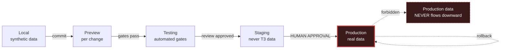
```mermaid
graph LR
    LOCAL["Local<br/>synthetic data"]
    PREVIEW["Preview<br/>per change"]
    TEST["Testing<br/>automated gates"]
    STAGE["Staging<br/>never T3 data"]
    PROD["Production<br/>real data"]

    LOCAL -->|commit| PREVIEW
    PREVIEW -->|gates pass| TEST
    TEST -->|review approved| STAGE
    STAGE -->|HUMAN APPROVAL| PROD
    PROD -.rollback.-> PROD

    BLOCK["Production data<br/>NEVER flows downward"]
    PROD -.->|forbidden| BLOCK

    style PROD fill:#3a1a1a,stroke:#c44,color:#fff,stroke-width:3px
    style BLOCK fill:#3a1a1a,stroke:#c44,color:#fff,stroke-dasharray: 6 4
```

**The same artifact is promoted**, never rebuilt per environment. Rebuilding introduces the possibility that what was tested is not what ships.

### 21.5 Deployment and rollback expectations

| Environment | Deployment | Rollback |
|---|---|---|
| Local | Continuous, unrestricted | Not applicable |
| Preview | Automatic on change | Discard the environment |
| Testing | Automatic | Not applicable |
| Staging | Automatic on merge | Redeploy previous artifact |
| **Production** | **Explicit human approval required** | **Mandatory, tested, time-bounded** |

A production release without a verified rollback path is not releasable. Where a change includes a forward-only data migration, the rollback path is broken by definition — such changes are one-way doors requiring explicit, separate approval.

### 21.6 Open decisions

**OPEN DECISION — REQUIRES ERNESTO'S APPROVAL** — Whether preview environments are per-branch, per-pull-request, or omitted initially on cost grounds.

**OPEN DECISION — REQUIRES ERNESTO'S APPROVAL** — Whether staging is permanently provisioned or created on demand.

**OPEN DECISION — REQUIRES ERNESTO'S APPROVAL** — How anonymised datasets are generated and who verifies that anonymisation is irreversible — a non-trivial problem at a cohort size of fifteen.

---

## 22. Scalability Strategy

Scalability here means **institutional growth**, not primarily traffic. The load that matters is complexity, contributor count, and the number of domains under management.

Each stage is a distinct architectural posture. Progression is driven by requirement, never by schedule.

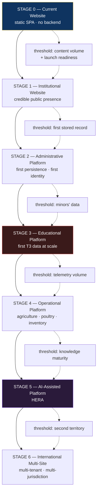
```mermaid
graph TD
    S0["STAGE 0 — Current Website<br/>static SPA · no backend"]
    S1["STAGE 1 — Institutional Website<br/>credible public presence"]
    S2["STAGE 2 — Administrative Platform<br/>first persistence · first identity"]
    S3["STAGE 3 — Educational Platform<br/>first T3 data at scale"]
    S4["STAGE 4 — Operational Platform<br/>agriculture · poultry · inventory"]
    S5["STAGE 5 — AI-Assisted Platform<br/>HERA"]
    S6["STAGE 6 — International Multi-Site<br/>multi-tenant · multi-jurisdiction"]

    S0 --> S1 --> S2 --> S3 --> S4 --> S5 --> S6

    T1["threshold: content volume<br/>+ launch readiness"]
    T2["threshold: first stored record"]
    T3["threshold: minors' data"]
    T4["threshold: telemetry volume"]
    T5["threshold: knowledge maturity"]
    T6["threshold: second territory"]

    S0 -.-> T1 -.-> S1
    S1 -.-> T2 -.-> S2
    S2 -.-> T3 -.-> S3
    S3 -.-> T4 -.-> S4
    S4 -.-> T5 -.-> S5
    S5 -.-> T6 -.-> S6

    style S0 fill:#0f3460,stroke:#d4af37,color:#fff
    style S3 fill:#3a1a1a,stroke:#c44,color:#fff
    style S5 fill:#2a1a3a,stroke:#96f,color:#fff
```

### Stage 0 — Current Website *(present state)*

| | |
|---|---|
| **Goals** | Communicate mission credibly; establish engineering discipline |
| **Priorities** | Modular composition, content separation, verified builds |
| **Complexity** | Low — 32 files, one deployable artifact |
| **Risks** | Scaffold residue mistaken for architecture; never deployed; never pushed |
| **Decisions** | Hosting; rendering strategy |

### Stage 1 — Institutional Website

| | |
|---|---|
| **Goals** | Launch-ready public presence: accessible, discoverable, honest |
| **Priorities** | Accessibility to AA; SEO foundations; real contact delivery; **removal of fabricated funding data** |
| **Complexity** | Low — still static, possibly a first light backend for form delivery |
| **Risks** | Shipping known doctrinal violations; the first backend arriving informally as "just a form handler" |
| **Decisions** | Rendering strategy; content management; whether any backend appears here |

### Stage 2 — Administrative Platform

| | |
|---|---|
| **Goals** | First persistent institutional data; staff operations |
| **Priorities** | Identity, authorization, audit, encryption, backup — **all before the first record is stored** |
| **Complexity** | **Step change.** Introduces backend, database, auth, deployment, observability simultaneously |
| **Risks** | The highest-risk transition in the roadmap. Every foundational control must exist at once; retrofitting audit or encryption later is far more expensive and often incomplete |
| **Decisions** | Backend framework; persistence; identity provider; hosting; CI/CD; observability; **legal regime** |

### Stage 3 — Educational Platform

| | |
|---|---|
| **Goals** | Curriculum, assessment, student records |
| **Priorities** | **T3 isolation**; consent management; retention policy; independent security audit |
| **Complexity** | High — and the sensitivity ceiling of the platform |
| **Risks** | Holding minors' educational and clinical data. A breach here is irreversible harm, not a compliance event |
| **Decisions** | Build vs adopt an LMS; whether minors hold accounts; retention; aggregation thresholds |

### Stage 4 — Operational Platform

| | |
|---|---|
| **Goals** | Agriculture, poultry, inventory, projects, properties |
| **Priorities** | Telemetry ingestion; time-series handling; downsampling; edge tolerance |
| **Complexity** | Moderate — high data volume, low data sensitivity |
| **Risks** | Telemetry cost and volume dominating without bounded retention; campus connectivity constraints |
| **Decisions** | Sensor and telemetry approach; whether agriculture and poultry share one substrate |

### Stage 5 — AI-Assisted Platform

| | |
|---|---|
| **Goals** | HERA as institutional decision support |
| **Priorities** | Permission-filtered retrieval; explainability; audit; human approval gates; model independence |
| **Complexity** | Very high — HERA touches every domain |
| **Risks** | Permission leakage through retrieval; re-identification via knowledge graph; inference cost; over-reliance on outputs presented too confidently |
| **Decisions** | Model provider; retrieval strategy; conversation persistence; T3 exclusion from third parties |

### Stage 6 — International Multi-Site

| | |
|---|---|
| **Goals** | Replicate the model in new territories |
| **Priorities** | Tenant isolation; data residency per jurisdiction; multi-currency; localization |
| **Complexity** | Highest |
| **Risks** | Multi-tenancy retrofitted onto a single-tenant model is among the most expensive corrections in software. **This risk is incurred at Stage 2**, not at Stage 6 |
| **Decisions** | Multi-tenant software vs independent deployments — **and the cost of deferring it grows at every intermediate stage** |

---

## 23. Reliability and Disaster Recovery

**Nothing described here exists.** There is no deployment, therefore no availability, no backup, and no recovery capability. The one reliability property currently held is git history on a single machine.

### 23.1 Availability

`docs/# 24` states a **99.9 % annual availability** target — approximately 8.8 hours of permitted downtime per year. That is a meaningful commitment requiring redundancy, monitoring, alerting, and someone available to respond.

Availability expectations should differ by module, and treating them uniformly wastes effort:

| Module class | Expectation | Rationale |
|---|---|---|
| Public website | High | Reputational; low complexity to achieve |
| Administrative | Business hours critical | Staff productivity |
| **Educational** | **Very high during teaching hours** | Downtime stops schooling |
| Operational | Tolerant | Batch-oriented |
| HERA | Degradable | Assistive; the institution functions without it |

### 23.2 Requirements

| Concern | Requirement |
|---|---|
| **Recovery planning** | Documented per module: what fails, what is lost, how it is restored, by whom |
| **Backup strategy** | Automated, encrypted, geographically separated. Frequency derived from RPO. Includes configuration and secrets, not only data |
| **Recovery testing** | Scheduled restore rehearsals. **An untested backup is a hypothesis.** Restores are verified for completeness, not merely for completion |
| **Business continuity** | How the institution operates while a system is down. Educational continuity in particular cannot depend on software availability |
| **Disaster recovery** | Total-loss scenario: infrastructure, region, or provider. The multicloud mandate in `docs/# 16` exists partly for this |
| **Failure isolation** | A failure in one module must not cascade. Bulkheads, timeouts, circuit breakers. **HERA failure must never impair core institutional operation** |
| **Graceful degradation** | Reduced function over total unavailability: read-only mode, cached content, queued writes |
| **Data restoration** | Point-in-time recovery where the domain warrants it. T3 restoration follows the same authorization as T3 access |
| **Incident communication** | Defined internal and external channels. Notification obligations depend on the unnamed legal regime |
| **Operational documentation** | Runbooks maintained and rehearsed. Undocumented recovery knowledge held by one person is itself a risk |

### 23.3 Recovery objectives

RPO (maximum tolerable data loss) and RTO (maximum tolerable downtime) must be set **per domain**, since they differ sharply.

**OPEN DECISION — REQUIRES ERNESTO'S APPROVAL** — RPO and RTO targets per domain. As a frame: Health and Psychology records likely warrant near-zero RPO; operational telemetry may tolerate hours.

### 23.4 Open decisions

**OPEN DECISION — REQUIRES ERNESTO'S APPROVAL** — Backup technology, frequency, and retention.

**OPEN DECISION — REQUIRES ERNESTO'S APPROVAL** — Whether availability commitments are formalised institutionally, given that a 99.9 % target implies out-of-hours response capacity that may not exist.

**OPEN DECISION — REQUIRES ERNESTO'S APPROVAL** — Disaster-recovery posture: cold, warm, or hot standby. Materially different in cost.

---

## 24. Compliance and Governance

**No claim of legal compliance is made anywhere in this document.** Compliance is a legal determination requiring qualified counsel and, in several areas, formal validation. This section describes only **architectural preparation** — building so that compliance is achievable once requirements are known.

### 24.1 The foundational gap

The institutional corpus defers everywhere to *"legislación aplicable"* without naming a single statute. No jurisdiction, regulation, or standard is cited in 112 documents.

**OPEN DECISION — REQUIRES ERNESTO'S APPROVAL**
**The applicable legal regime must be named.** Operations in Colombia involving minors' personal data plausibly implicate Ley 1581/2012 and Decreto 1377/2013; international donors may implicate GDPR; educational and health records carry sector-specific obligations. **Until named, retention periods, lawful bases, consent mechanics, breach-notification timelines, and residency requirements cannot be specified** — and every one of those is an architectural input, not a policy afterthought.

### 24.2 Preparation by area

| Area | Architectural preparation |
|---|---|
| **Child protection** | T3 isolation; no public path to minors' data; full audit; safeguarding review as a design gate. `docs/# 32` makes this supreme over all other objectives |
| **Privacy** | Data minimisation; purpose limitation via domain separation; pseudonymous keys; deletion as a first-class operation; encryption by default |
| **Educational information** | Individual academic records never published (`docs/# 10`); educator access scoped to assigned students; aggregate reporting subject to the fifteen-student constraint |
| **Health information** | Isolated store; medical role only; not accessible to administration by seniority; retention per medical record law once known |
| **Psychological information** | Isolated separately from Health; psychology role only; the most restricted domain in the platform |
| **Financial information** | Segregation of duties; immutable transaction records; donor PII protected from transparency reporting; PCI scope minimised by design |
| **Consent** | Consent state is data, recorded, versioned, and consulted at processing time — never assumed. Guardian consent gates lawful processing of student data |
| **Auditability** | Append-only, tamper-evident records covering authentication, authorization, T3 access, administrative action, configuration change |
| **Retention** | Per-domain policies with automated enforcement. **Cannot be specified until 24.1 is resolved** |
| **International operations** | Data residency per jurisdiction; cross-border transfer mechanisms; tenant isolation. Architecture must not assume a single legal regime |
| **Institutional governance** | Approval authority mirrors `docs/# 1007`: Consejo Institucional for constitutional matters, Dirección General for operational |
| **Human oversight** | Structural. No autonomous system takes consequential institutional action (`docs/# 1007`) |

### 24.3 Legal validation requirements

Before the corresponding system holds real data, legal validation is required for: the legal regime and lawful bases; consent mechanics for minors and guardians; retention schedules; cross-border transfer; breach-notification obligations; biometric processing of minors, if contemplated at all; and payment and tax-receipt obligations across donor jurisdictions.

**None of these is an engineering decision.** Architecture prepares for them; it cannot substitute for them.

---

## 25. Architectural Decision Records (ADR)

### 25.1 Purpose

An ADR captures **one architectural decision, its context, and its consequences, at the moment it is made.** It exists because reasoning decays faster than code: six months later the choice remains but the constraints that produced it are forgotten, and it is re-litigated or wrongly reversed.

This is the mechanism by which `PROJECT_CONSTITUTION.md`'s prohibition on silent architectural decisions is enforced.

### 25.2 Location and naming

**OPEN DECISION — REQUIRES ERNESTO'S APPROVAL**
ADR location and naming. Two coherent options:

| Option | Form | Trade-off |
|---|---|---|
| **A — Repository** | `docs/adr/ADR-0001-short-title.md` | Close to the code, versioned with it, low friction. Sits outside the institutional documentary system |
| **B — Institutional series** | Conforms to `docs/# 1004` naming, e.g. `2001_STD_INF_DECISION_PERSISTENCIA` | Full institutional standing, metadata, approval workflow. Heavier process; requires the Serie contradiction resolved first |

Recommendation: **Option A initially**, migrating to B once the documentary system is operational — but this is Ernesto's call, not an engineering one.

### 25.3 Template

```
# ADR-NNNN — Title

Status:        Proposed | Accepted | Rejected | Superseded by ADR-NNNN
Date:          YYYY-MM-DD
Deciders:      Named individuals
Approver:      Ernesto Cosovi
Supersedes:    ADR-NNNN (if applicable)
Related:       ARCHITECTURE.md §N ; docs/# NN

## Context
The forces at play: constraints, requirements, institutional doctrine cited
by document code, and what makes a decision necessary now.

## Decision
What was decided, stated unambiguously in the active voice.

## Alternatives Considered
Each option with its genuine advantages and why it was not chosen.
An alternative recorded without a real advantage was never a real alternative.

## Consequences
Positive, negative, and neutral. What becomes easier, what becomes harder,
what is now expensive to reverse.

## Approval
Approved by: ________________  Date: ____________
```

### 25.4 Lifecycle

| Status | Meaning |
|---|---|
| **Proposed** | Drafted, not yet approved. Not binding |
| **Accepted** | Approved and binding |
| **Rejected** | Considered and declined. **Retained** — knowing what was rejected and why prevents re-proposal |
| **Superseded** | Replaced by a later ADR. Retained; never deleted |

Superseded ADRs remain readable and link forward to their replacement. Reversing a decision creates a new ADR; it never edits the original.

### 25.5 Traceability

Each ADR links to the ARCHITECTURE.md sections it affects, the institutional documents constraining it, prior ADRs it supersedes, and the implementation that realises it. **When an ADR is accepted, this document is amended** — the register in Section 27 marks the decision resolved and cites the ADR.

### 25.6 Relationship to other documents

| Document | Relationship |
|---|---|
| **ARCHITECTURE.md** | Defines the decision space and holds the open register. ADRs resolve entries in it |
| **`PROJECT_CONSTITUTION.md`** | Requires that decisions be explicit; ADRs are the instrument |
| **`MASTER_DEVELOPMENT_GUIDE.md`** | Standards may change as a consequence of an ADR; the Guide is updated alongside |
| **`CLAUDE.md`** | Operating rules may tighten as a consequence. `CLAUDE.md` §4.1 forbids unapproved stack decisions — **an accepted ADR is the approval** |

---

## 26. Technical Debt and Known Risks

Every item verified by direct inspection on 19 July 2026. No item is inferred.

### 26.1 Classification

| Level | Meaning |
|---|---|
| **Critical** | Active risk of irreversible loss, harm, or institutional damage |
| **High** | Blocks safe progress or ships a known defect |
| **Medium** | Meaningful cost or degradation; not blocking |
| **Low** | Hygiene; low consequence |

### 26.2 Register

#### CRITICAL

**R-01 — Repository has never been pushed.**
*Description:* Five commits exist only on one machine. Remote `github.com/ercotan/alborada-foundation` is configured and unused.
*Impact:* Total loss of the codebase, the 112-document institutional corpus, and all governance documents. Approximately 106,000 words of institutional doctrine exist in one physical location.
*Likelihood:* Low per day, **approaching certain over years.** Two documents were already lost from the working tree during this session and survived only because they had been committed hours earlier.
*Recommendation:* Push to the configured remote. Establish a second off-site copy per `docs/# 1006`.
*Priority:* **Immediate.**

**R-02 — Fabricated funding data on the public site.**
*Description:* `DonationSection` renders hardcoded percentages ("78 % FINANCIADO", "45 % COMPLETADO", "90 % FINANCIADO") as live progress bars, and displays "✓ TRANSACCIÓN COMPLETA" when no payment processor exists.
*Impact:* Directly violates `docs/# 01_BRAND_BIBLE` Cap. VII, which forbids *"estadísticas manipuladas"* and *"resultados inventados"*, and contradicts `docs/# 10_TRANSPARENCY_STANDARD`. For an institution whose credibility rests on verifiable transparency, publishing invented figures is the single most damaging content on the site.
*Likelihood:* Certain if launched unchanged.
*Recommendation:* Remove the percentages or label them explicitly as illustrative; remove the transaction-complete state until a processor exists.
*Priority:* **Before any public launch.**

#### HIGH

**R-03 — TypeScript strict mode disabled.**
*Description:* `strict`, `noImplicitAny`, `strictNullChecks`, `noUnusedLocals`, `noUnusedParameters`, `noUncheckedIndexedAccess` all absent from `tsconfig.json`. Combined with `skipLibCheck: true` and no `include`/`exclude`.
*Impact:* `npx tsc --noEmit` passing proves far less than it appears. `undefined` flows silently through code that looks safe. The primary quality gate is substantially weaker than assumed.
*Likelihood:* Defects certain over time.
*Recommendation:* Enable `strict` as a dedicated change and fix the fallout.
*Priority:* High — cheapest available quality improvement.

**R-04 — No automated tests.**
*Description:* No framework, no test files, no test script. `coverage/` is gitignored for coverage that cannot be produced.
*Impact:* Every regression must be caught manually. Blocks safe development of anything handling money, personal data, or authentication.
*Likelihood:* Certain to cause defects as complexity grows.
*Recommendation:* Establish a framework before the first backend, not after.
*Priority:* High; **mandatory before Stage 2.**

**R-05 — No CI pipeline.**
*Description:* No `.github/workflows` or equivalent. All verification manual.
*Impact:* Gates depend on discipline. Nothing prevents a broken commit reaching `main`.
*Likelihood:* High as contributors increase.
*Recommendation:* Automate type check, lint, test, build once a framework exists.
*Priority:* High.

**R-06 — Accessibility deficiencies.**
*Description:* Zero `aria-*` attributes and zero `<label>` elements across `src/`. The contact `<select>` has no accessible name. No `<main>` landmark. Decorative `<canvas>` not `aria-hidden`. No skip link. Form success state has no `aria-live`. No `prefers-reduced-motion` handling despite continuous canvas animation.
*Impact:* Fails the WCAG 2.1 AA target stated in `MASTER_DEVELOPMENT_GUIDE.md`. Excludes users from an institution founded on human dignity. Reduced-motion absence may cause physical discomfort.
*Likelihood:* Currently affecting users.
*Recommendation:* Remediate before public launch.
*Priority:* High.

**R-07 — No mobile navigation.**
*Description:* Header nav is `hidden … lg:flex`. Below 1024 px only the logo and one button appear.
*Impact:* On phones — likely the majority of traffic — no section is reachable except by scrolling the entire page. A functional defect, not a styling preference.
*Likelihood:* Currently affecting users.
*Recommendation:* Add a mobile navigation pattern.
*Priority:* High.

**R-08 — No approved backend, database, or authentication.**
*Description:* None selected. No persistence, no identity, no authorization exists or is approved.
*Impact:* Every module beyond the public website is blocked. Risk is that these get decided informally under delivery pressure rather than deliberately.
*Likelihood:* Blocking by definition.
*Recommendation:* Resolve via ADR before Stage 2, with the legal regime named first.
*Priority:* High — sequencing risk, not defect risk.

**R-09 — Institutional corpus fails its own standards.**
*Description:* All 112 filenames violate `docs/# 1004` (leading `"# "` — a space and a symbol, both forbidden; no `TIPO`/`ÁREA` segments). No file has the ~45 metadata fields `# 1005` mandates. No version history tables per `# 1006`. No document has completed the `# 1007` approval workflow.
*Impact:* Under their own rules, **no document holds institutional validity.** Blocks Document Management design and makes HERA ingestion unsafe — an AI cannot distinguish approved doctrine from draft.
*Likelihood:* Certain.
*Recommendation:* Decide migration strategy; resolve the Serie contradiction first.
*Priority:* High.

**R-10 — `docs/# 1000` and `docs/# 1003` contradict each other.**
*Description:* `# 1000` assigns Serie 1000 = "Manuales Operativos (SOP)", Serie 3000 = "HERA". `# 1003` assigns Serie 1000 = "Normas Maestras", Serie 3000 = "Protocolos".
*Impact:* Irreconcilable. Blocks any code-based document system.
*Likelihood:* Certain.
*Recommendation:* Institutional ruling on which is authoritative.
*Priority:* High — blocks a module entirely.

#### MEDIUM

**R-11 — Parallel colour systems.**
*Description:* Theme tokens (`bg-navy-950`) and raw hex (`bg-[#020712]`, `bg-[#050a16]`, `text-[#d4af37]`) express identical colours. Three primary backgrounds in use exist nowhere in `@theme`. `#050a16` and `#050a1a` differ by four in the blue channel. Measured drift: 15 text opacities, 8 border opacities, 10 card backgrounds, 5 radii, 7 container widths, 5 icon sizes.
*Impact:* A rebrand requires find-and-replace across nearly every component instead of one `@theme` edit. Arbitrary values make change unsafe because effects are unpredictable.
*Recommendation:* Tokenise, then migrate with DOM-diff verification.
*Priority:* Medium.

**R-12 — Scaffold metadata throughout.**
*Description:* `index.html` title is `My Google AI Studio App`, no description, no Open Graph, no favicon, `lang="en"` while all copy is Spanish. `package.json` name `react-example`, version `0.0.0`. `README.md` is unmodified AI Studio boilerplate. `metadata.json` declares `MAJOR_CAPABILITY_SERVER_SIDE_GEMINI_API`, unused.
*Impact:* Any shared link previews as a scaffold app. Wrong language announced to assistive technology and search engines.
*Recommendation:* Replace before launch.
*Priority:* Medium; **the `index.html` portion is high before launch.**

**R-13 — Unused scaffold dependencies.**
*Description:* `@google/genai`, `express`, `dotenv`, `@types/express`, `autoprefixer`, `esbuild`, `tsx` are imported nowhere in `src/`. `vite` is listed in both `dependencies` and `devDependencies`.
*Impact:* Supply-chain surface without benefit. Risk of being mistaken for approved technology choices — `@google/genai` in particular could be read as an approved LLM provider.
*Recommendation:* Remove.
*Priority:* Medium.

**R-14 — No observability implementation.**
*Description:* No logging, metrics, tracing, error tracking, or monitoring.
*Impact:* Currently near-zero, as nothing is deployed. Becomes critical at Stage 2 — the 99.9 % target in `docs/# 24` is unmeasurable without it.
*Recommendation:* Establish alongside the first backend.
*Priority:* Medium now; High at Stage 2.

**R-15 — No disaster recovery implementation.**
*Description:* No backup, restore, or continuity capability beyond git.
*Impact:* Currently limited by the absence of data. Critical the moment institutional data exists.
*Recommendation:* Define RPO/RTO and implement before real data is stored.
*Priority:* Medium now; **Critical at Stage 2.**

**R-16 — No production infrastructure definition or deployment pipeline.**
*Description:* No infrastructure-as-code, no environments, no documented deployment. Never deployed.
*Impact:* Deployment would currently be manual and unreproducible.
*Recommendation:* Define infrastructure as code from the first deployment.
*Priority:* Medium.

**R-17 — No linting or formatting.**
*Description:* No ESLint, no Prettier. `lint` script runs `tsc --noEmit` only.
*Impact:* No enforcement of hook rules or conventions. Formatting inconsistency will surface with a second contributor.
*Recommendation:* Adopt both.
*Priority:* Medium.

#### LOW

**R-18 — Orphaned code.** `src/utils/audio.ts` (208 lines, a complete `CinematicAudioEngine`) imported nowhere. Types `AppView`, `CinematicState`, `FoundationPillar`, `Initiative` declared and never referenced. Two unused locals in `CinematicCanvas.tsx`, one in `audio.ts`. *Recommendation:* Wire deliberately or remove. *Priority:* Low.

**R-19 — No `.gitattributes`.** CRLF conversion warnings on every git operation. Will produce spurious diffs with a second contributor. *Priority:* Low now, Medium at second contributor.

**R-20 — Unused path alias.** `@` configured in both `tsconfig.json` and `vite.config.ts`; every import is relative. *Priority:* Low.

**R-21 — Canvas never idles.** `CinematicCanvas` runs a continuous `requestAnimationFrame` loop with 150 particles regardless of viewport visibility. No `IntersectionObserver`. *Impact:* Battery and CPU cost on mobile. *Priority:* Low.

**R-22 — Corpus split with deleted files.** Two documents (`# 83`, `# 85`) were deleted from the working tree during this session; `docs/` holds 0-byte placeholders of both. Content recoverable from commit `ccc80af`. *Recommendation:* Restore and consolidate. *Priority:* Low technically, **but a live demonstration of R-01.**

### 26.3 Summary

| Priority | Count | Items |
|---|---|---|
| **Critical** | 2 | R-01, R-02 |
| **High** | 8 | R-03 … R-10 |
| **Medium** | 7 | R-11 … R-17 |
| **Low** | 5 | R-18 … R-22 |

---

## 27. Open Architectural Decisions

The Architecture Decision Register. **No decision is resolved here.** Each becomes an ADR when approved (Section 25).

Approver is Ernesto Cosovi throughout, with the noted parties consulted.

### AD-001 — Applicable legal regime
**Status:** Open · **Review phase:** Immediate — before Stage 2
**Background:** The corpus defers everywhere to *"legislación aplicable"* without naming a statute in 112 documents.
**Why it matters:** Determines retention, lawful bases, consent, breach notification, residency, and cross-border transfer — all architectural inputs.
**Approaches:** Colombian regime only (Ley 1581/2012, Decreto 1377/2013); Colombian plus GDPR for international donors; broader multi-jurisdiction posture.
**Dependencies:** None. **This is the root dependency of the register.**
**Risk of deciding too early:** Minimal. Risk of deciding late is severe — retrofitting retention and consent into a live system is expensive and often incomplete.
**Consult:** Qualified legal counsel. **Not an engineering decision.**

### AD-002 — Do minors hold authenticated accounts?
**Status:** Open · **Review phase:** Before Stage 3
**Background:** Undetermined whether students authenticate to any system.
**Why it matters:** Determines the legal posture, consent mechanics, recovery design, session policy, and safeguarding obligations of Education, HERA, Mobile, and Security simultaneously.
**Approaches:** No student accounts (all mediated by staff); supervised accounts with guardian consent; full accounts with age-appropriate controls.
**Dependencies:** AD-001.
**Risk of deciding too early:** Low. Deciding late blocks four modules.

### AD-003 — Serie numbering authority
**Status:** Open · **Review phase:** Immediate
**Background:** `docs/# 1000` and `docs/# 1003` assign incompatible meanings to Serie 1000 and 3000.
**Why it matters:** Blocks Document Management design entirely and makes document codes unassignable.
**Approaches:** `# 1003` authoritative; `# 1000` authoritative; a third reconciling scheme superseding both.
**Dependencies:** None.
**Risk of deciding too early:** None. Purely institutional.

### AD-004 — Corpus formalisation strategy
**Status:** Open · **Review phase:** Before HERA ingestion
**Background:** No document meets `# 1004`/`# 1005`/`# 1006`/`# 1007`. None formally valid.
**Why it matters:** HERA answering from unapproved drafts as though authoritative is a governance failure.
**Approaches:** Migrate in place (add metadata, rename, approve); re-author to standard; grandfather existing and apply standards prospectively.
**Dependencies:** AD-003.
**Risk of deciding too early:** Moderate — a large mechanical change made before the target standard is settled would be done twice.

### AD-005 — Backend language and framework
**Status:** Open · **Review phase:** Before Stage 2
**Background:** Nothing named in the corpus. `express` in `package.json` is scaffold residue, not a choice.
**Why it matters:** The most consequential and least reversible technical choice; determines hiring, ecosystem, and operational model for a decade.
**Approaches:** Deliberately not enumerated — a shortlist would constitute the silent narrowing this document forbids.
**Dependencies:** AD-001, AD-010.
**Risk of deciding too early:** High. Choosing before requirements are known optimises for the wrong constraints.

### AD-006 — Persistence per domain
**Status:** Open · **Review phase:** Before Stage 2
**Background:** `docs/# 16` requires *"No existirá una única base"* across roughly ten domains.
**Why it matters:** T3 isolation is a data-layer property. Polyglot persistence multiplies operational burden.
**Approaches:** One engine, multiple logically isolated stores; genuinely polyglot per domain characteristics; hybrid with a common engine plus specialised stores for search and time-series.
**Dependencies:** AD-001 (residency), AD-005, AD-010.
**Risk of deciding too early:** High — operational cost of polyglot persistence is easy to underestimate at a foundation's scale.

### AD-007 — Identity provider
**Status:** Open · **Review phase:** Before Stage 2
**Background:** No provider or protocol selected.
**Why it matters:** Authentication implemented incorrectly is a common and severe failure. Sits directly on the child-protection path.
**Approaches:** Managed provider; self-hosted open-source; bespoke (**strongly discouraged**).
**Dependencies:** AD-001, AD-002.
**Risk of deciding too early:** Moderate. **Note the genuine tension:** managed reduces the risk of a small team getting authentication wrong, but weakens the no-vendor-lock-in mandate in `docs/# 16`. This conflict must be resolved deliberately, not by default.

### AD-008 — API style
**Status:** Open · **Review phase:** Before Stage 2
**Background:** REST, GraphQL, RPC, hybrid all open. Gateway is mandated; style is not.
**Why it matters:** Shapes every client, versioning strategy, and authorization granularity.
**Approaches:** Resource-oriented; graph-oriented; procedure-oriented; hybrid by surface.
**Dependencies:** AD-005.
**Risk of deciding too early:** Moderate — premature choice optimises for imagined rather than real access patterns.

### AD-009 — Rendering strategy
**Status:** Open · **Review phase:** Before Stage 1 completion
**Background:** Currently client-only SPA. No router.
**Why it matters:** Determines SEO capability for content-bearing modules and whether a server rendering tier is required.
**Approaches:** Client-only; static generation; server-side rendering; hybrid per route.
**Dependencies:** AD-010, AD-011.
**Risk of deciding too early:** Low. Deciding late means retrofitting routing and rendering into a grown application.

### AD-010 — Hosting and deployment model
**Status:** Open · **Review phase:** Before Stage 1 launch
**Background:** Never deployed. `docs/# 16` requires local/cloud/hybrid/multicloud/edge capability and *"Nunca dependeremos completamente de un proveedor."*
**Why it matters:** The portability mandate meaningfully excludes deeply proprietary managed services.
**Approaches:** Static hosting initially with a portability plan; container-based portable platform; hybrid with on-campus components.
**Dependencies:** AD-001 (residency).
**Risk of deciding too early:** Low for the static site; high for the full platform.

### AD-011 — Content management
**Status:** Open · **Review phase:** Stage 1
**Background:** Content is code-resident in `src/data/homepage.ts`, typed and CMS-ready.
**Why it matters:** Determines who can change public copy and whether changes require a deploy — and whether website content enters the `# 1007` approval workflow.
**Approaches:** Remain code-resident; headless CMS; institutional document system as content source.
**Dependencies:** AD-004, AD-009.
**Risk of deciding too early:** Low. Current architecture deliberately preserves both paths.

### AD-012 — Multilingual strategy
**Status:** Open · **Review phase:** Before content volume grows
**Background:** All copy Spanish. Structure is localization-ready; no i18n library present.
**Why it matters:** Affects routing, SEO, content model, and the international expansion module.
**Approaches:** Spanish only; Spanish plus English; full multilingual framework.
**Dependencies:** AD-009, AD-011.
**Risk of deciding too early:** Low. Retrofitting after large content volume is expensive.

### AD-013 — Test framework
**Status:** Open · **Review phase:** Before Stage 2
**Background:** No test infrastructure of any kind.
**Why it matters:** Prerequisite for anything handling money, personal data, or authentication.
**Approaches:** Not enumerated — selection follows AD-005 for the backend and is largely independent for the frontend.
**Dependencies:** AD-005.
**Risk of deciding too early:** Low. Frontend testing could begin immediately.

### AD-014 — Linter and formatter
**Status:** Open · **Review phase:** Immediate
**Background:** Neither present.
**Why it matters:** Nothing enforces the conventions already written down.
**Dependencies:** None.
**Risk of deciding too early:** None. **Lowest-risk decision in the register.**

### AD-015 — CI/CD provider
**Status:** Open · **Review phase:** Before Stage 2
**Dependencies:** AD-013, AD-016.
**Risk of deciding too early:** Low; migration between providers is comparatively cheap.

### AD-016 — Repository visibility and push
**Status:** Open · **Review phase:** **Immediate**
**Background:** Remote configured, never used. All history on one machine.
**Why it matters:** **The single largest risk in the register (R-01).** Also determines the contribution model and security posture.
**Approaches:** Private with restricted access; private with a mirror; public (transparency benefit, but requires certainty that no sensitive content is present).
**Dependencies:** Review of the corpus for content unsuitable for publication.
**Risk of deciding too early:** Low for private. **Public is difficult to reverse** — anything published may be copied.

### AD-017 — LLM provider
**Status:** Open · **Review phase:** Stage 5
**Background:** Claude and OpenAI each appear once in `docs/# 16` as tool-engine inventory items, not selections. `@google/genai` is scaffold residue.
**Why it matters:** Determines Spanish capability, cost per interaction, and data-retention terms concerning minors.
**Dependencies:** AD-019.
**Risk of deciding too early:** High. The field changes rapidly; `docs/# 16` requires provider independence regardless.

### AD-018 — HERA conversation persistence
**Status:** Open · **Review phase:** Before Stage 5
**Background:** `docs/# 14` gives students control over their personal memory.
**Why it matters:** Storing student conversations creates a duty of care proportional to their intimacy; not storing forfeits mentoring continuity.
**Dependencies:** AD-001, AD-002.
**Risk of deciding too early:** Low. **This is a policy decision that must precede the technical one.**

### AD-019 — Third-party model data boundary
**Status:** Open · **Review phase:** Before Stage 5
**Background:** Undetermined which institutional data may leave the platform for a model provider.
**Why it matters:** Transmitting T3 data to a third party may be unlawful and is certainly a safeguarding question.
**Approaches:** No institutional data leaves; T0/T1 only; T2 permitted under contract; case-by-case.
**Dependencies:** AD-001, AD-017.
**Risk of deciding too early:** None. **Recommendation: absolute T3 exclusion as a standing rule.**

### AD-020 — Biometric identification of minors
**Status:** Open · **Review phase:** Before any Security module specification
**Background:** `docs/# 18` contemplates facial recognition for campus access.
**Why it matters:** Biometric data of minors is among the most sensitive categories that exists, and sits in direct tension with `docs/# 07` (*"Los datos pertenecen a las personas"*) and `docs/# 32`.
**Approaches:** Prohibited entirely; permitted for adults only; permitted with guardian consent and strict controls.
**Dependencies:** AD-001, AD-002.
**Risk of deciding too early:** None. **Deciding late risks a system being built before the question is asked.**

### AD-021 — Educational platform: build or adopt
**Status:** Open · **Review phase:** Before Stage 3
**Background:** Mature open-source learning management systems exist.
**Why it matters:** Building bespoke is a multi-year commitment for a small team; it is plausibly larger than everything else in the platform combined.
**Approaches:** Adopt and integrate; adopt and extend; build bespoke.
**Dependencies:** AD-002, AD-005, AD-007.
**Risk of deciding too early:** Moderate. **Risk of deciding by drift is higher** — bespoke platforms are usually built by accident, one feature at a time.

### AD-022 — Payment processor
**Status:** Open · **Review phase:** Before Donations
**Background:** No processor selected. `DonationSection` currently simulates completion.
**Why it matters:** PCI scope, fraud exposure, Colombian availability, international cards, nonprofit fee structures, tax receipts.
**Approaches:** Hosted checkout (**materially reduces PCI scope** at some cost to brand continuity); embedded elements; direct integration (**discouraged**).
**Dependencies:** AD-001, AD-005, AD-013.
**Risk of deciding too early:** Low.

### AD-023 — Aggregation thresholds for student-derived statistics
**Status:** Open · **Review phase:** Before Transparency Dashboard
**Background:** Founding cohort is fifteen. Ordinary anonymisation may not prevent re-identification.
**Why it matters:** The Transparency Dashboard exists to publish; the child-protection mandate forbids exposing individuals.
**Dependencies:** AD-001.
**Risk of deciding too early:** None. Requires an explicit privacy analysis, not an engineering judgement.

### AD-024 — Monorepo adoption trigger
**Status:** Deferred by ratified decision (`PROJECT_CONSTITUTION.md` A.3) · **Review phase:** When a second deployable artifact exists
**Background:** Currently a single application. No corpus document specifies repository structure.
**Why it matters:** Restructuring later is disruptive; restructuring now is unjustified complexity under YAGNI.
**Risk of deciding too early:** Already assessed — deferral is the current decision, revisited at the stated trigger.

### AD-025 — Observability stack
**Status:** Open · **Review phase:** Before Stage 2
**Dependencies:** AD-005, AD-010.
**Risk of deciding too early:** Low.

### 27.1 Dependency structure

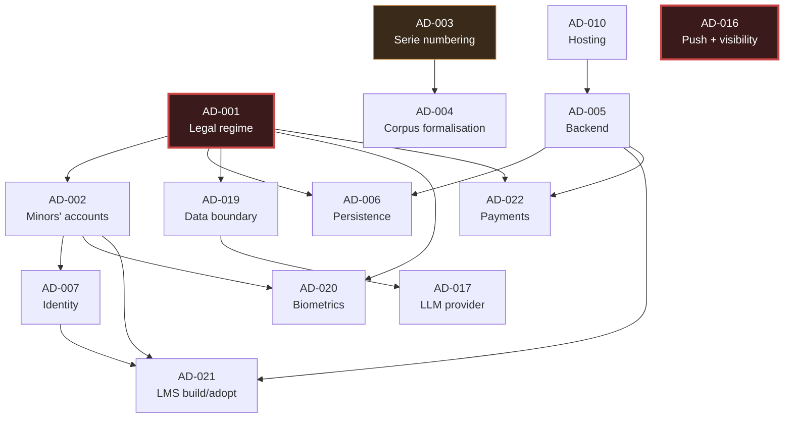
```mermaid
graph TD
    AD001["AD-001<br/>Legal regime"]
    AD002["AD-002<br/>Minors' accounts"]
    AD003["AD-003<br/>Serie numbering"]
    AD004["AD-004<br/>Corpus formalisation"]
    AD005["AD-005<br/>Backend"]
    AD006["AD-006<br/>Persistence"]
    AD007["AD-007<br/>Identity"]
    AD010["AD-010<br/>Hosting"]
    AD016["AD-016<br/>Push + visibility"]
    AD017["AD-017<br/>LLM provider"]
    AD019["AD-019<br/>Data boundary"]
    AD020["AD-020<br/>Biometrics"]
    AD021["AD-021<br/>LMS build/adopt"]
    AD022["AD-022<br/>Payments"]

    AD001 --> AD002
    AD001 --> AD006
    AD001 --> AD019
    AD001 --> AD020
    AD001 --> AD022
    AD002 --> AD007
    AD002 --> AD020
    AD002 --> AD021
    AD003 --> AD004
    AD010 --> AD005
    AD005 --> AD006
    AD005 --> AD021
    AD005 --> AD022
    AD007 --> AD021
    AD019 --> AD017

    style AD001 fill:#3a1a1a,stroke:#c44,color:#fff,stroke-width:3px
    style AD016 fill:#3a1a1a,stroke:#c44,color:#fff,stroke-width:3px
    style AD003 fill:#3a2a1a,stroke:#c84,color:#fff
```

**AD-001 is the root of the register.** Six decisions depend on it directly and most others transitively. **AD-016 is independent and immediate** — it is the only entry that can be resolved today with no prerequisite.

---

## 28. Phased Evolution Roadmap

Phases are gated by exit criteria, not dates. A phase completes when its criteria are met.

### Phase 0 — Repository Stabilization

| | |
|---|---|
| **Objectives** | Eliminate loss risk; correct scaffold identity; restore corpus integrity |
| **Deliverables** | Repository pushed to remote; second off-site copy; deleted documents restored and corpus consolidated; `index.html`, `package.json`, `README.md` corrected; unused dependencies removed; `.gitattributes` added |
| **Dependencies** | AD-016 |
| **Risks** | Continued single-machine existence of 106,000 words of doctrine |
| **Exit criteria** | History exists off-machine; corpus consolidated with no 0-byte placeholders; no scaffold identity remains; R-01 closed |

### Phase 1 — Public Website Completion

| | |
|---|---|
| **Objectives** | A launch-ready public presence that is accessible, discoverable, and honest |
| **Deliverables** | Accessibility remediation to AA; mobile navigation; SEO foundations and social metadata; **fabricated funding data removed**; contact form actually delivering; `prefers-reduced-motion` |
| **Dependencies** | AD-009, AD-010, AD-011 |
| **Risks** | Launching with known doctrinal violations (R-02) or accessibility failures (R-06) |
| **Exit criteria** | WCAG 2.1 AA verified; navigation works at every breakpoint; no fabricated data; contact messages reach a human; deployed and reachable |

### Phase 2 — Quality Gates

| | |
|---|---|
| **Objectives** | Make correctness enforceable rather than aspirational |
| **Deliverables** | TypeScript `strict` enabled and fallout fixed; linter and formatter; test framework with meaningful initial coverage; CI running type check, lint, test, build; visual regression formalised from the existing DOM-diff practice |
| **Dependencies** | AD-013, AD-014, AD-015 |
| **Risks** | Skipping this phase under pressure to start Stage 2 — the most likely and most expensive sequencing error in the roadmap |
| **Exit criteria** | CI blocks merges on failure; `strict` enabled; tests exist for all shared logic |

### Phase 3 — Core Platform Foundations

| | |
|---|---|
| **Objectives** | Establish the security and data substrate **before** any real data exists |
| **Deliverables** | Legal regime named; backend, persistence, identity selected via ADR; API gateway; authorization enforcing five levels; audit domain; encryption; secret management; backup with tested restore; observability; environments with promotion flow |
| **Dependencies** | AD-001, AD-005, AD-006, AD-007, AD-008, AD-010, AD-025 |
| **Risks** | **The highest-risk transition in the roadmap.** Every foundational control must exist simultaneously; retrofitting audit or encryption later is expensive and usually incomplete |
| **Exit criteria** | An authenticated request is authorised, served, and audited end to end; a restore has been performed successfully; no T3 data yet stored |

### Phase 4 — Administrative Platform

| | |
|---|---|
| **Objectives** | Staff operations on institutional data |
| **Deliverables** | Staff and volunteer domains; document management (**pending AD-003**); projects, properties, inventory; institutional workflows with human approval |
| **Dependencies** | Phase 3; AD-003, AD-004 |
| **Risks** | Document management blocked by the unresolved Serie contradiction; scope creep into Finance and HR without boundaries |
| **Exit criteria** | Staff operate daily without shadow spreadsheets; audit answers who did what; document lifecycle enforced |

### Phase 5 — Educational Platform

| | |
|---|---|
| **Objectives** | Serve students and teachers while holding the platform's most sensitive data |
| **Deliverables** | T3 isolation verified; consent management; Students, Guardians, Education domains; Health and Psychology as separately isolated stores; **independent penetration test**; retention policies enforced |
| **Dependencies** | Phase 4; AD-002, AD-021, AD-023 |
| **Risks** | Minors' data at scale. A breach is irreversible harm |
| **Exit criteria** | Independent security audit passed; T3 isolation demonstrated; deletion and subject-access operations proven; safeguarding sign-off obtained |

### Phase 6 — Operational Modules

| | |
|---|---|
| **Objectives** | Agriculture, poultry, inventory, and campus operations |
| **Deliverables** | Telemetry ingestion with bounded retention; production tracking; operational dashboards; student-facing learning surfaces |
| **Dependencies** | Phase 4 |
| **Risks** | Telemetry volume and cost without downsampling; campus connectivity |
| **Exit criteria** | Operations run on the platform; telemetry cost bounded and monitored |

### Phase 7 — HERA Integration

| | |
|---|---|
| **Objectives** | Institutional decision support |
| **Deliverables** | Knowledge ingestion of **approved** documents; permission-filtered retrieval; knowledge graph with re-identification controls; memory tiers; workflow automation with human approval gates; explainability and full audit |
| **Dependencies** | Phase 5; AD-004, AD-017, AD-018, AD-019 |
| **Risks** | Permission leakage through retrieval; re-identification via graph; inference cost; institutional over-reliance on confident outputs |
| **Exit criteria** | No query returns content above the requester's level; every answer cites sources; no consequential action executes without human approval; corpus formally approved before ingestion |

### Phase 8 — International Expansion

| | |
|---|---|
| **Objectives** | Replicate the model in new territories |
| **Deliverables** | Tenant isolation; per-jurisdiction residency; multi-currency; localization; per-territory governance |
| **Dependencies** | Phase 7; AD-012 |
| **Risks** | **Multi-tenancy retrofitted onto a single-tenant model is among the most expensive corrections in software — and the cost is incurred at Phase 3, not here** |
| **Exit criteria** | A second site operates with verified data isolation |

---

## 29. Architecture Diagrams

Conceptual diagrams. **Only Diagram 1 depicts a system that exists.** All others are proposed structure, not implemented reality.

### 29.1 Diagram 1 — Current Frontend Architecture *(exists)*

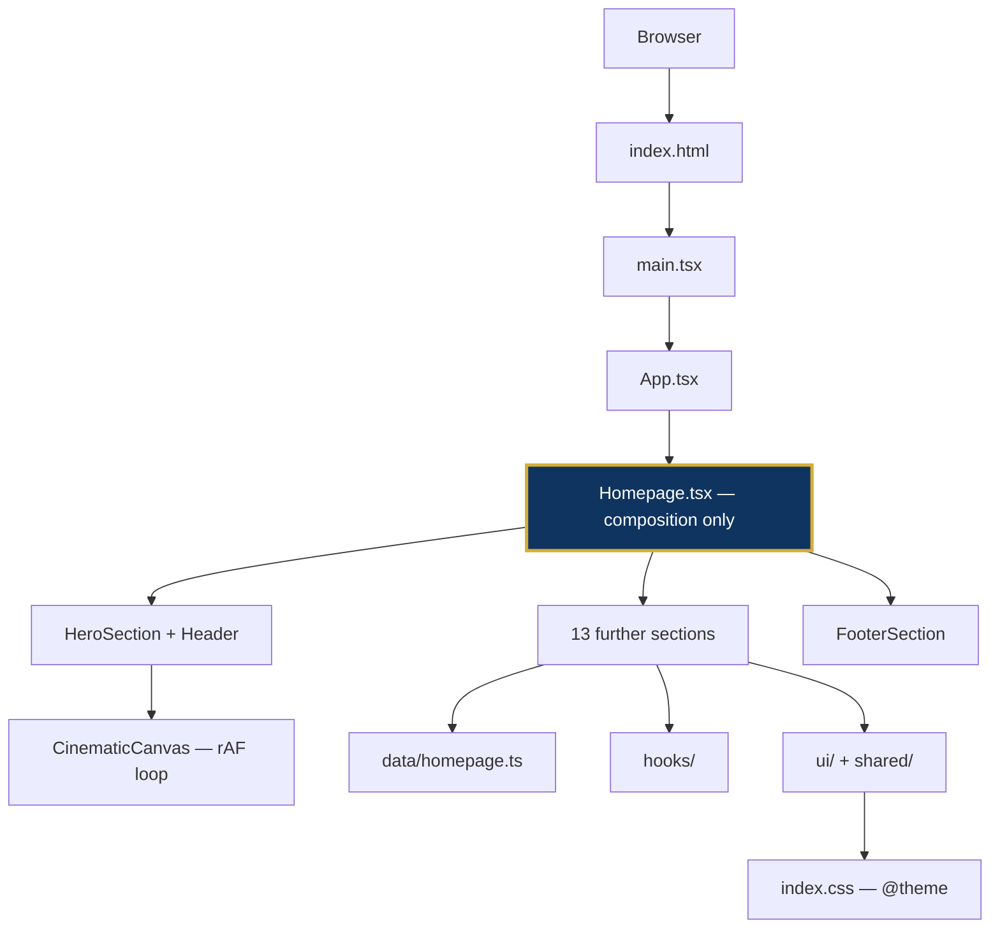
```mermaid
graph TD
    B["Browser"]
    IDX["index.html"]
    MAIN["main.tsx"]
    APP["App.tsx"]
    HP["Homepage.tsx — composition only"]
    HERO["HeroSection + Header"]
    SECS["13 further sections"]
    FOOT["FooterSection"]
    CAN["CinematicCanvas — rAF loop"]
    DATA["data/homepage.ts"]
    HOOKS["hooks/"]
    UIP["ui/ + shared/"]
    CSS["index.css — @theme"]

    B --> IDX --> MAIN --> APP --> HP
    HP --> HERO
    HP --> SECS
    HP --> FOOT
    HERO --> CAN
    SECS --> DATA
    SECS --> HOOKS
    SECS --> UIP
    UIP --> CSS

    style HP fill:#0f3460,stroke:#d4af37,color:#fff,stroke-width:3px
```

### 29.2 Diagram 2 — Future High-Level Ecosystem *(proposed)*

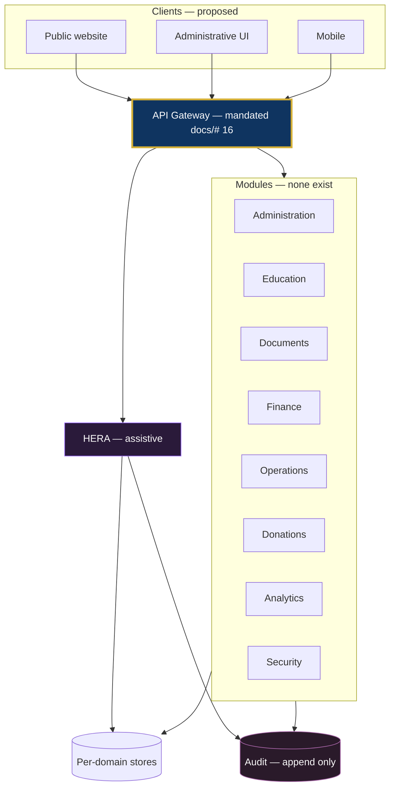
```mermaid
graph TD
    subgraph CL["Clients — proposed"]
        W["Public website"]
        A["Administrative UI"]
        M["Mobile"]
    end
    GW["API Gateway — mandated docs/# 16"]
    subgraph MOD["Modules — none exist"]
        ADM["Administration"]
        EDU["Education"]
        DOC["Documents"]
        FIN["Finance"]
        OPS["Operations"]
        DON["Donations"]
        ANA["Analytics"]
        SEC["Security"]
    end
    HERA["HERA — assistive"]
    DATA[("Per-domain stores")]
    AUD[("Audit — append only")]

    W --> GW
    A --> GW
    M --> GW
    GW --> MOD
    GW --> HERA
    MOD --> DATA
    HERA --> DATA
    MOD --> AUD
    HERA --> AUD

    style GW fill:#0f3460,stroke:#d4af37,color:#fff,stroke-width:3px
    style HERA fill:#2a1a3a,stroke:#96f,color:#fff
    style AUD fill:#2a1a2a,stroke:#a6a,color:#fff
```

### 29.3 Diagram 3 — Trust Boundaries *(proposed)*

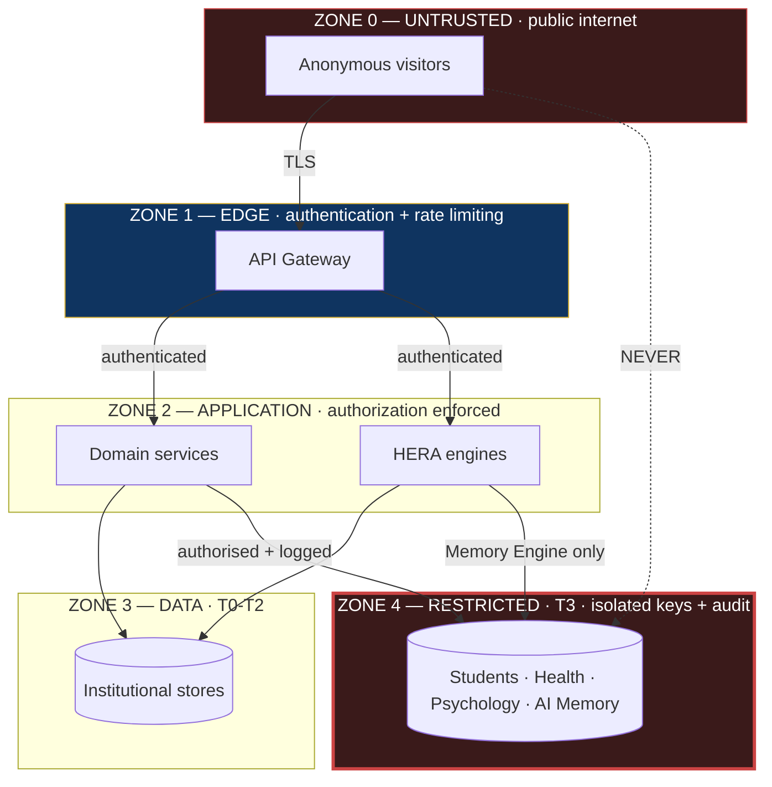
```mermaid
graph TD
    subgraph Z0["ZONE 0 — UNTRUSTED · public internet"]
        PUB["Anonymous visitors"]
    end
    subgraph Z1["ZONE 1 — EDGE · authentication + rate limiting"]
        GW["API Gateway"]
    end
    subgraph Z2["ZONE 2 — APPLICATION · authorization enforced"]
        SVC["Domain services"]
        HERA["HERA engines"]
    end
    subgraph Z3["ZONE 3 — DATA · T0-T2"]
        D12[("Institutional stores")]
    end
    subgraph Z4["ZONE 4 — RESTRICTED · T3 · isolated keys + audit"]
        D3[("Students · Health · Psychology · AI Memory")]
    end

    PUB -->|TLS| GW
    GW -->|authenticated| SVC
    GW -->|authenticated| HERA
    SVC --> D12
    HERA --> D12
    SVC -->|authorised + logged| D3
    HERA -->|Memory Engine only| D3
    PUB -.->|NEVER| D3

    style Z0 fill:#3a1a1a,stroke:#c44,color:#fff
    style Z4 fill:#3a1a1a,stroke:#c44,color:#fff,stroke-width:3px
    style Z1 fill:#0f3460,stroke:#d4af37,color:#fff
```

### 29.4 Diagram 4 — Future Knowledge Flow *(proposed)*

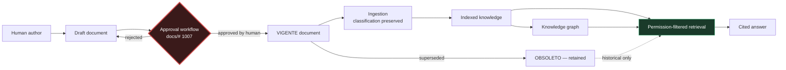
```mermaid
graph LR
    AUTH["Human author"]
    DRAFT["Draft document"]
    APPR{"Approval workflow<br/>docs/# 1007"}
    VIG["VIGENTE document"]
    ING["Ingestion<br/>classification preserved"]
    IDX["Indexed knowledge"]
    GRAPH["Knowledge graph"]
    RET["Permission-filtered retrieval"]
    ANS["Cited answer"]
    OBS["OBSOLETO — retained"]

    AUTH --> DRAFT --> APPR
    APPR -->|rejected| DRAFT
    APPR -->|approved by human| VIG
    VIG --> ING --> IDX --> GRAPH
    IDX --> RET --> ANS
    GRAPH --> RET
    VIG -->|superseded| OBS
    OBS -.historical only.-> RET

    style APPR fill:#3a1a1a,stroke:#c44,color:#fff,stroke-width:3px
    style RET fill:#1a3a2a,stroke:#4c8,color:#fff
```

### 29.5 Diagram 5 — Future HERA Integration *(proposed)*

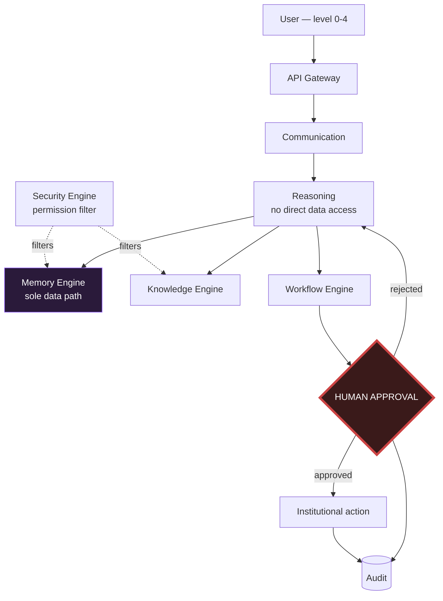
```mermaid
graph TD
    U["User — level 0-4"]
    GW["API Gateway"]
    SECE["Security Engine<br/>permission filter"]
    COM["Communication"]
    REA["Reasoning<br/>no direct data access"]
    MEM["Memory Engine<br/>sole data path"]
    KNO["Knowledge Engine"]
    WFL["Workflow Engine"]
    HUM{"HUMAN APPROVAL"}
    ACT["Institutional action"]
    AUD[("Audit")]

    U --> GW --> COM --> REA
    SECE -.filters.-> MEM
    SECE -.filters.-> KNO
    REA --> MEM
    REA --> KNO
    REA --> WFL --> HUM
    HUM -->|approved| ACT
    HUM -->|rejected| REA
    ACT --> AUD
    HUM --> AUD

    style HUM fill:#3a1a1a,stroke:#c44,color:#fff,stroke-width:4px
    style MEM fill:#2a1a3a,stroke:#96f,color:#fff
```

### 29.6 Diagram 6 — Environment Flow *(proposed)*

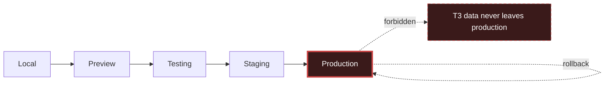
```mermaid
graph LR
    L["Local"] --> P["Preview"] --> T["Testing"] --> S["Staging"] --> PR["Production"]
    PR -.rollback.-> PR
    X["T3 data never leaves production"]
    PR -.->|forbidden| X

    style PR fill:#3a1a1a,stroke:#c44,color:#fff,stroke-width:3px
    style X fill:#3a1a1a,stroke:#c44,color:#fff,stroke-dasharray: 6 4
```

### 29.7 Diagram 7 — Document Lifecycle *(proposed — detail in §16.4)*

```mermaid
graph LR
    PROP["Propuesta"] --> DEV["Desarrollo"] --> RT["Revisión Técnica"] --> RO["Revisión Operativa"] --> CD["Control Documental"] --> AP{"Aprobación<br/>human only"}
    AP -->|approved| VIG["VIGENTE"]
    AP -->|rejected| DEV
    VIG --> OBS["OBSOLETO"] --> ARC["ARCHIVADO<br/>never deleted"]

    style AP fill:#3a1a1a,stroke:#c44,color:#fff,stroke-width:3px
    style VIG fill:#1a3a2a,stroke:#4c8,color:#fff
```

---

## 30. Architecture Governance

### 30.1 Authority

**Ernesto Cosovi holds final architectural authority.** No architectural decision is binding without his explicit approval. This is not ceremonial: `CLAUDE.md` §4.1 forbids unapproved stack decisions, and `PROJECT_CONSTITUTION.md` forbids silent ones. An accepted ADR bearing his approval is the only mechanism by which an open decision closes.

Where institutional doctrine governs — child protection, ethics, transparency — the Consejo Institucional and Dirección General hold authority per `docs/# 1007`, and architecture conforms rather than negotiates.

### 30.2 Proposal and review

```mermaid
graph TD
    ID["Need identified"]
    ADR["ADR drafted — Proposed"]
    TECH["Technical review<br/>correctness · alternatives · consequences"]
    SEC["Security review<br/>required if T2/T3, auth, or payments"]
    DOC["Doctrine check<br/>conformance with docs/"]
    APR{"Ernesto approves"}
    ACC["Accepted — binding"]
    REJ["Rejected — retained"]
    AMEND["ARCHITECTURE.md amended"]
    IMPL["Implementation permitted"]

    ID --> ADR --> TECH --> SEC --> DOC --> APR
    APR -->|yes| ACC --> AMEND --> IMPL
    APR -->|no| REJ

    style APR fill:#3a1a1a,stroke:#c44,color:#fff,stroke-width:3px
```

**Implementation may not begin before approval.** Writing code that presumes an unmade decision makes that decision silently — the specific failure this governance exists to prevent.

### 30.3 Reviewing documentation changes

Changes to this document, `PROJECT_CONSTITUTION.md`, `MASTER_DEVELOPMENT_GUIDE.md`, and `CLAUDE.md` are reviewed as architectural changes, because they are. Institutional documents in `docs/` follow the `# 1007` workflow instead.

### 30.4 Resolving conflicts between documents

Precedence: **institutional corpus → Constitution → ARCHITECTURE.md / Development Guide → CLAUDE.md.**

Procedure when a conflict is found:

1. **Stop.** Do not implement either reading.
2. Document the conflict precisely, citing both sources.
3. Escalate to the authority owning the higher layer.
4. Record the resolution — as an ADR for architectural conflicts, as a corpus amendment for doctrinal ones.
5. Correct the subordinate document.

**A conflict within the same layer cannot be resolved by engineering judgement.** The `# 1000` versus `# 1003` contradiction is the live example: both are master norms, so only an institutional ruling can settle it.

### 30.5 Retiring obsolete architecture

Superseded architecture is marked, not deleted. The superseding ADR references what it replaces; this document retains the history with its status. Removing the record of a prior decision destroys the reasoning that produced the current one and invites its accidental re-adoption.

### 30.6 How HERA participates

HERA may: surface relevant documents and prior decisions; detect contradictions between documents; draft ADRs for human revision; check proposals against doctrine; and maintain traceability.

HERA may **never**: approve an ADR, resolve a conflict between documents, alter this document without human review, or make an architectural decision. `docs/# 1007` — *"Nunca sustituye la aprobación humana."*

The asymmetry is deliberate. HERA is most valuable precisely where its judgement must not be trusted: it can read 106,000 words and find the contradiction a human would miss, and it must then hand that finding to a human to decide.

---

## 31. Definition of Architectural Readiness

Before implementation of any major subsystem begins, **all eight conditions must be satisfied.** Partial readiness is not readiness; the conditions exist because each has been, historically and across the industry, the one skipped under delivery pressure.

| # | Condition | Satisfied when |
|---|---|---|
| **1** | **Documentation completed** | Purpose, scope, boundaries, and interfaces documented. Relevant ARCHITECTURE.md sections amended |
| **2** | **Architecture approved** | Every ADR the subsystem depends on is Accepted. **No dependency remains Open** |
| **3** | **Security reviewed** | Threat model produced, including insider threat. Controls specified. Independent review where T2/T3, authentication, or payments are involved |
| **4** | **Dependencies approved** | Every technology approved by ADR. No unapproved package, service, or provider |
| **5** | **Risks documented** | Known risks recorded with impact, likelihood, and mitigation. Accepted risks explicitly accepted by a named person |
| **6** | **Data classification defined** | Every data element assigned a tier. T3 elements have isolation, retention, and access documented |
| **7** | **Operational ownership defined** | A named owner for operation, monitoring, and incident response. **A subsystem nobody owns is a subsystem nobody maintains** |
| **8** | **Acceptance criteria defined** | Testable criteria for functionality, security, accessibility, and performance agreed before implementation |

### 31.1 Readiness gate

```mermaid
graph LR
    PROP["Subsystem proposed"]
    G{"All 8 conditions met?"}
    IMPL["Implementation permitted"]
    BLOCK["Blocked — resolve gaps"]

    PROP --> G
    G -->|yes| IMPL
    G -->|no| BLOCK --> PROP

    style G fill:#3a1a1a,stroke:#c44,color:#fff,stroke-width:3px
```

**No subsystem currently meets these conditions.** The public website predates the framework and is grandfathered; everything subsequent is subject to it.

---

## 32. Immediate Next Actions

Recommendations only. **Nothing here has been implemented.**

### 32.1 Immediate — days

| # | Action | Rationale | Risk |
|---|---|---|---|
| 1 | **Push the repository to the configured remote** | 5 commits and 106,000 words of doctrine exist on one machine | R-01 · Critical |
| 2 | **Restore the two deleted documents** and consolidate the corpus into one location | `docs/` holds 0-byte placeholders; content recoverable from `ccc80af` | R-22 |
| 3 | **Rule on the Serie numbering contradiction** | Blocks Document Management entirely | R-10 · AD-003 |
| 4 | **Name the applicable legal regime** | Root dependency of six decisions; nothing downstream can be specified without it | AD-001 |
| 5 | **Decide repository visibility** | Prerequisite to action 1 if public is contemplated | AD-016 |

### 32.2 Short term — weeks

| # | Action | Rationale |
|---|---|---|
| 6 | **Remove the fabricated funding data** from `DonationSection` | Violates `docs/# 01` Cap. VII · R-02 |
| 7 | Replace scaffold metadata — `index.html`, `package.json`, `README.md` | R-12; site is currently unshareable |
| 8 | Fix `lang="en"` → `lang="es"` | Wrong language announced to assistive technology and search engines |
| 9 | Remove unused scaffold dependencies | R-13; prevents them being mistaken for approved choices |
| 10 | Add mobile navigation | R-07; functional defect on most traffic |
| 11 | Enable TypeScript `strict` and fix fallout | R-03; cheapest quality improvement available |
| 12 | Adopt linter and formatter | R-17 · AD-014, the lowest-risk decision in the register |
| 13 | Add `.gitattributes` | R-19; before a second contributor |

### 32.3 Medium term — months

| # | Action | Rationale |
|---|---|---|
| 14 | Accessibility remediation to WCAG 2.1 AA | R-06 |
| 15 | Establish test framework and CI | R-04, R-05 · AD-013, AD-015 |
| 16 | Decide corpus formalisation strategy | R-09 · AD-004 |
| 17 | Consolidate the dual colour system | R-11 |
| 18 | Decide rendering, hosting, and content management | AD-009, AD-010, AD-011 |
| 19 | Deploy the public website | Phase 1 exit criterion |
| 20 | Rule on minors' accounts and biometrics | AD-002, AD-020 — before any system presumes an answer |

### 32.4 Long term — quarters and beyond

| # | Action | Rationale |
|---|---|---|
| 21 | Backend, persistence, and identity decisions with security substrate | Phase 3 · AD-005, AD-006, AD-007 |
| 22 | Observability, backup with tested restore, disaster recovery | R-14, R-15 |
| 23 | Administrative platform | Phase 4 |
| 24 | Educational platform with independent security audit | Phase 5 — highest sensitivity |
| 25 | Operational modules | Phase 6 |
| 26 | HERA integration, only after corpus formalisation | Phase 7 |
| 27 | International expansion | Phase 8 |

> **Sequencing note.** Actions 1 and 4 are independent of everything else and unblock the most. Action 1 requires no decision from anyone but Ernesto and takes minutes. Action 4 requires counsel and may take weeks — which is precisely why it should start now rather than when Stage 2 is imminent.

---

## 33. Revision History

| Version | Date | Author | Summary of changes |
|---|---|---|---|
| **0.1** | 2026-07-19 | Claude (Chief Software Architect) — for Ernesto Cosovi | Initial creation. Part 1: Metadata and Sections 1–10 — Purpose, Executive Summary, Guiding Principles, Current Repository Overview, Runtime Architecture, Frontend Architecture, Content Architecture, Design System Architecture, Application Modules, Backend Architecture. Written after direct inspection of all configuration files, all 32 files in `src/`, `assets/`, and the 112-document corpus in `docs/`. 6 diagrams, 18 open decisions. |
| **0.2** | 2026-07-19 | Claude (Chief Software Architect) — for Ernesto Cosovi | Part 2: Sections 11–20 — Data Architecture (22 domains, 4 sensitivity tiers), API Architecture, Identity and Access Management, Security Architecture, HERA Architecture, Documentation Architecture, Infrastructure Architecture, Observability, Testing Strategy, Delivery Strategy. Status line updated. 5 further diagrams, 52 further open decisions. |
| **0.3** | 2026-07-19 | Claude (Chief Software Architect) — for Ernesto Cosovi | Part 3: Sections 21–36 — Environment Strategy, Scalability Strategy, Reliability and Disaster Recovery, Compliance and Governance, ADR process, Technical Debt Register (22 verified risks), Open Architectural Decision Register (25 entries), Phased Evolution Roadmap (Phases 0–8), consolidated Architecture Diagrams, Architecture Governance, Definition of Architectural Readiness, Immediate Next Actions, Revision History, Glossary, Repository Inventory Appendix, Final Architectural Statement. Document marked complete and awaiting approval. |

**Amendment rule:** every future change to this document adds a row. Substantive architectural changes additionally require an ADR (Section 25). No row is ever removed.

---

## 34. Glossary

| Term | Definition |
|---|---|
| **ADR** | Architecture Decision Record. A document capturing one architectural decision, its context, alternatives, and consequences at the moment it was made. See Section 25 |
| **Architecture** | The structure of a system: its components, their responsibilities, their relationships, and the constraints governing them. Distinct from implementation, which is how a component fulfils its responsibility |
| **Audit Trail** | An append-only, tamper-evident record of who did what, when, and under what authority. Required by `docs/# 16` and `# 24`. Itself protected data |
| **Backend** | Server-side software providing business logic, persistence, and APIs. **None exists in this project** |
| **Child Protection** | The overriding constraint of the platform. `docs/# 32`: no educational, technological, financial, or institutional objective takes priority over the safety, dignity, and wellbeing of the students |
| **Frontend** | Software executing in the user's browser. Currently the entirety of this project |
| **HERA** | The planned institutional intelligence platform. A decision-support system, **not a chatbot and not a replacement for people**. Named for the role of institutional memory. Does not exist |
| **Institutional Knowledge** | The accumulated documented understanding of the foundation — the 112-document corpus and what derives from it. The basis of institutional memory across generations of staff |
| **Knowledge Graph** | A representation of entities and their relationships, enabling traversal-based reasoning. Planned for HERA. Carries re-identification risk requiring controls at ingestion |
| **Least Privilege** | The principle that every actor receives the minimum access required. Default deny; access granted explicitly and narrowly |
| **Module** | A cohesive unit of functionality with a single responsibility and explicit boundaries. `docs/# 16`: *"Una responsabilidad por componente"* |
| **Observability** | The ability to understand a system's internal state from its external outputs — logs, metrics, traces. Distinct from monitoring, which watches known signals; observability supports investigating unknown ones |
| **RAG** | Retrieval-Augmented Generation. Grounding AI-generated answers in retrieved source documents, enabling citation. Retrieval must be **permission-filtered before generation, never after** |
| **Repository** | A version-controlled store of source code and documentation. Here: a single git repository, 5 commits, never pushed |
| **Scalability** | In this project, primarily the capacity to absorb institutional and organisational growth — additional domains, contributors, and complexity — rather than traffic volume |
| **T0 / T1 / T2 / T3** | Data sensitivity tiers: Public, Internal, Confidential, Highly Sensitive. T3 concerns minors, health, and psychology and is architecturally isolated. See Section 11.2 |
| **VIGENTE / OBSOLETO / ARCHIVADO** | Institutional document states per `docs/# 1006` and `# 1007`. Only one VIGENTE version of a document may exist; nothing is ever deleted |

---

## 35. Repository Inventory Appendix

The repository as inspected on 19 July 2026. **No file is listed that was not observed.**

### 35.1 Top-level directories

| Directory | Contents | Tracked |
|---|---|---|
| `src/` | Application source — 32 files, ~2,664 lines | Yes |
| `docs/` | Institutional corpus — 112 markdown documents, ~1.3 MB | Yes, since `ccc80af` |
| `assets/` | **Effectively empty** — contains only `assets/.aistudio/.gitignore` | No — gitignored |
| `node_modules/` | Dependencies | No — gitignored |

`DOCUMENTATION/` existed earlier in the session holding two documents; it was deleted from the working tree during the session. Content remains recoverable from commit `ccc80af`.

### 35.2 Root files

| File | Size | Notes |
|---|---|---|
| `ARCHITECTURE.md` | — | This document |
| `PROJECT_CONSTITUTION.md` | — | Engineering philosophy, layer 2 |
| `MASTER_DEVELOPMENT_GUIDE.md` | — | Standards and gap ledger |
| `CLAUDE.md` | — | AI engineering rules |
| `README.md` | — | ⚠ Unmodified Google AI Studio scaffold |
| `index.html` | 311 B | ⚠ Scaffold: title `My Google AI Studio App`, `lang="en"`, no description, no Open Graph, no favicon |
| `package.json` | 845 B | ⚠ Name `react-example`, version `0.0.0` |
| `package-lock.json` | — | Dependency lock |
| `tsconfig.json` | 508 B | ⚠ No strictness flags set |
| `vite.config.ts` | 708 B | React + Tailwind plugins; `@` alias to project root; conditional HMR |
| `metadata.json` | 322 B | ⚠ AI Studio manifest declaring `MAJOR_CAPABILITY_SERVER_SIDE_GEMINI_API` — unused |
| `.env.example` | 445 B | ⚠ Scaffold vars `GEMINI_API_KEY`, `APP_URL` — unused |
| `.gitignore` | 73 B | `node_modules/`, `build/`, `dist/`, `coverage/`, `.DS_Store`, `*.log`, `.env*` except `.env.example` |

**No other configuration file exists.** Specifically absent: `tailwind.config.*`, `postcss.config.*`, any ESLint or Prettier config, `.editorconfig`, `.gitattributes`, `.github/`, `Dockerfile`, any CI configuration, any test configuration.

### 35.3 Frontend technologies

**In use:** React `^19.0.1` · React DOM `^19.0.1` · Vite `^6.2.3` · TypeScript `~5.8.2` · Tailwind CSS `^4.1.14` (CSS-first, no config file) · `@tailwindcss/vite` `^4.1.14` · `@vitejs/plugin-react` `^5.0.4` · `motion` `^12.23.24` · `lucide-react` `^0.546.0`

**Declared but imported nowhere in `src/`:** `@google/genai` `^2.4.0` · `express` `^4.21.2` · `dotenv` `^17.2.3` · `@types/express` `^4.17.21` · `autoprefixer` `^10.4.21` · `esbuild` `^0.25.0` · `tsx` `^4.21.0`. Additionally `vite` is listed in both `dependencies` and `devDependencies`.

**Scripts:** `dev`, `build`, `preview`, `clean` (references a nonexistent `server.js`), `lint` (`tsc --noEmit`).

### 35.4 Documentation files

| Series | Count | Content |
|---|---|---|
| 00–99 | 100 | Constitutional and foundational |
| 100–999 | 1 | Strategic framework |
| 1000–1010 | 11 | Master norms — documentary governance |
| **Total** | **112** | ~106,000 words, ~1.3 MB |

All 112 filenames begin with `"# "` (hash plus space), violating `docs/# 1004`. Two files (`# 83`, `# 85`) are 0 bytes in `docs/`.

### 35.5 Known constraints

- No backend, database, authentication, authorization, API, or deployment exists
- No tests, linter, formatter, or CI
- TypeScript strictness entirely absent
- Zero `aria-*` attributes and zero `<label>` elements in `src/`
- **No images or video anywhere in the project** — the only `url()` is the Google Fonts import in `index.css`
- Repository never pushed; remote configured at `github.com/ercotan/alborada-foundation`
- Production bundle: ~377 kB JS (~119 kB gzip), ~35 kB CSS (~6.7 kB gzip)

### 35.6 Facts that could not be verified

Stated for completeness:

- **Deployment history** — no evidence of any deployment exists in the repository; the absence of evidence is not proof, though `metadata.json` suggests only AI Studio preview hosting
- **Remote repository contents** — the remote was never contacted; whether it exists or is empty is unknown
- **Authorship and approval status of the 112 documents** — no metadata records author, reviewer, or approver
- **Whether `docs/` is the intended canonical corpus location** — inferred from file count, not stated anywhere
- **Institutional intent behind the two 0-byte documents** — whether placeholders, or content lost before this session

---

## 36. Final Architectural Statement

This architecture exists to preserve the institutional mission of Fundación Alborada.

The foundation's purpose is to protect, educate, and prepare fifteen girls — and, in time, many more — across a horizon measured in decades. Every structure described in this document is subordinate to that purpose. **Technology exists to serve the mission; the mission does not exist to justify technology.** Where a technically superior design would compromise the mission, the design is wrong.

**Documentation is the institutional memory.** People leave; understanding must not. A decision recorded with its reasoning survives its author, and an institution that cannot remember why it chose what it chose will unmake its own work by increments. This document, the corpus it serves, and the decision records that will extend it are not administrative overhead — they are how the institution persists.

**Children's safety overrides technical convenience.** This is not a principle to be balanced against others; it is the constraint within which all others operate. `docs/# 32` states it without qualification, and this architecture reflects it structurally rather than procedurally: data concerning minors is isolated, not merely permissioned. Where safety and convenience conflict, convenience yields, and the inconvenience is documented rather than negotiated away.

**Security overrides speed.** A system that ships sooner and protects less has not been delivered faster; it has been delivered incomplete, with the cost deferred onto the people it was built to serve. The controls in this document are prerequisites, not enhancements.

**Architecture must evolve deliberately.** Systems are rarely destroyed by a single bad decision. They are eroded by many small ones made without record — each locally reasonable, collectively incoherent. The mechanisms here — ADRs, the readiness definition, the open-decision register, the prohibition on silent choices — exist to make deliberate evolution the path of least resistance.

**Every major architectural decision requires explicit approval from Ernesto Cosovi.** Seventy open questions are marked in this document precisely so that none is answered by accident, by omission, or by code written on an assumption. An unapproved decision is not a decision; it is a defect awaiting discovery.

**HERA exists to assist institutional intelligence, never to replace human governance.** It may read what no person has time to read, surface what no person would find, and draft what a person will revise. It may not approve, decide, or govern. `docs/# 1007` is unambiguous — *"Nunca sustituye la aprobación humana"* — and this is a permanent property of the design, not a limitation to be relaxed as capability improves. The judgement that matters most is precisely the judgement that must remain human.

---

*This document describes what exists, what is intended, and what remains undecided. Where they diverge, the divergence is recorded rather than concealed. Keep it that way — an architecture document that overstates its own certainty is worse than none at all.*

---

> **END OF DOCUMENT.**
> Sections 1–36 complete. Status: Draft, awaiting review and approval.
