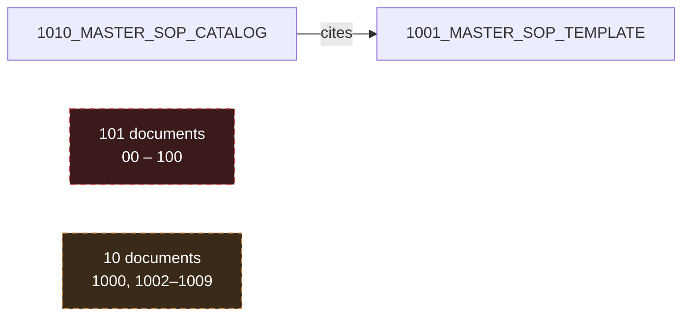
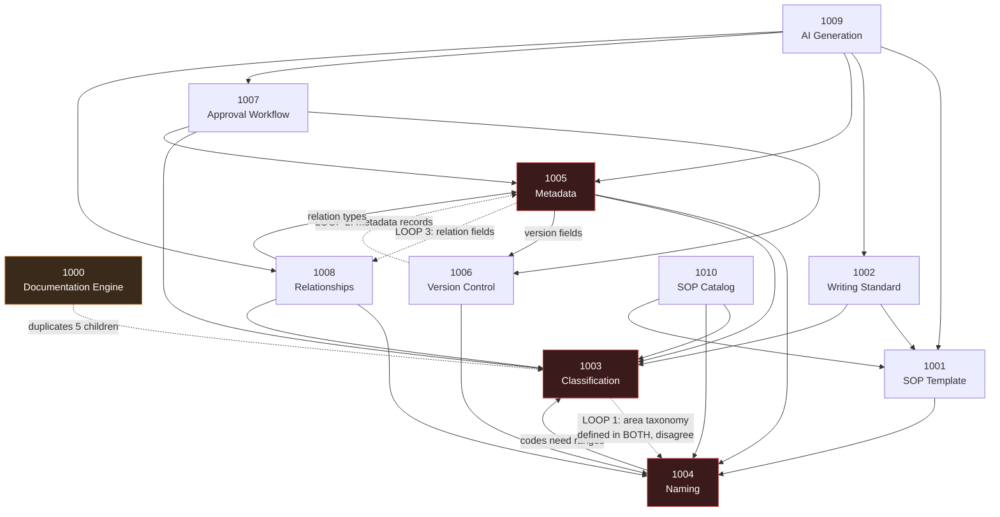
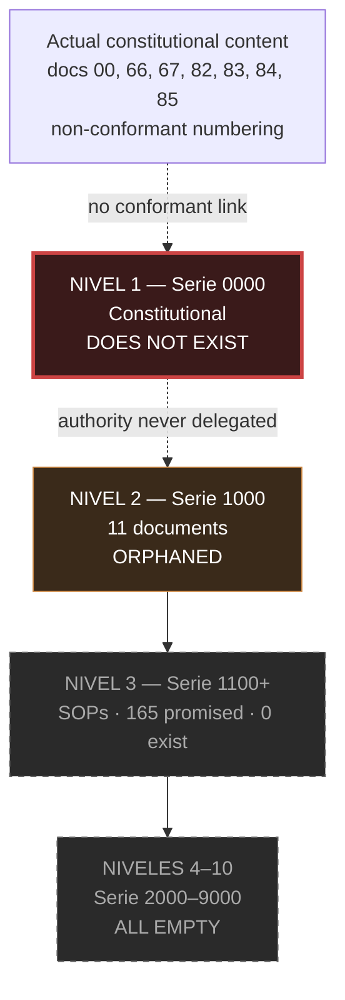
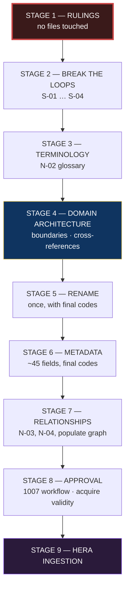

# DOCUMENTATION NORMALIZATION PLAN

**Master plan for consolidating the Alborada institutional knowledge base prior to HERA development**

| Field | Value |
|---|---|
| **Version** | 0.1 — Draft, awaiting approval |
| **Date** | 19 July 2026 |
| **Scope** | The 112-document corpus in `docs/`, plus the 2 residual files in `DOCUMENTATION/` |
| **Authority** | Subordinate to the institutional corpus and `PROJECT_CONSTITUTION.md`. Peer of `ARCHITECTURE.md` |
| **Status of corpus** | Read in full. 112 documents · 55,545 lines · 107,894 words |
| **Modifications made** | **None.** No document was altered, renamed, moved, or deleted in producing this plan |

---

## 1. Executive Summary

The corpus is **large, internally consistent in tone, and structurally incoherent**. It reads as one voice, which conceals the fact that it does not yet function as a knowledge base.

Three findings define the problem.

**First — the corpus has no connective tissue.** `# 1008` mandates a *Grafo de Conocimiento* in which every document is a node and every reference an edge. The actual graph has **112 nodes and 1 edge.** There are zero markdown links, zero instances of *"véase"*, *"conforme al documento"*, or any other reference verb, and exactly one prose citation in 107,894 words. Documents 00–100 — 101 of the 112 — reference nothing at all. The corpus is 112 isolated monologues.

**Second — the normative layer contradicts itself and is circular.** Three documents (`1000`, `1003`, `1010`) assign three incompatible meanings to the same series numbers. Five different names are used for the supreme governing body, and four mutually incompatible organisational charts exist. Within the 1000-series there are **three genuine dependency loops** that cannot be resolved in any linear order as written, because two documents each define the same taxonomy and disagree.

**Third — twelve clusters share scope at the level of title and subject.** `26` and `49` carry literally identical H1 titles; `44` and `77` are a word-order permutation of each other; `25`/`47`/`60` all open on knowledge as the most valuable asset.

> ⚠️ **This finding was originally stated as "roughly a quarter of the corpus is duplicated" and used to justify eliminating ~28 documents by merge. A line-level content audit performed at Stage 4 disproved that conclusion** — see §12. Real content overlap across the clusters measured **0–14 %, mean 6 %**. Shared titles did not indicate shared content. The finding survives as *thematic dispersion*; the elimination estimate does not.

Underlying all three: the corpus contains **no definitional register whatsoever**. There are zero occurrences of *"se entiende por"*, *"se define como"*, *"definimos"*, or *"entendemos por"*. `# 1002` mandates a *glosario institucional* and a define-on-first-use rule; neither exists. HERA is described in 21 mutually inconsistent ways across the corpus — as a person, an intelligence, an ecosystem, a tool, an asset, an engine, a memory, and an operating system.

**Why this matters now.** HERA's institutional accuracy is bounded by documentary discipline. Ingesting this corpus today would produce a system that answers confidently from unapproved drafts, cannot distinguish current doctrine from superseded, and inherits every contradiction as though it were settled fact. Asked *"who approves a constitutional document?"* it would have four defensible answers. Asked *"what is HERA?"* it would have twenty-one.

**The core recommendation is about sequence, not content.** The instinct is to fix the filenames first — they are the most visible defect. That instinct is expensive: renaming before the numbering scheme is settled means renaming twice. The order proposed in §16 exists to avoid that rework.

**There is no target corpus size.** Normalization succeeds by making the corpus coherent, navigable and owned — not smaller. Any metric expressed as a document count reduction has been removed from this plan by ruling.

---

## 2. Current Documentation Topology

### 2.1 Physical layout

| Location | Files | Notes |
|---|---|---|
| `docs/` | 112 `.md` | The corpus |
| `DOCUMENTATION/` | 2 `.md` | Residual — `# 83`, `# 85`, duplicated from the recovery operation |
| Repository root | 5 `.md` | Engineering governance, outside the institutional series |

### 2.2 Series distribution

| Series | Count | Intended level (`# 1003`) | Status |
|---|---|---|---|
| `00`–`99` | 100 | Nivel 1 — Constitutional | Content present; **numbering non-conformant** |
| `100` | 1 | Nivel 1 | Overruns the 100-slot allowance |
| `1000`–`1010` | 11 | Nivel 2 — Normas Maestras | Present, contradictory, circular |
| `1100`+ | **0** | Nivel 3 — SOPs | **Empty** — 165 promised |
| `2000`–`9000` | **0** | Niveles 4–10 | **Empty** — 7 of 10 levels |

**Three of ten hierarchy levels are populated. Seven are empty.**

### 2.3 Thematic clusters

Eighteen clusters. Fifteen contain four or more documents and are flagged as over-fragmented.

| Cluster | Documents | N | Flag |
|---|---|---|---|
| A — Constitutional charters | 00, 66, 67, 82, 83, 84, 85 | 7 | ⚠ |
| B — Doctrine / philosophy / identity | 02, 05, 68, 72, 73, 81, 86, 87, 88, 89, 100 | 11 | ⚠ |
| C — Brand / communication / transparency | 01, 10, 36, 74 | 4 | ⚠ |
| D — Governance / board / executive | 03, 13, 22, 33, 34, 78, 95 | 7 | ⚠ |
| E — Education / curriculum / faculty | 04, 11, 12, 30, 31, 90 | 6 | ⚠ |
| F — HERA / AI | 06, 07, 08, 14, 16, 24, 28, 56, 57, 58, 1009 | 11 | ⚠ |
| G — Digital / data / analytics / twins | 21, 27, 48, 51, 52, 53, 55, 59 | 8 | ⚠ |
| H — Campus / operations / security | 09, 15, 17, 18, 29, 32, 40 | 7 | ⚠ |
| I — Risk / resilience / continuity | 38, 39, 61, 70, 79, 98 | 6 | ⚠ |
| J — Knowledge / memory / learning | 25, 47, 60, 80, 91, 92, 93, 96 | 8 | ⚠ |
| K — Quality / performance / excellence | 37, 44, 69, 77, 94 | 5 | ⚠ |
| L — Ethics / legal / compliance / IP | 41, 42, 50, 71 | 4 | ⚠ |
| M — Finance / sustainability | 19, 45, 76 | 3 | |
| N — People / HR | 23, 43 | 2 | |
| O — Expansion / partnerships | 20, 35, 46, 64, 75 | 5 | ⚠ |
| P — Research / innovation / foresight | 26, 49, 62, 63, 65, 97 | 6 | ⚠ |
| Q — Institutional planning | 54 | 1 | |
| R — Documentary governance | 1000–1010 | 11 | ⚠ |

### 2.4 Structural signature

| Metric | Value |
|---|---|
| Smallest document | 322 lines (`# 68`) |
| Largest document | 741 lines (`# 17`) |
| Median | 500.5 |
| Mean | 496 |
| Range ratio | **2.3×** |

A 2.3× spread across 112 documents is anomalously tight. Combined with a strongly unimodal distribution clustered at 480–530 lines, this is the signature of **content generated to a target length** rather than written to the natural size of its subject. The practical consequence: length carries no information about importance. `# 00_FOUNDING_CHARTER` (385 lines) is *below* median while being the apex document; `# 1000`, nominal parent of the entire normative series, is the **shortest document in its own series** at 410 lines.

### 2.5 Template generations

Three distinct template generations coexist, revealing the corpus was written in at least three passes:

| Generation | Structure | Documents |
|---|---|---|
| **1 — Chapter** | `# CAPÍTULO I…XV` | 00, 01, 02, 03, 04, 05, 06, 07, 08, 09, 10, 15 (12) |
| **2 — Article** | `## Artículo 1…60` | 66, 84 (2) |
| **3 — Modern** | `PROPÓSITO / ALCANCE / FILOSOFÍA / PRINCIPIOS / … / DECLARACIÓN FINAL` | ~98 |

`# DECLARACIÓN FINAL` is the strongest marker at **108 / 112**. Full modern-template conformance (including `ALCANCE`): **51 / 112**.

---

## 3. Dependency Graph

### 3.1 The explicit graph

**One edge. 110 isolated nodes.** This is the entire declared reference structure of a 107,894-word corpus.

### 3.2 The logical graph — 1000-series

The dependencies that *exist in substance* but are nowhere declared.

### 3.3 Circular dependencies — three genuine loops

| Loop | Cycle | Cause | Consequence |
|---|---|---|---|
| **L1** | `1003` ↔ `1004` | **Both independently define the ÁREA code taxonomy, and the two lists disagree** — `1003` lists 18 areas and omits `INT` (Relaciones Internacionales), which `1004` includes. `1003` also explains itself using `1004`'s naming grammar | Neither can be settled first without the other changing |
| **L2** | `1005` ↔ `1006` | `1005`'s `VERSIONADO` block presumes `1006`'s scheme; `1006` specifies versions via metadata records defined by `1005` | Mutual substrate |
| **L3** | `1005` ↔ `1008` | `1005` defines relationship *fields*; `1008` defines relationship *types*. **The two sets are misaligned** — `1005` has no field for SUSTITUIDO/SUSTITUTO/REQUERIDO/GENERADO/CONSUMIDO; `1008` has no notion of "Formularios utilizados" | Mutual and inconsistent |
| **L4 (secondary)** | `1000` ↔ five children | `1000` independently restates the subject matter of `1003`, `1004`, `1005`, `1006`, and `1008` | Any edit to a child forces an edit to `1000`. **`1000` is the highest-overlap node in the corpus** |

**Acyclic and safe:** `1007` → {`1003`, `1005`, `1006`} is one-directional. `1009` and `1010` are pure sinks — nothing depends on them, so they can be revised last at no cost.

### 3.4 Constitutional dependencies

| Dependency | Basis |
|---|---|
| `03`, `22`, `33`, `34`, `78` → `00`, `66` | Governance bodies derive authority from the founding charter |
| `07` → `41`, `71` | HERA ethics specialises institutional ethics |
| `1007` roles → `03`, `22`, `33`, `34` | The workflow names organs it does not define |
| `1010` Serie 2200 → `24`, `28` | HERA SOPs presuppose the operating system |
| **All of the 1000-series → a Nivel 1 parent that does not exist** | See §7 |

---

## 4. Terminology Conflicts

### 4.1 The root cause

**The corpus contains no definitional register.** Zero occurrences of *"se entiende por"*, *"se define como"*, *"se definirá como"*, *"definimos"*, *"entendemos por"* across 107,894 words.

`# 1002:172-176` mandates: *"Todo término técnico deberá definirse la primera vez que aparezca. Las definiciones deberán incorporarse al glosario institucional."* **The word *glosario* appears exactly once in the corpus — in that mandate. No glossary exists.**

### 4.2 Beneficiary terminology

| Term | Occurrences | Documents |
|---|---|---|
| `líderes` | 91 | 28 |
| `estudiantes` | 51 | 30 |
| `niñas` | 28 | 13 |
| `alumnas` | 4 | 2 |
| `beneficiarias` | 1 | 1 (used only to negate it) |

**No canonical term is established anywhere.** Confirmed within-document inconsistency in at least five documents. `# 04_EDUCATIONAL_PHILOSOPHY` uses all three principal terms in identical grammatical frames with no discernible distinction. `# 32_CHILD_PROTECTION_SYSTEM` alternates within a three-line span — L14 *"la protección integral de las **niñas**"*, L16 *"el bienestar de las **estudiantes**"*.

This matters beyond style: a retrieval system cannot reliably answer *"what protections apply to students?"* when the protected class is named four ways.

### 4.3 HERA — twenty-one conflicting framings

| Framing | Representative |
|---|---|
| Person-like mentor | `# 06:20` *"HERA representa ese mentor"*; `# 06:35` header *"**Quién** es HERA"*; `# 82:331` *"una aliada"* |
| Intelligence | `# 06:37`, `# 67:228`, `# 68:277` |
| Beyond software | `# 08:465` *"HERA será mucho más que software"* |
| Operating system | `# 24:18` |
| Cognitive core | `# 27:492` |
| Ecosystem | `# 66:237` |
| Tool | `# 87:178` *"una **herramienta** al servicio de las personas"* |
| Memory | `# 88:212`, `# 85:188` |
| Asset | `# 50:473` *"uno de los principales **activos** intelectuales"* |
| Engine | `# 51:362`, `# 55:368`, `# 47:324` |

**Direct contradiction:** `# 24:14` — *"HERA no será simplemente un asistente conversacional"* — against `# 22:469` *"HERA **asiste**, nunca reemplaza"* and `# 34:378` *"HERA **asistirá** a la Dirección Ejecutiva"*. The corpus simultaneously affirms and denies the assistant framing.

**One structural irony:** `# 1009_AI_AUTOMATIC_DOCUMENT_GENERATION_SYSTEM:58` states *"HERA no escribe documentos"* — in a document whose own title is *AI Automatic Document Generation System*.

### 4.4 The human-oversight rule — consistent in substance, chaotic in expression

Stated 50+ times, **never contradicted**, which is the corpus's greatest strength. But phrased with four different verbs (`reemplazará` / `sustituirá` / `reemplaza` / `sustituye`) and **at least twelve different protected objects**: *la decisión humana, el juicio humano, el juicio moral humano, la responsabilidad humana, la responsabilidad directiva, la responsabilidad moral, la aprobación humana, el criterio humano, el criterio docente, la conciencia, el propósito humano, la evaluación humana, la ética.*

For HERA this is the difference between one enforceable rule and thirteen fuzzy ones.

**One passage in tension:** `# 58:32` — *"la **mayoría de los procesos** … funcionen **de forma autónoma** bajo una supervisión humana estratégica."* Scoped, so not a flat contradiction, but it is the only such statement and it deserves explicit reconciliation.

### 4.5 Undefined structural vocabulary

| Term | Occurrences | Documents | Definition |
|---|---|---|---|
| `memoria institucional` | 71 | 33 | **None** |
| `inteligencia institucional` | 60 | 31 | **None** (circular — `# 06:37` defines HERA *as* it) |
| `nivel` | **151** | **64** | **None** — and denotes incompatible things: student attainment (`# 12:431`), financial approval authority (`# 19:292`), memory tier (`# 14:197`) |
| `inteligencia colectiva` | 43 | 18 | **None** |
| `gemelo digital` | 34 | 5 | **Two conflicting definitions** — `# 27:46` *"sincronizada … mediante datos en tiempo real"* vs `# 59:18` *"representación **viva**"* |
| `motor` | 29 | 12 | **None** — three different referents |
| `capa` | 12 | **1** | **None** — 10 layers declared in `# 24` with no definition of what a *capa* is |
| `conocimiento crítico` | 5 | 3 | Near-definition once (`# 92:292`) |
| `antifragilidad` | 5 | **1** | **None** — confined to `# 70` despite naming a core doctrine |
| `soberanía` | **0** | 0 | Term does not exist |

`nivel` is the most dangerous: 151 uses across 64 documents, three incompatible meanings, and it is also the word `# 1003` uses for the document hierarchy.

---

## 5. Governance Conflicts

### 5.1 Five names for the supreme body

| Name | Where | Powers |
|---|---|---|
| **Consejo Fundacional** | `# 03:90`, `# 22:65,107` | *"el máximo órgano institucional"*; custodia la misión, modifica estatutos, **nombra Presidente Ejecutivo** |
| **Consejo Superior de Gobierno** | `# 33:3,14`; `# 34`, `37`, `39`, `41`, `43`, `45` | *"el máximo órgano estratégico"*; define estrategia, aprueba Plan Maestro, **nombra Presidente Ejecutivo** |
| **Consejo Institucional** | `# 1006:320`, `# 1007:144` | Approves constitutional documents, policies, master norms |
| **Consejo Directivo** | `# 19:312`, `# 78:106,172`, `# 28:352` | Highest financial approval tier |
| **Consejo Internacional** | `# 20:304` | No powers enumerated |

**Assessment:** *Consejo Fundacional* and *Consejo Superior de Gobierno* are almost certainly **the same body under two names** — both are declared supreme and both hold the identical, distinctive power of appointing the Presidente Ejecutivo. Neither document cross-references the other. *Consejo Institucional* and *Consejo Directivo* are likely further renamings, but **nothing in the corpus resolves this**.

### 5.2 Four incompatible organisational charts

| Source | Chart |
|---|---|
| `# 03:90` | Consejo Fundacional → Dirección Ejecutiva → Dirección Académica *(no President, no Director General)* |
| `# 22:65` | CONSEJO FUNDACIONAL → PRESIDENTE EJECUTIVO → DIRECCIÓN GENERAL → 8 areas *(no Dirección Ejecutiva)* |
| `# 33:114` | Consejo Superior → Presidente del Consejo → Comités → Presidente Ejecutivo → Direcciones Generales *(adds two tiers)* |
| `# 34:97` | Consejo Superior → Presidente Ejecutivo → Director General → Direcciones Estratégicas *(omits Comités)* |

### 5.3 Role conflicts

- **`Dirección Ejecutiva` vs `Presidente Ejecutivo` — three of four duties are verbatim equivalent** (`# 03:102` vs `# 34:124`). Different titles, same job. `# 22` contains no Dirección Ejecutiva at all.
- **`Dirección Ejecutiva` is simultaneously an organ and a two-person tier** — `# 34:14` calls it *"el **órgano** responsable"*, while `# 34:97-105` places Presidente Ejecutivo and Director General as separate boxes inside it.
- **`Dirección General` is both a person and an approval authority** — `# 34:146` defines a person; `# 1007:138` and `# 19:306` treat it as a signing authority.

### 5.4 Approval authority — four claimants for one function

| Claim | Source |
|---|---|
| Consejo Institucional approves constitutional documents | `# 1007:144` |
| Consejo Fundacional aprueba modificaciones estratégicas | `# 03:90` |
| Dirección Ejecutiva + Consejo Superior approve jointly | `# 37:440` |
| Dirección General approves operational-impact documents | `# 1007:138` |

**This is the single most consequential governance conflict**, because `# 1007` is the gate through which every document must pass to acquire institutional validity. Until it is resolved, **no document can be validly approved** — which is why all 112 remain formally drafts.

---

## 6. Numbering Conflicts

### 6.1 Three incompatible series schemes

| Serie | `# 1000` | `# 1003` | `# 1010` |
|---|---|---|---|
| 1000 | Manuales Operativos (SOP) | Normas Maestras | — |
| 1100+ | — | SOPs (Nivel 3) | SOPs |
| 2000 | Academia Alborada | Políticas (Nivel 4) | **SOPs Finanzas** |
| 3000 | HERA | Protocolos (Nivel 5) | — |
| 4000 | Gobierno Institucional | Instructivos (Nivel 6) | — |
| 5000 | Economía | Formularios (Nivel 7) | — |
| 6000 | Infraestructura | Checklists (Nivel 8) | — |
| 7000 | Seguridad | Registros (Nivel 9) | — |
| 8000 | Investigación | **omitted entirely** | — |
| 9000 | Escalabilidad Internacional | Documentación Histórica (Nivel 10) | — |

**Three documents, three meanings for Serie 2000.** `# 1004` sides with `# 1003` (its example `3101_PRO_SEG_INCENDIOS` treats 3000 as Protocolos), giving `# 1003` a 2-to-1 majority — but majority is not authority.

### 6.2 Further numbering defects

| Defect | Detail |
|---|---|
| **Serie 8000 orphaned** | Defined in `# 1000`; `# 1003`'s hierarchy jumps 7000 → 9000 |
| **0000 capacity overrun** | `# 1003`/`# 1004` allow `0001`–`0100` = 100 slots. Corpus has `00`–`100` = **101 documents** |
| **Code format** | Spec requires 4-digit zero-padded. Actual: 2–3 digits |
| **Code `1001` has two meanings** | `# 1000:268` uses `1001_SOP_ADMISION_NIÑAS` as an example; `1001` is actually the SOP Template |
| **SOP catalog overruns its range** | `# 1010` allocates families 2000–2500, colliding with `# 1003`'s Nivel 4 |
| **`# 1010` internal arithmetic** | Declares 150 SOPs; **enumerates 165** |
| **`# 1009` defines a rival hierarchy** | Its own Nivel 1–7, distinct from `# 1003`'s Nivel 1–10, with no parent definition |
| **Filename/title mismatch** | `# 21_DIGITAL_TRANSFORMATION_MASTERP.md` declares itself `MASTERPLAN.md` on line 1 — the only such mismatch in 112 files |

### 6.3 Naming compliance

**0 / 112.** Every filename violates `# 1004`, which forbids spaces and symbols: all begin with `"# "` — a symbol *and* a space. None carries the mandated `[TIPO]` or `[ÁREA]` segments.

---

## 7. Hierarchy Conflicts

### 7.1 The orphan problem

**All eleven documents of the 1000-series are orphans.** They are Nivel 2 norms claiming authority delegated from a Nivel 1 constitutional document that does not exist in conformant form. The constitutional *content* exists (docs 00, 66, 67, 82–85) but none of it is numbered as Serie 0000, so the delegation chain is broken at the root.

Meanwhile all 101 documents in `00`–`100` have **no parent at all** under `# 1003`'s scheme.

### 7.2 Missing children

| Promised by | Promise | Exist |
|---|---|---|
| `# 1010` | 165 SOPs across 15 families (1101–2510) | **0** |
| `# 1010` | *"capacidad proyectada: más de 2.000 SOP"* | 0 |
| `# 1000` | 8 series (2000–9000) | **0** |
| `# 1001` | Registros (7000), Checklists (6000), Anexos per SOP | **0** |
| `# 1003` | Confidentiality markers on every document | **0 applied** |
| `# 1008` | Mapa Documental, Grafo de Conocimiento, Matriz de Dependencias | **0** |
| `# 1009` | Plantillas (plural) beyond `1001` | **0** |

**0 % of the 165 explicitly enumerated future documents exist.**

---

## 8. Overlapping Subjects

Twelve clusters share subject at the level of **title and opening framing**. Several share opening sentences or titles verbatim.

> ⚠️ **The final column records the original merge recommendation and is superseded.** It is retained as the historical record of what was proposed and on what basis. The line-level content audit at Stage 4 (§12) measured real overlap at **0–14 %, mean 6 %**, and the merge strategy was withdrawn by ruling. These clusters are now treated as **domain-architecture inputs** — documents to be differentiated and cross-referenced, not consolidated.

| # | Documents | Evidence | ⚠️ Original merge recommendation — superseded |
|---|---|---|---|
| **D1** | `25`, `47`, `60` | *"One document written three times."* All open on knowledge as the most valuable asset; `25`↔`47` share 31 lines | Merge into one |
| **D2** | `26`, `49` | **Identical H1 titles** — both `SISTEMA DE INVESTIGACIÓN, DESARROLLO E INNOVACIÓN (I+D+i)`; 46 shared lines | `49` (broader) |
| **D3** | `27`, `59` | Both define the Digital Twin; both end with identically-titled `LOS TREINTA PRINCIPIOS DEL GEMELO DIGITAL`; 45 shared lines. **Plus a third twin section inside `21`** | `27` (canonical architecture) |
| **D4** | `35`, `46`, `75` | All three open *"ninguna institución… trabajando de manera aislada"*; titles are permutations | One survivor |
| **D5** | `44`, `77` | Titles are a **word-order permutation** of each other | One survivor |
| **D6** | `61`, `98` | *Organizational* vs *Strategic* "Resilience and Adaptive Capacity" — same subject | One survivor |
| **D7** | `21`, `48` | Digital Transformation Masterplan vs Digital Transformation and Technological Innovation | `21` (concrete roadmap) |
| **D8** | `00`, `67` | Founding Charter vs Charter of the Alborada Foundation | One survivor |
| **D9** | `66`, `84` | The only two `## Artículo`-structured documents; same genre and function | One survivor |
| **D10** | `02`, `88` | Cultural Manifesto vs Institutional Culture and Way of Life | One survivor |
| **D11** | `41`, `71` | Ethics and Institutional Integrity vs Ethics and Moral Responsibility | One survivor |
| **D12** | `12`, `30` | Curriculum Framework vs Global Curriculum Framework | `30` (broader) |

### 8.1 Substantial-but-not-identical clusters

Requiring differentiation rather than merger:

- **Risk / resilience / continuity — six documents** (`38`, `39`, `61`, `70`, `79`, `98`). `38`↔`70` share 55 lines, the **highest overlap measured in the corpus**.
- **Knowledge — eight documents** (cluster J), of which `25`/`47`/`60` are D1 and `92`/`93`/`96` substantially overlap.
- **HERA — eleven documents**, with `08`↔`16` (Architecture vs Technical Architecture) and `28`↔`57`↔`58` substantially overlapping.
- **1000-series** — `# 1000` is SUBSTANTIAL against **six of its ten siblings**, the highest-overlap node in the corpus.

These clusters, together with the twelve above, define the **domain boundaries** that Stage 4 must draw. High shared-line counts identify where two documents say the same thing in the same words — which is a cross-referencing and ownership problem, not necessarily a redundancy one.

---

## 9. Missing Documents

| Category | Missing | Priority |
|---|---|---|
| **Nivel 1 constitutional parent** (Serie 0000) | 1 — the root of the entire hierarchy | **Blocking** |
| **Glosario institucional** | 1 — mandated by `# 1002:172`, never created | **Blocking** |
| **Mapa documental / índice maestro** | 1 — mandated by `# 1008` | High |
| **Matriz de dependencias** | 1 — mandated by `# 1008` | High |
| Nivel 3 SOPs | 165 enumerated | Deferred |
| Nivel 4 Políticas (2000) | Unknown count | Deferred |
| Nivel 5 Protocolos (3000) | Unknown; `# 18` is protocol content mis-levelled | Medium |
| Niveles 6–10 | Instructivos, Formularios, Checklists, Registros, Histórica | Deferred |

**Only four documents are needed to unblock normalization.** The other ~165+ are operational content that should follow, not precede, the structural fix.

---

## 10. Missing Relationships

`# 1008` mandates eight relationship types: **DOCUMENTO PADRE, HIJO, RELACIONADO, SUSTITUIDO, SUSTITUTO, REQUERIDO, GENERADO, CONSUMIDO**. `# 1005` makes *"Documento padre"* and *"Documentos relacionados"* **obligatory metadata**.

| Measure | Value |
|---|---|
| Documents declaring any relationship | **0 / 112** |
| Occurrences of `DOCUMENTOS RELACIONADOS` | **1** — the definition inside `# 1001` itself |
| Graph edges | **1** |
| Graph edges mandated | One per reference, across 112 nodes |

**Mechanical cause identified:** the template's one relationship-bearing section (`# 1001` section 5) was never instantiated outside the 1000-series, and the `Clasificación:` field — the only metadata actually used — degenerated into free text with **37 distinct values across 112 documents**, mapping onto neither `# 1003`'s levels nor `# 1004`'s TIPO set.

---

## 11. Missing Metadata

`# 1005` mandates ~45 fields across 8 blocks.

| Field | Present |
|---|---|
| YAML frontmatter | **0 / 112** |
| Código documental | **0 / 112** |
| UUID | 0 / 112 (2 definitional mentions) |
| Estado (BORRADOR / VIGENTE / OBSOLETO) | **1 / 112** |
| Historial de cambios | 3 / 112 |
| Palabras clave | 3 / 112 |
| Autor / revisor / aprobador | 17 / 112 |
| Versión | 17 / 112 (all "1.0") |
| Clasificación | 112 / 112 — **but free text, 37 distinct values** |
| Área responsable | 0 / 112 |
| Nivel de confidencialidad | 0 / 112 |

**Consequence:** under `# 1007` — *"Ningún documento tendrá validez institucional sin haber recorrido el proceso definido"* — **none of the 112 documents currently holds institutional validity.**

---

## 12. Stage 4 — Domain Architecture and Cross-Reference Normalization

**Status:** Approved and in progress · **Supersedes:** the merge strategy recorded in §12.2

### 12.1 What Stage 4 is

Stage 4 establishes **domain boundaries and explicit relationships** across the corpus. It does not consolidate documents.

Its objectives are:

1. **Domain ownership** — each subject domain has a defined boundary and a document that owns it.
2. **Cross-reference normalization** — documents that depend on one another say so explicitly, by code, per `# 1008`.
3. **Differentiation** — where two documents overlap in subject, the boundary between them is made explicit in both, rather than one absorbing the other.
4. **Relationship typing** — detected relationships are classified per `# 1008`'s taxonomy.

**There is no target corpus size, and corpus size is not a success metric.** A corpus of 114 well-bounded, mutually referencing documents is a better outcome than 84 merged ones whose provenance is lost.

### 12.2 ⚠️ Superseded — the merge strategy

**Withdrawn by ruling.** Preserved as the historical record of what was proposed, why, and what disproved it.

**What was proposed.** Fifteen merges (M-01 … M-15) eliminating ~28 documents, reducing the corpus from 112 to ~84.

**What it was based on.** Title similarity, shared opening sentences, and shared-line counts. Clusters were described as *"one document written three times"* and *"identical scope"* on that basis.

**What disproved it.** Before executing M-05, a line-level content audit was run across the clusters. Measured real content overlap was **0–14 %, mean 6 %**:

| Cluster | Basis for merge | Measured content overlap |
|---|---|---|
| `44` ↔ `77` | Titles are a word-order permutation | **12 %** |
| `02` ↔ `88` | Both cultural doctrine | **0 %** |
| All twelve clusters | Title/scope similarity | **0–14 %, mean 6 %** |

Documents with near-identical titles were found to contain substantially different doctrine. **Title similarity had been treated as evidence of content duplication; it was not.** Executing the merges would have destroyed distinct doctrine under the belief it was redundant.

**Ruling.** The merge plan was suspended before M-05 and replaced with the Domain Architecture approach in §12.1. Document count reduction was removed as an objective.

**What carries forward.** The cluster analysis (§8) remains valid as a map of *thematic dispersion* — it identifies where domain boundaries need to be drawn. Only the conclusion that those clusters should collapse was withdrawn.

**M-08 and M-09 are not revived by this.** Those merge constitutional instruments (`00`+`67`, `66`+`84`) and remain a **constitutional question for the Consejo Superior de Gobierno**, outside the technical workflow, whatever Stage 4's methodology is.

Original merge table — M-01 … M-15 (superseded, retained for the record)

| ID | Merge | Into | Effort |
|---|---|---|---|
| M-01 | `25` + `47` + `60` | One knowledge-management document | High — three-way |
| M-02 | `26` + `49` | One R&D&i document | Medium |
| M-03 | `27` + `59` + twin section of `21` | One Digital Twin document | High — cross-document extraction |
| M-04 | `35` + `46` + `75` | One partnerships document | High — three-way |
| M-05 | `44` + `77` | One performance/excellence document | Low |
| M-06 | `61` + `98` | One resilience document | Low |
| M-07 | `21` + `48` | One digital transformation document | Medium |
| M-08 | `00` + `67` | One founding charter | **Constitutional — requires ruling** |
| M-09 | `66` + `84` | One constitution | **Constitutional — requires ruling** |
| M-10 | `02` + `88` | One culture document | Medium |
| M-11 | `41` + `71` | One ethics document | Medium |
| M-12 | `12` + `30` | One curriculum framework | Medium |
| M-13 | `08` + `16` | One HERA architecture document | Medium — verify layers reconcile |
| M-14 | Rationalise `38`/`39`/`70`/`79` | Two documents: risk, and continuity/DR | High |
| M-15 | Rationalise `92`/`93`/`96` | One or two after M-01 | High |

*None of the above is to be executed. M-01 … M-04 were never started; M-05 was halted before execution.*

### 12.3 Stage 4 progress

**Completed.**

| Item | Outcome |
|---|---|
| Five relationship-taxonomy pilots | Ran on the 1000-series, the HERA cluster, the constitutional cluster, and two F4 samples — one thematic, one dispersed |
| Dispersed-sample control | The thematic sample suggested competing definitions; the dispersed sample found none. Confirmed that thematically-adjacent selection produces false positives |
| Mention-vs-dependency standard | Deterministic classification rules, validated at 100 % precision on explicit references |
| `# 1012` | The standard persisted as an auditing instrument, explicitly non-normative (commit `eab9cec`) |

**Remaining.**

| Item | Status |
|---|---|
| Documentary families model (F1–F4) | Designed, **not approved**. Requires ruling before consolidation |
| Domain boundary definitions | Not started — depends on the families model |
| Cross-reference population across the full corpus | Not started. `# 1012` validates explicit references but does not discover latent ones |
| Latent dependency discovery | **Out of scope** for `# 1012` by declaration. Requires a separate semantic instrument (§15.1) |

**Known limitation carried into Stage 5.** `# 1012` achieves full precision but partial coverage. It verifies relationships already declared; it does not find missing ones. The corpus's central defect — 114 nodes and almost no edges — is therefore **not** solved by `# 1012` alone.

---

## 13. Required Splits

| ID | Split | Rationale |
|---|---|---|
| **S-01** | **`# 1000`** — remove its restatements of `1003`, `1004`, `1005`, `1006`, `1007`, `1008` | It duplicates six of its ten children (loop L4). Should become a **pure index/charter** pointing to them, owning nothing |
| **S-02** | **ÁREA taxonomy** — currently defined in both `1003` and `1004`, disagreeing on `INT` | Assign to **one owner** (recommend `1003`). Breaks loop **L1** |
| **S-03** | **Version-state vocabulary** — split between `1005` and `1006` | Assign to `1006`; `1005` references it. Breaks loop **L2** |
| **S-04** | **Relationship types vs fields** — `1008` types, `1005` fields, misaligned | Assign types to `1008`; `1005` stores only. Breaks loop **L3** |
| **S-05** | **`# 18_SECURITY_PROTOCOLS`** | Contains Nivel 5 protocol content sitting at Nivel 1. Extract to Serie 3000 once created |
| **S-06** | **`# 34`** — conflates *Dirección Ejecutiva* as organ with *Presidente/Director* as roles | Separate organ definition from role definitions |
| **S-07** | **`# 1010`** — catalog overruns Serie 2000 | Re-allocate families within Nivel 3 range |

**S-01 through S-04 are the four operations that make the 1000-series linearly resolvable.** They are the highest-leverage work in this plan.

---

## 14. Required Renames

**Not to be executed until §16 Stage 5.**

| Scope | Count |
|---|---|
| Strip `"# "` prefix | 114 — the full corpus |
| Apply `[CÓDIGO]_[TIPO]_[ÁREA]_[NOMBRE]` | 114 |
| Convert to 4-digit zero-padded codes | 114 |
| Fix `# 21_..._MASTERP` → `MASTERPLAN` | 1 |
| Resolve 0000 capacity (101 docs, 100 slots) | Structural |

**Every rename is blocked on the numbering ruling (§6.1).** Renaming first would require renaming twice.

Recommended execution: a single scripted pass with before/after checksums proving content untouched, committed separately so the rename is reviewable in isolation from content changes.

---

## 15. Required New Documents

Four are needed to unblock normalization. **None should be written before the rulings in Stage 1.** A fifth (**N-05**) is deferred to Stage 5 and blocks nothing.

| ID | Document | Purpose | Depends on |
|---|---|---|---|
| **N-01** | **Nivel 1 constitutional root** (Serie 0000) | Ends the orphanhood of the entire 1000-series by supplying the authority it claims to derive | Numbering ruling; Consejo ruling on the constitutional instruments (`00`/`67`, `66`/`84`) |
| **N-02** | **Glosario Institucional** | Mandated by `# 1002:172`. Fixes canonical terms: beneficiary term, institutional self-reference, HERA definition, the human-oversight formula, and the ~10 undefined structural terms | Terminology rulings |
| **N-03** | **Mapa Documental / Índice Maestro** | Mandated by `# 1008`. The single index `# 1003` requires: *"No existirán carpetas independientes sin relación con el sistema central"* | Final codes (Stage 5) |
| **N-04** | **Matriz de Dependencias** | Mandated by `# 1008`. Machine-readable relationship graph | N-03 |
| **N-05** | **Registry of non-normative governance artifacts** | Makes auditing and methodology documents discoverable without placing them inside the normative corpus | **Deferred to Stage 5** — see §15.1 |

**N-02 is the highest-value single document in this plan.** It resolves terminology conflicts at the source rather than document by document, and it is the artifact HERA most needs. *(N-02 was delivered as `# 1011_GLOSARIO_INSTITUCIONAL`, commit `3e119b9`.)*

---

### 15.1 Deferred architectural decision — non-normative governance registry

**Status:** Deferred by ruling · **Resolve during:** Stage 5 · **Blocks:** nothing

**Origin.** `# 1012_ESTANDAR_DE_AUDITORIA_DE_REFERENCIAS` (commit `eab9cec`) declares itself an auditing instrument and not an institutional norm. The `ARQUITECTURA NORMATIVA` index in `# 1000` enumerates `# 1001` through `# 1011`. `# 1012` was deliberately left out of it.

**Ruling.** Do **not** add `# 1012` to the normative index in `# 1000`. Placing a document inside a section titled *Normative Architecture* would contradict the nature that document declares about itself. `# 1000` is not to be modified for this purpose before Stage 5.

**Decision to design at Stage 5.** A separate registry for non-normative governance artifacts, covering at least:

- auditing standards;
- validation methodologies;
- quality assurance standards;
- migration procedures;
- tooling documentation.

**Objective.** Keep the normative corpus strictly normative while keeping supporting governance documents discoverable.

**Principle to preserve.** The separation between institutional doctrine and governance methodology is intentional. Any design that resolves discoverability by widening the normative index — rather than by creating a parallel one — fails this constraint regardless of how convenient it is.

**Open questions for Stage 5.**

1. Does the registry receive its own series, or a reserved band inside an existing one? Depends on the Stage 1 numbering ruling.
2. Does `# 1000` gain a pointer to the registry, and if so worded so that pointing does not imply normative absorption?
3. Is the registry itself normative? A registry that mandates its own use would be; one that only records would not.
4. Does N-03 (Mapa Documental) subsume this, or index it as a peer?
5. Which existing documents besides `# 1012` belong in it? Requires a classification pass, not an assumption.

**Interim state.** `# 1012` has outbound relationships to `# 1003`, `# 1005`, `# 1008` and `# 1011`, and no inbound reference. It is therefore not an orphan under the four-condition test in `# 1008:330-342`, but it has no parent document until this decision is resolved.

---

## 16. Recommended Execution Order

The ordering below is chosen specifically to minimise rework. The rationale for each precedence is stated, because the intuitive order is materially more expensive.

### Why this order

| Precedence | Reason | Rework avoided |
|---|---|---|
| **Rulings before everything** | Numbering, governance, and terminology are institutional decisions. Any file work done first is done against a scheme that may change | Total rework of all subsequent stages |
| **Break loops before merging** | `1003`/`1004`/`1005` cannot be edited coherently while circular. Merging content into a circular normative frame propagates the defect | Repeated edits to the normative core |
| **Glossary before domain architecture** | Drawing a boundary between two documents requires canonical terms for what each owns. Without them, every boundary re-litigates terminology individually | ~15 separate terminology debates |
| **Domain architecture before renaming** | Codes encode `[ÁREA]`. Assigning them before domain boundaries exist means assigning them against boundaries that may move | A full re-coding pass |
| **Rename before metadata** | Metadata block includes `Código documental` and `Nombre del archivo`. Writing metadata before final names means writing it twice | **114 metadata edits** |
| **Metadata before relationships** | Relationships are stored *in* the metadata block (`# 1005` RELACIONES) | Full relationship re-entry |
| **Relationships before approval** | `# 1007` validation checks metadata completeness, which includes relationships | A second approval cycle |
| **Approval before ingestion** | Ingesting unapproved drafts gives HERA no way to distinguish doctrine from draft | Re-ingestion + trust damage |

**The saving versus the intuitive "rename first" order is substantial but no longer quantified.** The original 40–45 % estimate assumed ~28 documents would disappear before renaming. With the merge strategy withdrawn, the saving now comes from assigning codes once against settled domain boundaries rather than twice.

### Stage detail

| Stage | Contents | Files touched | Gate |
|---|---|---|---|
| **1 — Rulings** | Numbering authority · governing-body name · approval authority · org chart · beneficiary term · HERA definition · oversight formula | **None** | Ernesto + Consejo |
| **2 — Break loops** | S-01 … S-04, S-07 | 5 (`1000`, `1003`, `1004`, `1005`, `1008`) | Loops resolved; series linearizable |
| **3 — Terminology** | N-02 glossary; apply canonical terms | 1 new | Glossary approved |
| **4 — Domain architecture** | Domain boundaries · cross-reference normalization · relationship typing per `# 1008` (§12) | TBD by boundary count | Every domain has one owner; declared references validate under `# 1012`. **No document-count target** |
| **5 — Rename** | All renames + `# 21` title fix + 0000 allocation + **N-05 non-normative registry design (§15.1)** | 114 | Checksums prove content untouched; N-05 designed without widening the normative index |
| **6 — Metadata** | ~45 fields per document; states assigned | 114 | `# 1005` compliance |
| **7 — Relationships** | Populate RELACIONES; N-03, N-04 | 114 + 2 new | Graph connected |
| **8 — Approval** | `# 1007` 13-stage workflow | 114 | Documents acquire validity |
| **9 — Ingestion** | HERA knowledge base | — | Only VIGENTE documents |

---

## 17. Risk Analysis

| ID | Risk | Impact | Likelihood | Mitigation |
|---|---|---|---|---|
| **RK-01** | **Structural work executed on unverified similarity.** **This risk materialized.** The merge plan reached the point of execution on title-similarity evidence; a content audit run before M-05 measured real overlap at 0–14 % and the plan was withdrawn (§12.2) | **Critical** — would have destroyed distinct doctrine believed redundant | **Occurred once** | No structural action on any cluster without line-level content verification first. Similarity of title, scope or opening framing is a hypothesis, never evidence |
| **RK-02** | **Renaming before the numbering ruling** | High — full rename repeated | **High** if the intuitive order is followed | Stage gate: no rename before Stage 1 closes |
| **RK-03** | **Constitutional instruments (`00`/`67`, `66`/`84`) restructured on engineering judgement** | **Critical** — alters founding instruments | Medium | Consejo Superior de Gobierno ruling required. Outside the technical workflow regardless of methodology. Engineering must not decide |
| **RK-04** | **Rulings never arrive**, leaving the plan stalled indefinitely | High — corpus stays unusable | **High** — these have been open since first identification | Time-box Stage 1. If unresolved, adopt `# 1003` provisionally (2-to-1 majority) **and record it as provisional** |
| **RK-05** | **Terminology normalization flattens meaningful distinction.** Some `niñas`/`estudiantes` alternation may be intentional (age, context) | Medium | Medium | Glossary defines *when* each term applies rather than forcing one |
| **RK-06** | **HERA ingests the corpus before Stage 8** | High — confident answers from unapproved, contradictory drafts | Medium | Hard gate: ingestion permitted only for VIGENTE documents |
| **RK-07** | **Stage 4 judged by corpus size.** Domain architecture produces no visible reduction, and may be read as having achieved nothing | Medium — pressure to revive the withdrawn merge plan | Medium | Success criteria are boundary coverage and edge density, never document count. §12.2 records why the count metric was removed |
| **RK-08** | **The 165 promised SOPs are authored before the structure is fixed** | **Critical** — 165 documents built on a broken scheme | Medium | Freeze SOP authoring until Stage 5 completes |
| **RK-09** | **Work performed on the uncommitted corpus** | High — no recovery point | **Currently active** | Commit before Stage 2 |
| **RK-10** | **Residual `DOCUMENTATION/` duplication persists**, causing edits to the wrong copy | Medium | Medium | Resolve canonical location before Stage 2 |
| **RK-11** | **Scope creep into rewriting content** rather than normalizing structure | Medium — indefinite timeline | **High** | Explicit rule: normalization changes structure, terminology, and duplication only. New doctrine is out of scope |

**RK-04 deserves emphasis.** Every structural stage depends on decisions only Ernesto and the Consejo can make. The technical work is well-understood and bounded; the critical path runs entirely through institutional rulings.

---

## 18. Final Normalization Roadmap

```mermaid
gantt
    title Normalization roadmap — sequence, not calendar
    dateFormat X
    axisFormat %s

    section Decisions
    Numbering authority ruling        :crit, d1, 0, 2
    Governance and approval ruling    :crit, d2, 0, 2
    Terminology rulings               :crit, d3, 0, 2

    section Structure
    Commit corpus recovery point      :crit, s0, 0, 1
    Break 1000-series loops           :s1, after d1, 2
    Glossary                          :s2, after d3, 2

    section Domain architecture
    Boundaries and cross-references   :m1, after s2, 4
    Rename with final codes           :m2, after m1, 2
    Metadata population               :m3, after m2, 3

    section Activation
    Relationships and index           :a1, after m3, 2
    Approval workflow                 :a2, after a1, 3
    HERA ingestion gate               :milestone, after a2, 0
```

### Roadmap summary

| Stage | Blocking dependency | Outcome |
|---|---|---|
| **0** | — | Corpus committed; recovery point exists |
| **1** | Institutional rulings | Numbering, governance, terminology settled |
| **2** | Stage 1 | 1000-series acyclic and single-owned |
| **3** | Stage 1 | Canonical vocabulary exists |
| **4** | Stage 3 | Domain boundaries owned; declared cross-references valid |
| **5** | Stage 4 | Conformant filenames, assigned once; N-05 registry designed |
| **6** | Stage 5 | `# 1005` metadata complete |
| **7** | Stage 6 | Knowledge graph populated |
| **8** | Stage 7 | Documents hold institutional validity |
| **9** | Stage 8 | HERA ingestion permitted |

### The three gates that matter

1. **No file is renamed before the numbering ruling.** Violating this repeats the entire rename pass.
2. **No structural action on a cluster without line-level content verification.** This gate replaces the original *"no merge before the glossary"*. The merge plan was withdrawn precisely because structural work was about to proceed on title similarity — see RK-01 and §12.2. Similarity of title or scope is a hypothesis; only measured content is evidence.
3. **HERA ingests nothing before Stage 8.** Violating this builds institutional memory on unapproved, self-contradictory drafts — and an AI that confidently cites a superseded draft is worse than one that says nothing.

---

## Appendix — Verification basis

Produced from a complete read of the corpus using two independent analysis passes plus scripted structural measurement.

| Measure | Value |
|---|---|
| Documents analysed | 112 |
| Lines | 55,545 |
| Words | 107,894 |
| Explicit cross-references found | 1 |
| Circular dependency loops | 3 (+1 secondary) |
| Identical-scope clusters | 12 |
| Governing-body name variants | 5 |
| Organisational charts | 4 incompatible |
| Series numbering schemes | 3 incompatible |
| HERA definitional framings | 21 |
| Documents with conformant filenames | 0 |
| Documents with required metadata | 0 |
| Documents with declared relationships | 0 |
| Documents holding institutional validity | 0 |

**Files modified in producing this plan: none.** No document renamed, moved, deleted, or altered. No commit, no push.

---

*This plan describes what must change and in what order. It decides nothing that belongs to the institution — every ruling in Stage 1 is reserved to Ernesto and the Consejo. Where this plan and the institutional corpus conflict, the corpus prevails and this plan is corrected.*
