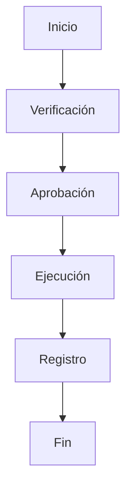

# 1001_MASTER_SOP_TEMPLATE.md

# PLANTILLA MAESTRA DE PROCEDIMIENTOS OPERATIVOS ESTÁNDAR (MASTER SOP TEMPLATE)
## Fundación Alborada

Versión 1.0

Clasificación: Documento Maestro del Sistema Operativo Institucional

---

# PROPÓSITO

El presente documento establece la estructura oficial, única y obligatoria para la elaboración de todos los Procedimientos Operativos Estándar (Standard Operating Procedures - SOP) de la Fundación Alborada.

Su objetivo es garantizar que toda la documentación operativa mantenga un formato uniforme, facilite la automatización mediante HERA y permita la escalabilidad documental de la institución durante las próximas generaciones.

Ningún SOP podrá desarrollarse utilizando una estructura diferente a la definida en este documento.

---

# ALCANCE

Esta plantilla será utilizada para todos los procedimientos relacionados con:

• Dirección General

• Gobierno Institucional

• Admisión

• Educación

• Psicología

• Medicina

• Nutrición

• Agricultura

• Avicultura

• Infraestructura

• Seguridad

• Tecnología

• Inteligencia Artificial

• Finanzas

• Recursos Humanos

• Investigación

• Relaciones Institucionales

• Logística

• Mantenimiento

• Auditoría

• Gestión Documental

• Comunicación

• Expansión Internacional

Y cualquier nueva área creada en el futuro.

---

# FILOSOFÍA

Cada procedimiento representa conocimiento institucional.

El conocimiento institucional constituye patrimonio permanente de la Fundación.

Por ello todos los procedimientos deberán escribirse de manera que cualquier persona correctamente capacitada pueda ejecutarlos con el mismo nivel de calidad.

Los procedimientos pertenecen a la institución.

Nunca a una persona.

---

# ESTRUCTURA OFICIAL DE TODO SOP

Todo procedimiento deberá seguir exactamente el siguiente orden.

---

# 1. IDENTIFICACIÓN

Código

Nombre

Versión

Área

Proceso

Subproceso

Nivel de confidencialidad

Fecha

Estado

Autor

Revisor

Aprobador

---

# 2. PROPÓSITO

Responder claramente:

¿Por qué existe este procedimiento?

¿Qué problema resuelve?

¿Qué valor genera?

---

# 3. ALCANCE

Definir exactamente.

Dónde aplica.

Cuándo aplica.

Cuándo no aplica.

Quién debe utilizarlo.

---

# 4. RESPONSABLES

Definir.

Responsable principal.

Responsables secundarios.

Áreas involucradas.

Supervisión.

Aprobación.

---

# 5. DOCUMENTOS RELACIONADOS

Constitución Alborada.

Políticas.

Reglamentos.

Otros SOP.

Protocolos.

Normativas.

Formularios.

Checklists.

---

# 6. DEFINICIONES

Toda palabra técnica deberá definirse.

No se asumirán conocimientos previos.

---

# 7. PRINCIPIOS INSTITUCIONALES APLICABLES

Cada SOP deberá indicar expresamente qué documentos doctrinales (Serie 0000) sustentan el procedimiento.

---

# 8. RECURSOS NECESARIOS

Personal.

Infraestructura.

Equipos.

Software.

Documentación.

Materiales.

Tiempo.

Presupuesto.

---

# 9. PRECONDICIONES

Todo aquello que debe existir antes de comenzar.

---

# 10. PROCEDIMIENTO

Esta será la sección principal.

Cada paso deberá contener.

Número.

Descripción.

Responsable.

Tiempo estimado.

Resultado esperado.

Documentación generada.

Puntos de control.

---

Ejemplo

Paso 1

Verificar documentación.

Responsable:

Coordinador.

Tiempo:

15 minutos.

Resultado esperado:

Documentación validada.

---

# 11. DIAGRAMA DEL PROCESO

Todo SOP incluirá un flujo utilizando Mermaid.

Ejemplo

---

# 12. MATRIZ RACI

Todo procedimiento incluirá.

Responsible

Accountable

Consulted

Informed

Para cada actividad.

---

# 13. MATRIZ DE RIESGOS

Cada SOP deberá identificar.

Riesgo.

Probabilidad.

Impacto.

Controles.

Responsable.

Plan de contingencia.

---

# 14. PUNTOS DE CONTROL

Indicar.

Qué verificar.

Quién verifica.

Cuándo.

Cómo.

---

# 15. INDICADORES (KPIs)

Cada procedimiento deberá tener indicadores medibles.

Ejemplos.

Tiempo promedio.

Errores.

Retrabajos.

Calidad.

Cumplimiento.

Satisfacción.

Costo.

Eficiencia.

---

# 16. REGISTROS GENERADOS

Todo documento producido durante el procedimiento deberá identificarse.

Nombre.

Código.

Ubicación.

Tiempo de conservación.

Responsable.

---

# 17. CASOS ESPECIALES

Excepciones.

Situaciones extraordinarias.

Emergencias.

Variaciones permitidas.

---

# 18. ACCIONES CORRECTIVAS

Qué hacer cuando.

El procedimiento falla.

Existe incumplimiento.

Se detectan errores.

Cambian las condiciones.

---

# 19. AUDITORÍA

Todo SOP deberá indicar.

Frecuencia.

Auditor.

Criterios.

Evidencias.

Indicadores.

---

# 20. CONTROL DE CAMBIOS

Versión.

Fecha.

Cambio realizado.

Autor.

Motivo.

---

# 21. CHECKLIST OPERATIVO

Todo procedimiento finalizará con un checklist práctico.

Ejemplo.

□ Paso 1 realizado

□ Paso 2 realizado

□ Documentación archivada

□ Indicadores registrados

□ Auditoría completada

---

# 22. ANEXOS

Podrán incluirse.

Formularios.

Modelos.

Planos.

Diagramas.

Imágenes.

Tablas.

Plantillas.

Normativas.

---

# REGLAS DE REDACCIÓN

Todos los SOP deberán cumplir las siguientes reglas.

Escribir en presente.

Utilizar lenguaje claro.

Eliminar ambigüedad.

Evitar opiniones.

Usar verbos de acción.

Mantener coherencia terminológica.

No duplicar procedimientos.

Numeración obligatoria.

Títulos normalizados.

Lenguaje compatible con IA.

---

# AUTOMATIZACIÓN CON HERA

Todos los SOP deberán ser compatibles con HERA.

Para ello deberán.

Mantener estructura fija.

Utilizar metadatos.

Referenciar documentos relacionados.

Usar identificadores únicos.

Permitir indexación automática.

Facilitar auditorías inteligentes.

Permitir generación automática de nuevas versiones.

---

# ESCALABILIDAD

Esta plantilla ha sido diseñada para soportar.

100 SOP.

1.000 SOP.

10.000 SOP.

100.000 SOP.

Sin modificar su arquitectura.

---

# DECLARACIÓN FINAL

La Fundación Alborada establece que la excelencia operativa comienza con procedimientos claros, consistentes y correctamente documentados.

Todo SOP generado mediante esta plantilla formará parte del patrimonio documental institucional y deberá contribuir a fortalecer la continuidad, la eficiencia y la capacidad de servicio de la Fundación.

Esta plantilla constituye el estándar oficial para toda la documentación operativa presente y futura de la Fundación Alborada y será utilizada por HERA como modelo estructural para la generación, actualización, auditoría y preservación automática de todos los procedimientos institucionales.

---

Fundación Alborada

1001_MASTER_SOP_TEMPLATE.md

Versión 1.0