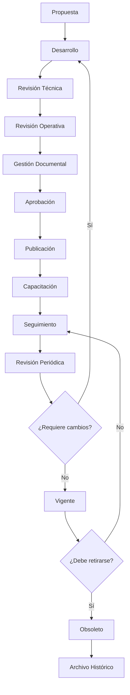

# 1007_DOCUMENT_APPROVAL_AND_PUBLICATION_WORKFLOW.md

# FLUJO OFICIAL DE APROBACIÓN, PUBLICACIÓN Y RETIRO DE DOCUMENTOS DE LA FUNDACIÓN ALBORADA
## Fundación Alborada

Versión 1.0

Clasificación: Norma Institucional de Gobernanza Documental

---

# PROPÓSITO

El presente documento establece el flujo oficial mediante el cual todo documento institucional será creado, revisado, aprobado, publicado, actualizado y retirado de circulación.

Su finalidad es garantizar que únicamente la documentación correctamente validada forme parte del Sistema Oficial de Conocimiento de la Fundación Alborada.

Ningún documento tendrá validez institucional sin haber recorrido el proceso definido en este estándar.

---

# ALCANCE

Este procedimiento aplica a:

• Constitución Institucional.

• SOP.

• Manuales.

• Políticas.

• Protocolos.

• Reglamentos.

• Formularios.

• Instructivos.

• Guías.

• Informes normativos.

• Documentación técnica.

• Documentación generada por HERA.

---

# FILOSOFÍA

Toda organización excelente protege su conocimiento.

No todo documento escrito debe convertirse en documento oficial.

La aprobación documental constituye un mecanismo de protección institucional.

---

# PRINCIPIOS

Todo proceso de aprobación deberá ser.

Objetivo.

Trazable.

Documentado.

Reproducible.

Auditado.

Transparente.

Escalable.

---

# ROLES

## Autor

Responsable de elaborar el documento.

Debe garantizar que el contenido cumpla los estándares institucionales.

---

## Revisor Técnico

Verifica.

Exactitud.

Coherencia.

Viabilidad.

Contenido técnico.

---

## Revisor Operativo

Evalúa.

Aplicabilidad.

Facilidad de ejecución.

Compatibilidad con otros procesos.

Impacto operativo.

---

## Gestión Documental

Verifica.

Formato.

Versionado.

Metadatos.

Clasificación.

Referencias.

Cumplimiento de estándares.

---

## Dirección General

Aprueba documentos de impacto operativo.

---

## Consejo Superior de Gobierno

Aprueba.

Documentos constitucionales.

Políticas.

Normas maestras.

Cambios estratégicos.

---

## HERA

Asiste durante todo el proceso mediante.

Detección de inconsistencias.

Comparación de versiones.

Análisis de dependencias.

Control de referencias.

Verificación de metadatos.

Nunca sustituye la aprobación humana.

---

# CICLO DE VIDA DOCUMENTAL

Todo documento seguirá obligatoriamente las siguientes etapas.

---

## ETAPA 1

PROPUESTA

Estado.

BORRADOR

El documento existe únicamente como propuesta.

No posee validez institucional.

---

## ETAPA 2

DESARROLLO

El autor completa.

Contenido.

Referencias.

Metadatos.

Anexos.

Diagramas.

---

## ETAPA 3

REVISIÓN TÉCNICA

Se evalúan.

Exactitud.

Coherencia.

Cumplimiento normativo.

Calidad técnica.

---

## ETAPA 4

REVISIÓN OPERATIVA

Se verifica.

Facilidad de implementación.

Compatibilidad.

Viabilidad.

Riesgos.

---

## ETAPA 5

CONTROL DOCUMENTAL

Gestión Documental verifica.

Formato.

Código.

Versionado.

Metadatos.

Clasificación.

Relaciones.

Cumplimiento del estándar documental.

---

## ETAPA 6

APROBACIÓN

La autoridad competente aprueba formalmente el documento.

A partir de este momento podrá publicarse.

---

## ETAPA 7

PUBLICACIÓN

El documento pasa a estado.

VIGENTE

Se incorpora al Sistema Oficial de Documentación.

Se actualizan.

Índices.

Relaciones.

Catálogos.

Repositorios.

---

## ETAPA 8

CAPACITACIÓN

Cuando corresponda.

Se comunica.

Se capacita.

Se documenta la implementación.

---

## ETAPA 9

SEGUIMIENTO

Se monitorea.

Cumplimiento.

Resultados.

Indicadores.

Incidentes.

Retroalimentación.

---

## ETAPA 10

REVISIÓN PERIÓDICA

Todo documento tendrá una fecha programada de revisión.

---

## ETAPA 11

ACTUALIZACIÓN

Cuando sea necesario.

Se inicia una nueva versión.

El ciclo comienza nuevamente.

---

## ETAPA 12

OBSOLESCENCIA

Si un documento deja de utilizarse.

Pasa a estado.

OBSOLETO

Nunca será eliminado.

---

## ETAPA 13

ARCHIVO HISTÓRICO

Toda versión aprobada permanecerá disponible para consulta histórica.

---

# FLUJOGRAMA

---

# CRITERIOS DE APROBACIÓN

Todo documento deberá cumplir.

Contenido completo.

Referencias válidas.

Metadatos completos.

Versionado correcto.

Ortografía.

Coherencia.

Compatibilidad con otros documentos.

Cumplimiento doctrinal.

---

# CAUSALES DE RECHAZO

El documento será rechazado cuando.

Contenga contradicciones.

No cumpla estándares.

Posea referencias incorrectas.

No tenga responsables definidos.

Sea técnicamente inviable.

No responda al propósito institucional.

---

# PUBLICACIÓN

Al publicarse un documento.

Se actualizarán automáticamente.

Catálogo documental.

Índice maestro.

Mapa de relaciones.

Historial.

Repositorio oficial.

Base de conocimiento HERA.

---

# RETIRO DE DOCUMENTOS

Un documento podrá retirarse cuando.

Sea reemplazado.

Pierda vigencia.

Cambie la normativa.

Cambie la estructura institucional.

Se detecten errores críticos.

---

# TRAZABILIDAD

Toda aprobación registrará.

Fecha.

Versión.

Responsable.

Observaciones.

Justificación.

Resultado.

---

# INDICADORES

Tiempo promedio de aprobación.

Cantidad de documentos rechazados.

Tiempo promedio de revisión.

Cantidad de revisiones por documento.

Porcentaje de documentos vigentes.

Porcentaje de revisiones realizadas en término.

---

# AUDITORÍA

Las auditorías verificarán.

Cumplimiento del flujo.

Aprobaciones registradas.

Responsables.

Versiones.

Estados.

Trazabilidad.

---

# INTEGRACIÓN CON HERA

HERA asistirá mediante.

Alertas de revisión.

Detección de inconsistencias.

Seguimiento de estados.

Análisis de impacto.

Actualización de relaciones.

Generación de reportes.

La aprobación institucional continuará siendo responsabilidad exclusiva de las personas designadas por la Fundación.

---

# DECLARACIÓN FINAL

La Fundación Alborada establece que la calidad de su patrimonio documental depende de un proceso riguroso de revisión, aprobación y control.

Todo documento oficial deberá recorrer el flujo definido en este estándar antes de formar parte del Sistema Institucional de Conocimiento.

Este procedimiento garantiza que el crecimiento documental de la Fundación sea ordenado, verificable y sostenible, preservando la integridad de su conocimiento para las generaciones futuras.

---

Fundación Alborada

1007_DOCUMENT_APPROVAL_AND_PUBLICATION_WORKFLOW.md

Versión 1.0