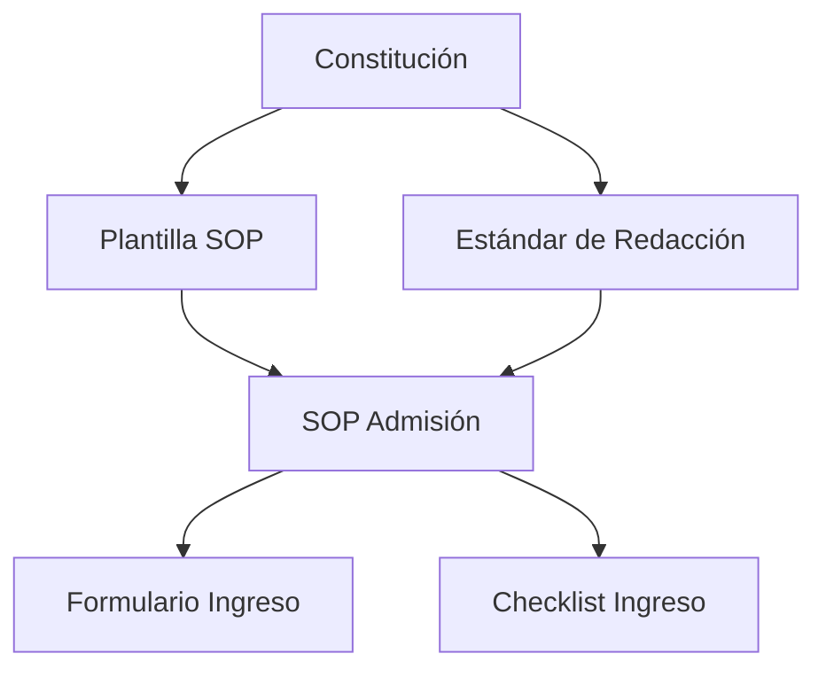

# 1008_DOCUMENT_RELATIONSHIP_AND_TRACEABILITY_SYSTEM.md

# SISTEMA OFICIAL DE RELACIONES Y TRAZABILIDAD DOCUMENTAL DE LA FUNDACIÓN ALBORADA
## Fundación Alborada

Versión 1.0

Clasificación: Norma Institucional de Arquitectura del Conocimiento

---

# PROPÓSITO

El presente documento establece el Sistema Oficial de Relaciones y Trazabilidad Documental de la Fundación Alborada.

Su propósito es garantizar que todos los documentos institucionales formen parte de una única red de conocimiento, donde cada documento conozca su origen, sus dependencias, sus referencias y el impacto que produce sobre el resto del sistema documental.

La Fundación no administrará documentos aislados.

Administrará un ecosistema integrado de conocimiento.

---

# ALCANCE

Este sistema aplica a:

• Constitución Institucional.

• Normas Maestras.

• SOP.

• Manuales.

• Protocolos.

• Políticas.

• Reglamentos.

• Formularios.

• Checklists.

• Registros.

• Auditorías.

• Investigaciones.

• Documentación técnica.

• Documentación generada por HERA.

---

# FILOSOFÍA

El verdadero valor del conocimiento no reside únicamente en cada documento individual.

Su mayor valor surge de las relaciones existentes entre todos los documentos.

Cada documento constituye un nodo dentro del conocimiento institucional.

---

# PRINCIPIOS

Toda relación documental deberá ser.

Identificable.

Bidireccional cuando corresponda.

Verificable.

Actualizable.

Automatizable.

Auditada.

Permanente.

---

# CONCEPTO DE RELACIÓN DOCUMENTAL

Existe una relación documental cuando un documento.

Depende de otro.

Hace referencia a otro.

Complementa otro.

Reemplaza otro.

Genera otro.

Es utilizado por otro.

Modifica otro.

---

# TIPOS DE RELACIÓN

Toda relación deberá clasificarse.

---

## DOCUMENTO PADRE

Documento del cual deriva otro.

Ejemplo.

Constitución.

↓

Política.

↓

SOP.

---

## DOCUMENTO HIJO

Documento desarrollado a partir de uno superior.

---

## DOCUMENTO RELACIONADO

Documento complementario.

No existe dependencia directa.

---

## DOCUMENTO SUSTITUIDO

Documento reemplazado por una versión superior.

---

## DOCUMENTO SUSTITUTO

Documento vigente que reemplaza otro.

---

## DOCUMENTO REQUERIDO

Documento indispensable para comprender o ejecutar otro.

---

## DOCUMENTO GENERADO

Documento producido como resultado de un procedimiento.

Ejemplo.

Formulario.

Registro.

Informe.

---

## DOCUMENTO CONSUMIDO

Documento utilizado como insumo.

---

# GRAFO DE CONOCIMIENTO

Toda la documentación institucional conformará un Grafo de Conocimiento.

Cada documento representará un nodo.

Cada referencia representará una conexión.

Esto permitirá.

Comprender dependencias.

Identificar impactos.

Navegar entre documentos.

Automatizar actualizaciones.

---

# MATRIZ DE DEPENDENCIAS

Cada documento deberá indicar.

Documentos superiores.

Documentos inferiores.

Documentos relacionados.

Formularios utilizados.

Protocolos asociados.

Normas aplicables.

Políticas relacionadas.

---

# TRAZABILIDAD ASCENDENTE

Todo documento deberá responder.

¿De dónde surge?

¿Qué norma lo fundamenta?

¿Qué documento lo autoriza?

---

# TRAZABILIDAD DESCENDENTE

Todo documento deberá responder.

¿Qué documentos dependen de él?

¿Qué procedimientos utilizan esta información?

¿Qué procesos dejarían de funcionar si desaparece?

---

# TRAZABILIDAD HORIZONTAL

Todo documento deberá identificar.

Procesos paralelos.

Áreas relacionadas.

Responsables compartidos.

Dependencias cruzadas.

---

# TRAZABILIDAD TEMPORAL

Todo documento deberá conservar.

Historial.

Versiones.

Cambios.

Autores.

Aprobadores.

Auditorías.

---

# IMPACTO DOCUMENTAL

Cuando un documento cambie.

HERA identificará automáticamente.

Documentos afectados.

Procedimientos afectados.

Formularios afectados.

Capacitaciones necesarias.

Riesgos asociados.

---

# MAPA DOCUMENTAL

La Fundación mantendrá un Mapa Maestro Documental que representará visualmente.

Jerarquía.

Relaciones.

Dependencias.

Flujos.

Áreas.

Procesos.

---

# REFERENCIAS CRUZADAS

Las referencias deberán realizarse siempre mediante.

Código.

Nombre oficial.

Versión vigente.

Nunca mediante descripciones ambiguas.

---

# DETECCIÓN DE DOCUMENTOS HUÉRFANOS

Se considerará documento huérfano aquel que.

No tenga documento padre.

No sea utilizado por ningún proceso.

No posea relaciones documentales.

No pertenezca a ningún flujo operativo.

Los documentos huérfanos deberán revisarse.

---

# DETECCIÓN DE CICLOS

HERA verificará automáticamente que no existan.

Dependencias circulares.

Contradicciones.

Duplicidades.

Referencias inválidas.

---

# MATRIZ DE IMPACTO

Toda modificación documental generará automáticamente un análisis de impacto.

Incluyendo.

Procesos.

Áreas.

SOP.

Protocolos.

Formularios.

Capacitaciones.

Indicadores.

---

# VISUALIZACIÓN

La Fundación podrá representar gráficamente las relaciones mediante.

Mermaid.

Grafos.

Diagramas de dependencia.

Mapas de conocimiento.

Redes semánticas.

---

Ejemplo.

---

# RESPONSABILIDADES

## Gestión Documental

Mantener actualizadas todas las relaciones.

---

## Autores

Declarar correctamente las dependencias.

---

## Revisores

Validar la coherencia documental.

---

## HERA

Actualizar automáticamente.

Relaciones.

Dependencias.

Impactos.

Mapas.

Alertas.

Sin modificar el contenido documental.

---

# AUDITORÍA

Las auditorías verificarán.

Documentos huérfanos.

Referencias rotas.

Dependencias incorrectas.

Duplicidades.

Contradicciones.

Impactos no evaluados.

Consistencia del grafo documental.

---

# ESCALABILIDAD

El sistema ha sido diseñado para administrar.

Miles de documentos.

Millones de relaciones.

Décadas de evolución documental.

Expansión internacional.

Múltiples idiomas.

Múltiples sedes.

Sin modificar su arquitectura.

---

# DECLARACIÓN FINAL

La Fundación Alborada establece que el conocimiento institucional debe entenderse como una red viva de información, donde cada documento aporta valor no solo por su contenido, sino también por las relaciones que mantiene con el resto del sistema.

El presente Sistema Oficial de Relaciones y Trazabilidad Documental constituye la base para que HERA construya y mantenga un Grafo de Conocimiento Institucional capaz de preservar, comprender y expandir el patrimonio intelectual de la Fundación durante generaciones.

---

Fundación Alborada

1008_DOCUMENT_RELATIONSHIP_AND_TRACEABILITY_SYSTEM.md

Versión 1.0